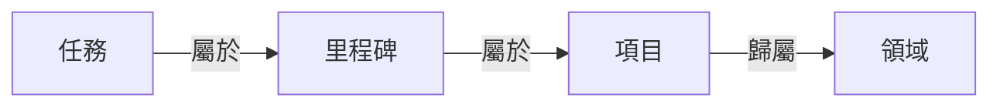

在 GranoFlow 裡，任務就是你要做的一件具體的事。你可以先點底部中間的 **+**，把事情寫下來並儲存；以後再決定它要不要放進項目、里程碑或領域。

你可以把 GranoFlow 當成普通任務清單來用。例如「給媽媽打電話」「完成第三章初稿」，都可以直接建成任務。

GranoFlow 也支援把任務連接到項目、里程碑和領域。這樣做的好處是：當事情變多時，你不只知道「要做什麼」，也能看見「這件事為什麼重要」。但這不是必須的。簡單的事，直接記成任務就夠了。

## 怎麼加一個任務

最快的方法是：點底部欄中間的 **+** 按鈕，輸入任務內容，然後儲存。

現在不需要想清楚它屬於哪個項目、哪天做、有沒有標籤。先把事情記下來，晚點再整理。

<!-- manual-screenshot:id=tasks-overview-main -->

如果任務沒有日期，它會先進入**收集箱（Inbox）**。項目和里程碑只說明任務歸屬，不會單獨把一條無日期任務移出收集箱。你可以把收集箱理解成臨時便條區：先放進去，有空再處理。

左上角菜單裡可以找到這些任務視圖：

| 入口 | 顯示的內容 |
| --- | --- |
| 收集箱 | 沒有日期、且仍是待辦或進行中的任務 |
| 任務列表 | 正在推進的任務 |
| 已完成 | 已經做完的任務 |
| 已歸檔 | 不需要日常關注、但想保留記錄的任務 |
| 回收站 | 已刪除但還沒有清空的任務 |

進入「任務列表」後，任務會按時間分區顯示，例如逾期、今天、明天、本週、本月、下個月和更晚。每個分區右上角都可以快速新增任務；如果你在「今天」裡新增，任務會預設安排到今天，如果在「明天」裡新增，就會預設安排到明天。儲存時仍然可以改標題、日期、提醒、項目、里程碑、標籤或圖片。

## 為甚麼只細排今天和明天

GranoFlow 不鼓勵你把未來每一天都排成精確日程。現實生活裡，變化和意外才是常態；把下星期、下個月的每一天都提前塞滿，往往只會製造一種「計劃已經失敗」的壓力。

所以任務列表只把今天和明天當作真正需要細排的日級計劃：今天決定現在先做甚麼，明天留下清晰但不沉重的下一步。更遠的任務，只需要估計大概會落在本週、本月、下個月或更晚，讓它們形成一個粗略分佈。等時間靠近，再把其中真正要處理的事情移到今天或明天。

這和傳統 Todo List 不一樣：GranoFlow 不是讓你提前控制未來每一天，而是幫你在不確定中保持方向感。

如果你已經把某個任務設為當前正在做的任務，任務列表頂部會出現「當前任務」。它不是一個新的任務，而是原任務的置頂顯示，方便你回到正在推進的那件事。點開它，寬螢幕時會在右側開啟詳情，窄螢幕時會進入任務詳情頁。

## 任務、項目、里程碑、領域的關係

你可以先只用任務。等事情變複雜了，再往上加結構：

- **任務**：一件具體要做的事，是最基本的單位
- **里程碑**：項目裡的一個階段節點，例如「完成用戶測試」
- **項目**：一段時間內持續推進的目標，例如「App 發佈」
- **領域**：你長期在意的生活範圍，例如「工作」「健康」

不是每個任務都需要連接到項目。能直接完成的小事，就直接做。需要長期推進的事，再用項目、里程碑和領域來整理。

## 任務的幾種狀態

| 狀態 | 什麼時候用 |
| --- | --- |
| 待辦 | 還沒開始做 |
| 進行中 | 正在做，建議同時只標一個 |
| 已完成 | 已經做完，會記錄完成時間 |
| 已歸檔 | 不再需要關注，但保留記錄 |
| 回收站 | 已刪除，還沒有清空 |

:::tip[專注技巧]
把任務標為「進行中」時，GranoFlow 會盡量只保留一個進行中任務。這樣可以幫助你把注意力放在當前正在做的那件事上。
:::

在任務詳情裡點「專注」，這條任務會變成當前任務，並開始記錄一次專注會話。之後你回到任務列表，就會在頂部看到它。如果已經有另一條任務正在專注中，GranoFlow 會提示你先完成或停止那條任務，避免同時有兩件事都被當成「當前正在做」。

如果任務已經拆成節點，任務列表會在未完成任務下方顯示一個輕量的「下一步」。勾選這裡時，只會完成當前這個節點，不會直接把整條任務標為完成；完成後列表會重新整理到下一個未完成節點。

## 第一次用，怎麼開始

點 **+**，寫下今天最想完成的一件事，然後儲存。

這就夠了。等你真的需要整理時，再去使用項目、里程碑、領域、歸檔等功能。
