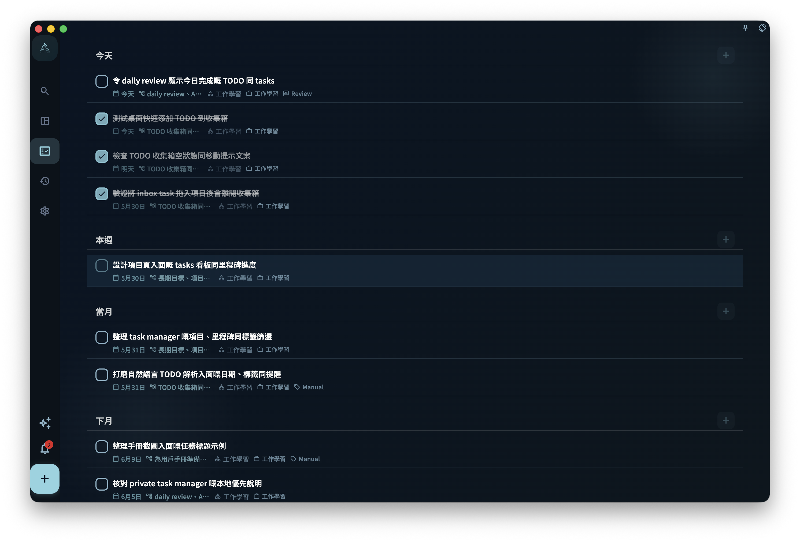
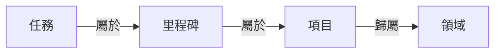

任務（tasks）就是你要做的那件具體的事。不管是「打電話給媽媽」還是「完成第三章初稿」，都可以是一個任務。

GranoFlow 的任務系統和普通 Todo 應用最大的不同是：任務可以連接到項目、里程碑和領域，讓你在記錄的同時，不迷失「這件事為什麼重要」。

但這不是強制的。你完全可以只用任務清單，不碰項目，效果也很好。

## 怎麼加一個任務

最快的方式：點底部欄中間的 **+** 按鈕，寫下來，儲存。

不需要現在就想清楚它屬於哪個項目、幾號做、有沒有標籤。先記，晚點再整理。

任務如果沒有日期也沒有項目，它會先落在**收集箱（Inbox）**。你可以把收集箱當成你口袋裏的便條紙堆——下次有空再處理。

左上角菜單裏可以找到所有任務視圖：

| 入口 | 顯示的內容 |
| --- | --- |
| 收集箱 | 還沒有日期或項目的任務 |
| 任務列表 | 正在推進的任務 |
| 已完成 | 做完的任務 |
| 已歸檔 | 不再需要日常關注、但保留記錄的任務 |
| 回收站 | 刪掉的任務，還可以恢復 |

## 任務、項目、里程碑、領域的關係

可以先從任務開始，等結構需要的時候再往上搭：

- **任務**：一件具體的事，最基本的單位
- **里程碑**：項目裏的一個階段節點（例如「完成用戶測試」）
- **項目**：一段時間內的持續目標（例如「App 發布」）
- **領域**：你長期在意的生活範圍（例如「工作」「健康」）

不需要每個任務都連接到項目。簡單的事直接做，複雜的事才需要上層結構。

## 任務的幾種狀態

| 狀態 | 甚麼時候用 |
| --- | --- |
| 待辦 | 還沒開始做 |
| 進行中 | 正在做（建議同時只標一個） |
| 已完成 | 做完了，會記錄完成時間 |
| 已歸檔 | 不再需要關注，但留着記錄 |
| 回收站 | 刪掉了，還沒清空 |

:::tip[專注技巧]
把任務標為「進行中」時，GranoFlow 會盡量只保留一個進行中任務，幫你保持專注，不讓半吊子的事越堆越多。
:::

## 第一次用，怎麼開始

點 **+**，寫下今天最想完成的一件事，儲存。

就這樣。其他功能等你用到了再探索。
