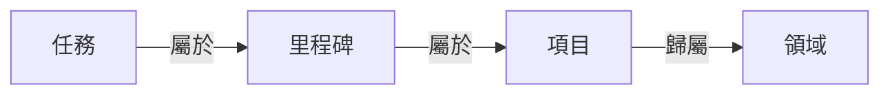

在 GranoFlow 裏，任務就是你要做的一件具體事情。你可以先點底部中間的 **+**，寫低要做的事並儲存；之後再決定它要不要放入項目、里程碑或領域。

你可以把 GranoFlow 當成普通任務清單使用。例如「打電話給媽媽」「完成第三章初稿」，都可以直接建立成任務。

GranoFlow 也支援把任務連接到項目、里程碑和領域。當事情變多時，這樣可以幫你不只看見「要做甚麼」，也看見「這件事為甚麼重要」。但這不是必須的。簡單的事，直接記成任務就可以。

## 怎樣加一個任務

最快的方法是：點底部欄中間的 **+** 按鈕，輸入任務內容，然後儲存。

現在不需要想清楚它屬於哪個項目、哪天做、是否需要標籤。先把事情記低，之後再整理。

<!-- manual-screenshot:id=tasks-overview-main -->

如果任務沒有日期，也沒有項目，它會先進入**收集箱（Inbox）**。你可以把收集箱理解成臨時便條區：先放入去，有空再處理。

左上角菜單裏可以找到這些任務視圖：

| 入口 | 顯示的內容 |
| --- | --- |
| 收集箱 | 還沒有日期或項目的任務 |
| 任務列表 | 正在推進的任務 |
| 已完成 | 已經做完的任務 |
| 已歸檔 | 不需要日常關注、但想保留記錄的任務 |
| 回收站 | 已刪除但還沒有清空的任務 |

## 任務、項目、里程碑、領域的關係

你可以先只用任務。等事情變複雜，再往上加結構：

- **任務**：一件具體要做的事，是最基本的單位
- **里程碑**：項目裏的一個階段節點，例如「完成用戶測試」
- **項目**：一段時間內持續推進的目標，例如「App 發布」
- **領域**：你長期在意的生活範圍，例如「工作」「健康」

不是每個任務都需要連接到項目。可以直接完成的小事，就直接做。需要長期推進的事，再用項目、里程碑和領域整理。

## 任務的幾種狀態

| 狀態 | 甚麼時候用 |
| --- | --- |
| 待辦 | 還沒開始做 |
| 進行中 | 正在做，建議同時只標一個 |
| 已完成 | 已經做完，會記錄完成時間 |
| 已歸檔 | 不再需要關注，但保留記錄 |
| 回收站 | 已刪除，還沒有清空 |

:::tip[專注技巧]
把任務標為「進行中」時，GranoFlow 會盡量只保留一個進行中任務。這樣可以幫你把注意力放在當下正在做的那件事上。
:::

## 第一次用，怎樣開始

點 **+**，寫低今天最想完成的一件事，然後儲存。

這樣就夠了。等你真的需要整理時，再去使用項目、里程碑、領域、歸檔等功能。
