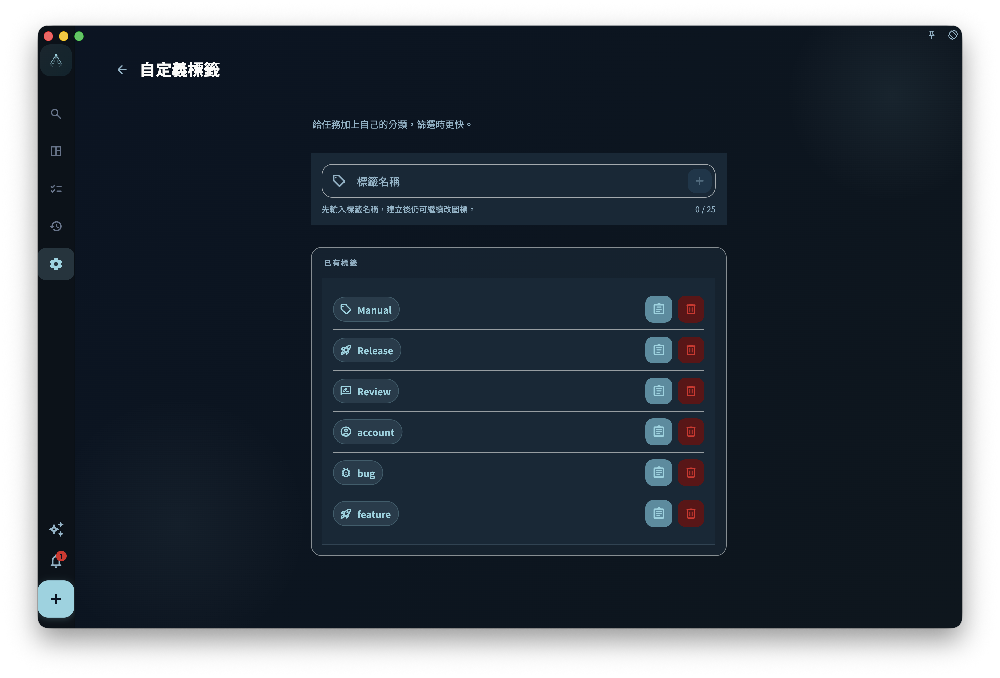

想按「狀態、類型、精力、臨時重點」呢類角度標記任務，就用標籤。項目說明任務屬於邊個目標；標籤說明呢個任務有咩共同特徵，方便之後篩選同整理。

例如你有「健身 App 開發」呢個項目，入面有啲任務係「需要設計稿」，有啲係「等待第三方 API」。呢啲唔係新項目，而係跨項目都可能出現嘅狀態或類型，就適合用標籤。

## 怎樣給任務加標籤

新建任務或打開任務詳情時，找到標籤區域，然後選擇已有標籤，或者輸入新名稱建立標籤。

即使截圖未能載入，都可以咁理解：

- 已有標籤會顯示為可選項
- 找不到合適標籤時，可以輸入一個新名稱來建立
- 一個任務可以同時加多個標籤

## 標籤用來記甚麼好

標籤適合表達**跨項目、會重複使用**的分類。以下都比較適合：

| 用途 | 標籤示例 |
| --- | --- |
| 場景 / 精力 | `低精力` `深度工作` `碎片時間` |
| 等待狀態 | `等待他人` `等待回覆` `待確認` |
| 類型 | `電話` `創意` `管理` |
| 臨時標記 | `本週重點` `稍後處理` |

不建議將項目名稱複製成標籤。任務已經在項目入面時，就不需要再用同一個項目名標多一次。

## 刪除標籤的影響

刪除一個標籤**不會**刪除使用它的任務。它只會將這個標籤從那些任務上移除。

:::caution[刪前確認]
刪除標籤是不可撤銷的。確認不再需要這個分類，再操作。
:::

## 標籤太多怎麼辦

標籤太多會令篩選變得無用。建議定期整理：

- 合併意思接近的標籤
- 刪除已經沒有人用的標籤
- 保持標籤名稱簡短、容易分辨
