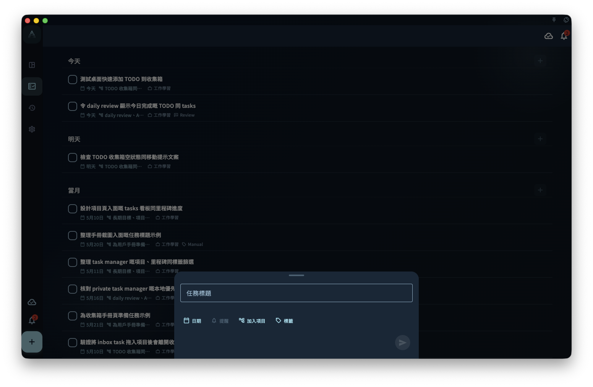

用標題裡的 #、@、~ 和日期提示更快整理任務，同時理解哪些內容需要確認才會變成欄位。

## 從哪裡開始

在新建任務或編輯標題時直接輸入自然語言。`#` 用來提示標籤，`@` 用來提示項目，`~` 用來提示提醒時間，日期詞會進入待確認狀態。

<!-- manual-screenshot:id=tasks-title-parser-confirmation -->

## 怎麼操作

- 輸入 `#標籤` 或 `@項目` 後，從候選項中點擊、按 Enter 或 Tab 確認；確認後才會寫入標籤或項目欄位。
- 輸入日期或提醒詞後，先看高亮和候選提示。點擊日期提示或在日期後繼續輸入空格，才會把它寫成結構化日期。
- 不確認的片段會繼續保留在標題裡，不會偷偷改成欄位。

## 結果和邊界

標題解析的目標是減少整理成本，而不是替你決定任務結構。你可以先把句子寫完整，再只確認真正想結構化的部分。

- `#`、`@`、`~` 的識別依賴清晰邊界；普通文字裡的符號不一定會被當作欄位。
- 解析建議可能不完整，最終以你確認後的欄位為準。

## 下一步

如果你經常用標籤或項目整理任務，可以繼續閱讀“標籤”和“把任務連接到項目”。
