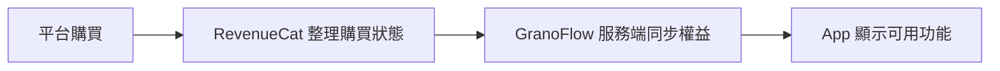

如果你的會員沒有顯示，先確認三件事：你登入緊邊個 GranoFlow 帳號、購買係經 Apple 定 Google 發生、訂閱而家仲係咪有效。帳號、訂閱、會員同權益唔係同一樣嘢，任何一環未對齊，App 入面見到嘅結果都可能唔啱。

## 四個詞的區別

| 詞 | 是什麼 |
| --- | --- |
| **帳號** | 你在 GranoFlow 的身份，用來識別數據和權益屬於邊個 |
| **訂閱** | 你在 Apple 或 Google 平台上的購買關係 |
| **會員** | GranoFlow 對外描述的用戶身份，例如 Pro |
| **權益** | 目前帳號實際可以使用哪些功能 |

可以將流程理解成咁：

所以，「我撳過購買按鈕」唔等於「目前帳號一定已經有權益」。平台購買、購買狀態整理、服務端同步、App 刷新顯示，每一步都需要對齊。

## 登入有什麼用

唔登入都可以使用 GranoFlow 的本地功能，例如記錄任務、整理項目、寫回顧。

登入帳號之後，GranoFlow 先可以確認呢啲內容同權益屬於邊個。以下功能通常需要登入並經過服務端確認：雲同步、多裝置使用、會員權益識別、恢復購買、刪除帳號。

> 本地使用解決「我而家點樣記錄」。登入帳號解決「呢啲數據同權益屬於邊個」。

如果你開啟咗離線模式，或者登入、購買服務暫時不可用，本地功能唔會因此停止。只係登入、同步、權益確認同恢復購買需要遲啲再試。

## 恢復購買

換裝置或者重裝 App 之後，如果會員權益沒有出現，可以嘗試「恢復購買」。佢嘅作用係讓 Apple 或 Google 重新檢查購買記錄，再同目前登入的 GranoFlow 帳號權益對齊。

恢復購買唔可以解決所有情況：

- 如果購買綁定的是另一個 GranoFlow 帳號，目前帳號唔會自動得到權益
- 如果訂閱已經退款或過期，恢復購買亦唔會重新開通權益
- 如果購買服務暫時不可用，App 會提示遲啲再試，本地數據唔會受到影響

## 桌面端為什麼沒有購買按鈕

桌面端，即 Windows、macOS 同 Linux 版本，為咗符合各平台分發規則，可能唔會顯示購買入口。

呢個唔代表桌面端少咗會員功能。你已經有會員的話，在桌面端登入同一個 GranoFlow 帳號後，對應功能會正常解鎖。需要購買會員時，請從 iOS 或 Android 端操作。

## 遇到問題時先問自己

1. 我而家登入的是邊個 GranoFlow 帳號？
2. 購買發生在哪個平台，Apple 定 Google？
3. 目前訂閱是否仍然有效？
4. App 是否已經刷新了權益？
5. 有沒有把不同帳號搞混？

呢幾個問題可以定位絕大多數會員同權益問題。
