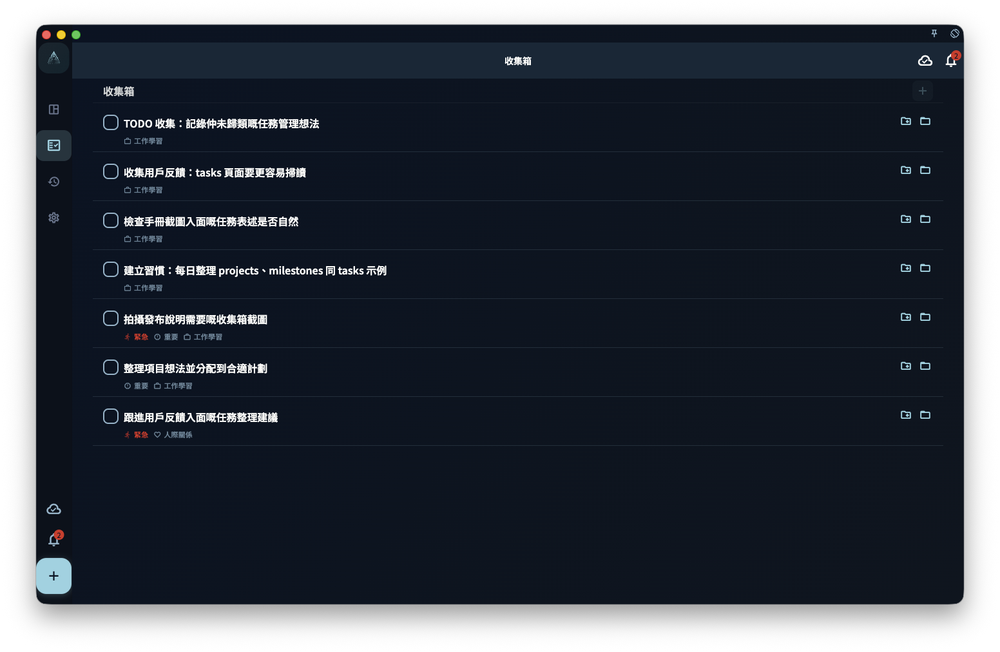

這一章把 ACT（接納與承諾療法）和《幸福的陷阱》的思路，放進 GranoFlow 的領域、價值觀、項目、里程碑、任務和回顧入面。它適合你把長期目標變成今日可以開始的一步，而不是令任務管理變成另一種焦慮。

GranoFlow 背後有一個重要思想：ACT（Acceptance and Commitment Therapy，接納與承諾療法）。

簡單講，ACT 不要求你先消滅焦慮、拖延、痛苦同混亂，才開始生活。它更關心的是：當這些狀態仍然存在時，你是否仍然看得見自己重視甚麼，並做出下一步行動。

很多中文讀者認識 ACT，是由 Russ Harris 的 *The Happiness Trap*（《幸福的陷阱》）開始。這本書用更接近日常生活的語言介紹 ACT：人不需要先清除所有痛苦、焦慮、拖延或不確定，才可以開始過自己重視的生活。

ACT 通常被歸入現代認知行為療法（CBT）相關方法，圍繞接納、正念、價值和承諾行動展開。它關心的不是消滅所有不舒服的感受，而是在真實處境裏提升心理靈活性：看見目前發生甚麼，看見自己重視甚麼，然後做出一個更接近價值的行動。

GranoFlow 不是心理治療工具，也不能替代書籍、醫生、治療師或專業協助。它只是借用了 ACT 和《幸福的陷阱》中適合日常生活的一部分：接納現實、澄清價值、承諾行動，再透過任務、項目和回顧把行動留下來。

## 接納：先承認目前的狀態

很多人以為，只有狀態好了，才可以開始行動。

等不焦慮了，再工作。  
等不拖延了，再學習。  
等想清楚了，再做計劃。  
等生活穩定了，再開始改變。

但現實通常不是這樣。

你可能一邊混亂，一邊還有事情要做。你可能一邊懷疑自己，一邊仍然想推進某個目標。你可能還未完全準備好，但今日已經需要開始。

在 GranoFlow 裏，第一步不是把自己調整到完美狀態，而是先把事情寫下來。

寫下一件事，不代表你已經想清楚了。  
寫下一件事，只是承認：它正在佔用你的注意力。

你可以把任務放進收集箱，也可以在回顧裏寫下今日的狀態。它暫時不需要被解釋、分類或優化。先記錄下來，就是把腦中的混亂移到一個可以慢慢處理的位置。

<!-- manual-screenshot:id=tasks-inbox-main -->

接納不是躺平，也不是認輸。

接納的意思是：我先承認目前就是這樣，然後由這裏開始。

## 價值：想清楚自己重視甚麼

任務回答的是「我要做甚麼」。

價值回答的是「我想成為怎樣的人」。

同樣是學英文，有人是為了考試，有人是為了工作，有人是為了更自由地理解世界。  
同樣是鍛煉身體，有人是為了外形，有人是為了健康，有人是為了令自己長遠更有力量。  
同樣是做一個項目，有人是為了收入，有人是為了作品，有人是為了證明自己可以長期完成一件事。

GranoFlow 裏的領域和價值觀，不是用來裝飾頁面的。

它們的作用是幫你看見：你反覆投入時間的地方，是否真的接近你重視的方向。

你不需要一開始就寫出完美的人生價值觀。可以先問自己幾個簡單問題：

- 我希望自己在工作或學習中成為怎樣的人？
- 我希望如何對待重要的人際關係？
- 我希望如何照顧自己的身心健康？
- 我希望留下甚麼作品、表達或創造？

答案可以很普通。

- 我希望自己是一個可靠的人。
- 我希望自己遇到困難時仍然可以繼續推進。
- 我希望自己不是只消耗生活，也可以創造一點東西。
- 我希望自己可以照顧身體，而不是一直透支。

真正有用的價值觀，往往不是一句漂亮口號，而是可以反覆指導選擇的方向。

## 承諾：把方向變成下一步行動

只寫價值觀還不夠。

如果「我想成為可靠的人」永遠停留在一句話裏，它不會自動改變生活。它需要變成項目、里程碑和任務。

例如，你重視「成為可靠的人」。

它可以落成一個項目：

> 完成目前產品版本

項目下面可以有里程碑：

> 完成核心功能  
> 完成測試  
> 準備發佈材料

里程碑下面再拆成任務：

> 檢查登錄流程  
> 修復圖片上載問題  
> 更新手冊文案  
> 提交審核說明

這樣，價值觀就不再只是抽象願望，而是進入了每天可以推進的結構。

承諾行動不是說「我從此不能中斷」。

它的意思是：即使我目前狀態並不完美，我也願意朝自己重視的方向，做一個具體動作。

當你不知道該做甚麼時，看任務。  
當任務太碎時，看里程碑。  
當項目失去意義時，看價值觀。  
當價值觀變得模糊時，回到回顧裏重新整理。

## 回顧：讓經歷變成積累

完成任務不是結束。

如果你只是持續寫任務、做任務、刪除任務，生活很容易變成一串被消耗掉的清單。

回顧的作用，是讓經歷留下痕跡。

你可以在一日結束時問自己：

- 今日我實際做了甚麼？
- 哪些事讓我更接近重視的方向？
- 哪些事只是消耗了我？
- 下一步應該是甚麼？

回顧不需要長，也不需要漂亮。它不是作文，不是日報，也不是自我檢討。

它更像一次簡短整理：把今日發生過的事，和你長期在意的方向重新連起來。

有些時候，回顧會告訴你：這個項目值得繼續。  
有些時候，回顧會告訴你：這個目標其實已經不重要了。  
有些時候，回顧只是讓你承認：今日很難，但你仍然做了一點。

這些都算數。

## 中斷不是失敗

GranoFlow 不以連續打卡作為核心。

因為人生本來就會中斷。

你可能生病、轉工、情緒低落、臨時忙其他事，也可能只是突然失去動力。中斷不代表你失敗了，只代表生活發生了變化。

真正重要的不是「從來沒有停下」，而是「停下之後仍然可以回來」。

回來時，不需要補償過去，也不需要責備自己。你只需要重新看一眼：

- 目前仍然重要的領域是甚麼？
- 哪個項目仍然值得繼續？
- 最近一個里程碑是甚麼？
- 今日可以推進的最小任務是甚麼？

如果舊計劃已經不適合，也可以調整、歸檔或放下。

放下一個項目，不等於否定過去的投入。只要你能從中看見經驗，它仍然會成為積累的一部分。

## 用 GranoFlow 完成一次 ACT 循環

你可以把 GranoFlow 的一次完整使用，看成一個簡單循環：

1. **接納現實**：把腦中的混亂、任務或狀態寫下來。
2. **看見價值**：判斷它和哪個領域、價值觀或長期方向有關。
3. **承諾行動**：把方向拆成項目、里程碑和任務。
4. **實際推進**：今日只完成一個清楚的下一步。
5. **回顧沉澱**：記錄發生了甚麼，以及下一步是甚麼。
6. **中斷後回來**：不清零，不羞恥，重新由目前狀態開始。

你不需要每一天都完整走完這個循環。

有時你只是寫下一件事。  
有時你只是完成一個任務。  
有時你只是做一次回顧。

這些都可以，都是有效的使用方式。

GranoFlow 的目的不是讓你變成一個永遠高效的人，而是幫你在真實生活裏，持續靠近自己重視的方向。

## 延伸閱讀

如果你想進一步了解 ACT，可以閱讀 Russ Harris 的 *The Happiness Trap*（《幸福的陷阱》），也可以查看 Wikipedia 上的 [The Happiness Trap](https://en.wikipedia.org/wiki/The_Happiness_Trap) 和 [Acceptance and commitment therapy](https://en.wikipedia.org/wiki/Acceptance_and_commitment_therapy) 條目，或查看 Association for Contextual Behavioral Science 對 ACT 的介紹。

GranoFlow 不是《幸福的陷阱》的總結，也不是這本書的替代品。它只是把其中一部分適合日常生活的思路，轉化成記錄、項目、任務和回顧結構，幫你把「我重視甚麼」落到今日可以做的一步。
