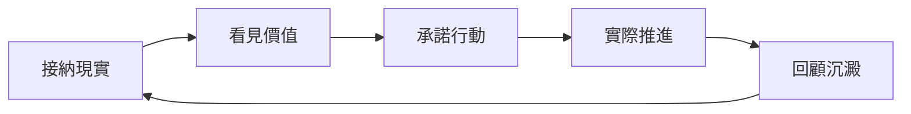

這頁想回答一個實際問題：當你焦慮、混亂、覺得未準備好時，點樣仍然用 GranoFlow 推進重要的事？答案是：先接納而家嘅狀態，把事情寫低，再把你重視的方向變成今日做到的一小步。

好多任務工具都容易令人覺得：你要先調整好狀態，然後先開始行動。

例如，等自己不再焦慮先工作。等所有事想清楚先做計劃。等生活穩定先開始改變。

但現實通常不是這樣。完全準備好的一日，可能一直都不會出現。

GranoFlow 借用了 **ACT（接納與承諾療法）** 的思路，來自 Russ Harris 的《幸福的陷阱》：你不必先消滅焦慮和混亂，才能過自己重視的生活。你可以帶住現實中的不完美，仍然做下一步。

## 一個循環：接納 → 價值 → 行動 → 回顧

這個循環的意思是：先承認而家嘅現實，再看見自己在意什麼，然後選一個具體動作去做，最後透過回顧把經驗留下來。

你不需要每天完整走完一次。有時你只是寫低一件事。有時你只是做一次回顧。這些都算數。

## 接納：先寫低，不用先想清楚

在 GranoFlow 入面，第一步不是把自己調整到完美狀態，而是先把佔用注意力的事寫低。

把它放入收集箱。這個時候，你暫時不需要解釋它為什麼在這裡，也不需要立即分類、排序或想出完整計劃。

如果截圖載入不到，也不影響理解：你要做的只是找到收集箱，把腦中正在佔用注意力的事情先記下來。

接納不是躺平。接納的意思是：我先承認現在就是這樣，然後由這裡開始。

## 價值：我想成為怎樣的人

任務回答「我要做什麼」。價值回答「我想成為怎樣的人」。

同樣是做運動，有人是為了外形，有人是為了健康，有人是為了令自己在長期生活中更有力量。同一件事，背後的價值可以完全不同。

你不需要寫出漂亮的人生格言。最有用的價值觀往往很普通：

- 我希望自己是一個可靠的人
- 我希望遇到困難時仍然可以繼續推進
- 我希望不只是消耗生活，也可以創造一點東西

## 承諾行動：把方向變成今日做到的一步

只寫價值觀不夠。價值需要落到項目、里程碑和任務入面。

例如你重視「成為可靠的人」，可以把它變成一個項目：「完成目前產品版本」。這個項目可以再拆成里程碑：「完成核心功能 → 測試 → 上線」。每個里程碑再拆成今日可以推進的具體任務。

承諾行動不是說「從此不能中斷」。它的意思是：即使狀態不完美，我也願意朝自己重視的方向，做一個具體動作。

## 中斷不是失敗

人生本來就會中斷。生病、轉工、情緒低落，都可能令計劃暫停。

真正重要的不是「從來沒有停下」，而是「停下之後還能回來」。

回來時，不需要補償過去，也不需要責備自己。只需要重新問兩個問題：目前還重要的項目是什麼？今日能推進的最小一步是什麼？

## GranoFlow 的立場

GranoFlow 不是心理治療工具，也不能替代專業幫助。它只是借用了 ACT 適合日常生活的部分：接納現實、看見價值、承諾行動、透過回顧把行動留下來。

目標不是令你變成永遠高效的人，而是在真實生活入面，持續靠近自己重視的方向。
