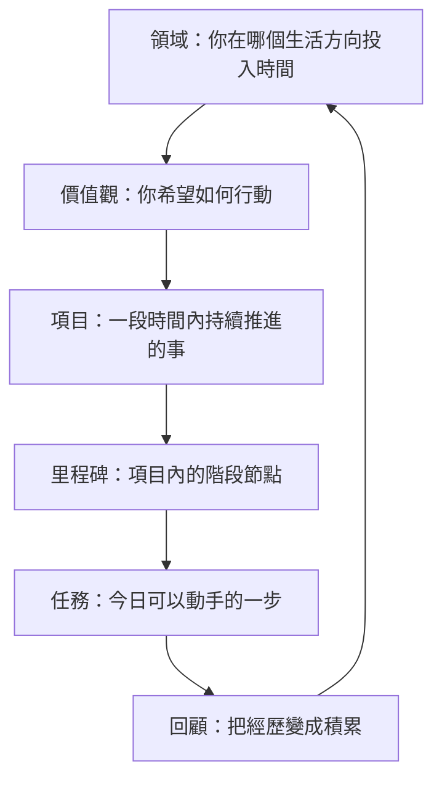

如果你想知道「我應該將一個想法放在哪裏」，可以先這樣判斷：長期方向放在領域，做選擇的原則放在價值觀，需要持續推進的事放在項目，項目內的階段放在里程碑，今日可以動手的一步寫成任務，做完之後用回顧把經驗留下來。

GranoFlow 不只是一個 Todo 清單。它更像一本有結構的生活手冊：先看見你長期在意甚麼，再把它拆成項目和任務，最後透過回顧，將每天的行動和更大的方向重新連起來。

不用一開始就搭好所有結構。你可以先由任務開始，之後再慢慢整理出項目、領域和價值觀。

## 一圖看懂：從大到小

這不是一張必須填滿的表格，而是一套幫你說清楚生活方向的語言。

## 領域

領域是你長期在意的生活方向，例如「工作學習」「人際關係」「身心健康」「業餘創作」。

領域不是任務分類夾，也不是短期目標。它更像你人生地圖上的幾個區域。項目可以歸屬到某個領域，回顧時你亦可以看見自己最近把精力投放到哪裏。

容易混淆的例子：

| 不是領域 | 更適合做 |
|---------|---------|
| 完成一個 App 版本 | 項目 |
| 每星期跑步三次 | 任務或習慣 |
| 工作學習 | ✅ 領域 |
| 身心健康 | ✅ 領域 |

## 價值觀

價值觀不是目標。目標可以完成，價值觀不能一次過打勾完成。

> 「三個月減重 5 公斤」→ 這是目標。
>
> 「我希望長期照顧身體，而不是一直透支自己」→ 這是價值觀。

價值觀的作用，是在你需要做選擇時給你方向：哪些行動更接近你想成為的人？

不需要寫成漂亮的人生宣言。越普通、越真實，越容易長期使用。

## 項目

項目是比任務更大、比人生目標更具體的容器，通常會持續幾日到幾個月。

判斷一件事要不要建立成項目，可以先問自己：

> 這件事今日之內可以完成嗎？

如果今日可以完成，寫成任務就夠了。如果它會反覆佔用注意力，需要拆分、推進和繼續跟進，就適合建立成項目。

## 里程碑

里程碑是項目內的階段節點。它的作用是把大項目拆成幾段，令推進時更清楚。

例如「完成產品版本」可以拆成：

- 完成核心功能
- 修復主要問題
- 準備發布材料
- 提交審核

有了里程碑，你就不是在追趕「整個項目」，而是在推進目前這一段。小項目可以沒有里程碑。

## 任務

任務是 GranoFlow 入面的基本行動單位。一個好的任務，應該令你看完就知道怎樣開始。

好任務：寫完首頁文案、檢查登入流程、整理 10 個測試反饋

不太好的任務：變得更自律、做好產品、學好英文

如果一個任務令你遲遲無法開始，通常不是你太懶，而是它還不夠具體。繼續拆小，直到它變成一個可以動手的動作。

## 回顧

回顧的作用，是把經歷變成積累。

任務完成後，如果沒有回顧，它只是一個被劃掉的清單項。經過回顧，它才更容易變成經驗和判斷。

回顧時可以只問幾個簡單問題：

- 今日完成了甚麼？
- 哪些行動更接近我重視的方向？
- 下一步是甚麼？

:::tip[不必一開始就搭好全部結構]
最簡單的路徑是：先寫任務 → 發現它會持續就建項目 → 項目變大了再拆里程碑 → 回顧時慢慢整理領域和價值觀。結構是慢慢長出來的。
:::
