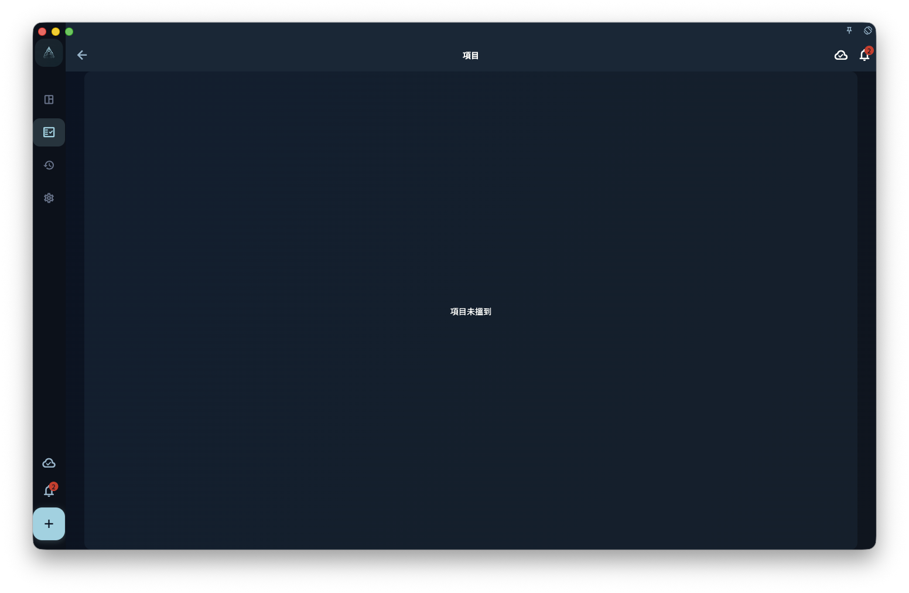

這一章把 ACT（接納與承諾療法）和《幸福的陷阱》的思路，放進 GranoFlow 的領域、價值觀、項目、里程碑、任務和回顧入面。它適合你把長期目標變成今日可以開始的一步，而不是令任務管理變成另一種焦慮。

有了領域和價值觀之後，下一步不是馬上寫一大堆任務。

你需要先問自己：

> 這段時間，我想持續推進甚麼？

這個答案，通常就是項目。

## 項目是甚麼

項目是一段時間內持續推進的目標。

它比任務更大，比人生願望更具體。

例如：

- 完成目前產品版本
- 準備一次考試
- 建立三個月鍛鍊節奏
- 完成第一組漫畫
- 建立個人網站
- 整理一次搬家計劃

這些都適合作為項目。

項目不是一句抽象願望。

例如：

- 變得更自律
- 學好英語
- 改善生活
- 做好產品
- 成為更好的人

這些太大、太虛，不適合直接作為項目。它們更像價值觀、長期方向，或者需要繼續拆分的問題。

一個好的項目，應該能回答：

> 完成到甚麼程度，才算這一階段結束？

<!-- manual-screenshot:id=projects-milestones-detail -->

## 甚麼時候需要建立項目

不是所有事情都需要項目。

如果一件事當天就能完成，直接寫成任務就夠了。

例如：

- 回覆一封電郵
- 買一件東西
- 改一個按鈕文案
- 預約一次身體檢查

這些不需要項目。

但如果一件事符合下面幾種情況，就適合建立項目：

- 需要持續幾天或幾星期
- 需要多個步驟
- 中途可能暫停再回來
- 需要整理資料、任務和階段
- 完成後值得回顧經驗

例如，「寫一篇文章」可能只是任務。  
但「連續寫完一個系列文章」就適合成為項目。

「跑步 20 分鐘」是任務。  
「建立三個月跑步節奏」是項目。

「修一個小 Bug」是任務。  
「完成一個版本發佈」是項目。

項目的作用，是讓持續投入有一個容器。

## 里程碑是甚麼

里程碑是項目裏的階段節點。

它回答的是：

> 目前先完成哪一段？

例如，一個項目叫：

> 完成目前產品版本

它可以拆成幾個里程碑：

- 完成核心功能
- 修復主要問題
- 準備發佈材料
- 提交審核
- 處理審核反饋

一個項目叫：

> 建立三個月鍛鍊節奏

它可以拆成：

- 第一星期適應
- 第一個月穩定
- 第二個月提高強度
- 第三個月形成固定節奏

里程碑不是為了讓項目變複雜。

它的作用是把一個大目標切成幾段，讓你不用每天面對整個項目，只需要知道目前階段是甚麼。

## 小項目可以沒有里程碑

不要為了完整而強行添加里程碑。

如果一個項目很小，只有三五個任務，直接用項目管理就夠了。

例如：

> 整理一次旅行材料

它可能只有幾個任務：

- 確認機票
- 整理護照資料
- 保存酒店訂單
- 檢查行李清單

這種項目不一定需要里程碑。

但如果項目很長，任務很多，或者持續時間超過幾星期，最好加里程碑。否則項目會變成一堆越來越重的任務。

判斷標準很簡單：

> 如果你看着項目覺得不知道從哪裏繼續，就該拆里程碑。

## 項目不要太大

太大的項目會讓人無法開始。

例如：

> 改變人生

這不是項目。

> 學好英語

也太大。

可以拆成更具體的項目：

- 完成一本英語教材
- 堅持 30 天口語練習
- 準備一次英語面試
- 看完一門英文課程

再比如：

> 做好 GranoFlow

也太大。

可以拆成：

- 完成新手手冊第一版
- 修復圖片上載體驗
- 準備公測用戶邀請
- 完成 App Store 審核材料

項目越具體，越容易推進。

如果一個項目永遠無法完成，它就不是一個好項目。它可能應該被拆成多個項目，或者上升為領域和價值觀。

## 項目要能落到任務

項目不能只停留在標題上。

每個項目最後都要落到今天可以做的一步。

例如：

項目：

> 完成新手手冊第一版

里程碑：

> 寫完前 6 章

今天的任務：

> 寫完「項目與里程碑」這一章草稿

這樣你就不會每天面對一個模糊的大目標，而是知道今天到底要推進甚麼。

如果你發現一個項目下面沒有任何任務，通常有兩種可能：

第一，它還只是願望，沒有進入執行階段。  
第二，它太模糊，需要先拆成里程碑或任務。

GranoFlow 的項目不是用來收藏願望的。項目應該幫助你行動。

## 項目可以完成

項目完成，表示這一階段的目標已經結束。

完成不代表它完美，也不代表以後不會繼續做相關事情。

例如：

> 完成第一組漫畫

這個項目完成後，你以後仍然可以建立新項目：

> 完成第二組漫畫

這樣比把所有創作都塞進一個永遠不會結束的「漫畫項目」更清楚。

項目完成後，可以在回顧中看：

- 哪些任務真正推進了項目？
- 哪些階段比預期困難？
- 哪些經驗可以保留到下一個項目？
- 這個項目是否接近我的價值觀？

完成項目，不只是關閉一個容器，也是把一段時間的投入變成經驗。

## 項目可以歸檔或放棄

不是所有項目都必須完成。

有些項目會過期。  
有些項目會失去意義。  
有些項目開始後，你才發現它並不重要。  
有些項目只是當時需要，現在已經不需要了。

這時可以歸檔，或者放棄。

放棄不是失敗。

真正的問題不是「我有沒有完成所有項目」，而是「我有沒有看清它為甚麼不再值得繼續」。

例如：

> 我原本想做這個課程，但現在發現它和目前方向關係不大。先歸檔，之後不再佔用注意力。

這就是有效的回顧。

GranoFlow 不要求你把每一個開始過的項目都做到最後。它更重視：你是否能從行動中看見自己的方向，並及時調整。

## 一個完整例子

領域：

> 工作學習

價值觀：

> 我希望自己成為一個可靠、清楚、能交付的人。

項目：

> 完成 GranoFlow 新手手冊第一版

里程碑：

> 完成前 3 章  
> 完成核心功能說明  
> 完成數據安全說明  
> 完成發佈前校對

任務：

> 寫完「快速開始」  
> 修改「把價值變成行動」  
> 補充「核心概念」  
> 校對術語一致性

回顧：

> 今天完成了項目與里程碑章節。結構比之前清楚，但任務和收集箱還需要單獨寫一章。下一步寫任務系統。

這樣，一條價值觀就被落到了項目、里程碑、任務和回顧裏。

你不是只是在完成待辦事項，而是在用一段時間的行動，靠近自己重視的方向。

## 下一步

有了項目和里程碑之後，就可以開始處理每天的具體行動。

下一章可以繼續閱讀：

> 任務與收集箱：把下一步寫下來。
