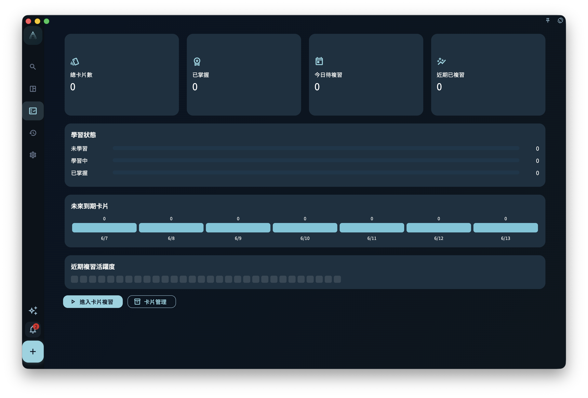
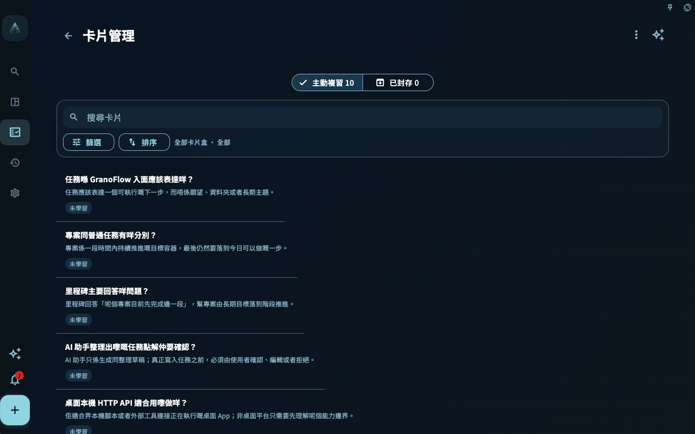

很多人会记任務、做任務、勾掉任務。但如果事情做到這裡就結束了，一天很容易只剩下两种感受：

- 做得不夠多
- 還有很多没做完

這也是為什么，很多任務工具越用越忙，越用越容易讓人觉得自己永远在落後。

GranoFlow 裡的“回顧”，不是為了讓你把一天重新审判一遍。
它的存在，是為了帮你把已经发生的事，从“完成记录”慢慢變成“可以带走的經驗”。

寫下任務，是為了减轻腦中的负担。
完成任務，是為了推进现实裡的事情。
回顧，则是為了把经历變成判断，讓你慢慢知道：

- 什么对自己有效
- 什么只是看上去很忙
- 哪些行動真的接近你重视的方向
- 下一步怎样更清楚

如果你熟悉 ACT（接纳與承诺疗法）或《幸福的陷阱》，可以把回顧理解成一次温和的“承诺行動检查”：

> 我這段時间，是否仍在靠近自己真正重视的方向？

更多背景可以读 [ACT 與《幸福的陷阱》](/zh-hk/value-to-action/act-loop/)。

## 回顧不是自我检讨

回顧不是批评自己。

它不是问：

> 我今天為什么不夠努力？
> 我為什么又拖延？
> 我為什么没有完成所有计划？

這些问题很容易讓回顧變成压力，也会讓你下意识地回避它。

更适合问的是：

> 今天真实发生了什么？
> 我完成了哪些事？
> 哪些行動接近我重视的方向？
> 哪些地方需要调整？
> 下一步是什么？

回顧的目的不是审判自己，而是看清现实。
看清现实之後，你才知道哪些事情值得繼續，哪些事情需要改变，哪些事情可以放下。

## 完成任務只是第一步

任務完成以後，它会成為记录。
但记录本身還不是經驗。

例如，你完成了：

> 写完「任務與收集箱」這一章

如果只是打勾，它只是一个已完成任務。

如果你在回顧裡寫下：

> 今天写完了任務章节。结构已经清楚，但“回顧”這一章需要更明确地区分“沉淀經驗”和“自我检讨”。明天繼續处理回顧系統。

它就變成了經驗。

完成任務告诉你：我做了什么。
回顧告诉你：這件事意味着什么。

這就是回顧真正的价值：
它讓你不是只把一天“用掉”，而是把一天“留下来”。

## 每天只问几个问题就夠了

日回顧不需要很长。
很多時候，真正能持续使用的回顧，反而是短的、真实的、没有表演感的。

每天結束時，你可以只回答几个问题：

- 今天完成了什么？
- 哪件事最接近我重视的方向？
- 哪件事消耗了我，但没有真正推进什么？
- 有什么值得记住？
- 下一步是什么？

你不需要每天写出“深刻洞见”。
有時候，一句简单记录就夠了：

> 今天状态一般，但還是完成了一个关键任務。明天繼續处理剩下的部分。

這也是有效回顧。

回顧的重點，从来不是文采，而是真实。

## 不要只看任務数量

完成很多任務，不一定代表這一天真的有价值。

有時候，你完成了十件小事，但都只是杂务。
有時候，你只完成了一件事，但它真正推进了項目。

所以回顧時，不要只看数量。
更重要的是看：

- 哪些任務推进了項目？
- 哪些任務推动了裡程碑？
- 哪些行動接近價值觀？
- 哪些事情只是讓自己看起来很忙？

GranoFlow 的回顧，不是為了证明你很高效。
它是為了帮你看见：你的時间，是否真的流向了重要的方向。

## 把經驗留下來，之後再複習

有些回顧內容不只是當天有用。

例如：

> 和客戶溝通前，先寫下對方真正關心的限制條件。

這樣的經驗以後還會反覆用到。你可以把它整理成知識卡片，讓它和相關任務保持關聯。之後在任務詳情、日回顧、周回顧或月回顧中看到這些卡片時，可以進入卡片複習，把已經發生過的經驗重新帶回下一次行動。

在任務詳情入面，即使當前還沒有關聯卡片，也可以從「關聯卡片」區域新增一張新卡片，或把已有卡片關聯到這個任務。新增或編輯卡片時，可以選擇基礎卡、雙向卡或填空卡；常用的正面、背面放在主區域，譯文、來源和關鍵詞放在進階選項入面。從任務詳情進入新建卡片時，保存後會自動關聯當前任務。

匯入 Anki 卡片後，不需要即刻將整個卡片盒都變成每日必須完成的負擔。比較穩陣的做法是：只匯入和你最近工作、學習有關的卡片盒；每日新增工作或學習任務時，順手關聯幾張真正相關的卡片。你亦可以直接建立學習任務來關聯已匯入的卡片；如果某張卡片暫時在已封存視圖入面，確認要重新學習時再取消封存。

這會將卡片從「單獨背誦」帶回真實場景。按學習層級看，單純刷卡更偏向識記；將卡片和正在做的任務放在一起，會更快進入理解和應用：你不只是記得答案，還能判斷它適用在哪裡，並在下一次行動裡用出來。

卡片複習不是考試。它更像一次輕量提醒：

- 我還記得這條經驗嗎？
- 我能不能說出它適用的場景？
- 下一次遇到類似任務時，我要不要調整做法？

如果一張卡片已經有譯文，卡片詳情會把譯文放在進階區域；複習時先看問題，再顯示答案，最後用「遺忘、勉強、記得、輕鬆」四檔給自己一個簡單回饋。顯示答案後，如果這張卡片已經不適合繼續學習，可以移到回收站；如果只是想令佢不再進入主動複習，可以選擇封存。封存卡片仍可能在相關任務和回顧上下文中出現，並會標記「已封存」。這兩個動作都會提供撤銷入口。

進展頁的「卡片學習」區域會顯示主動複習卡片數和今日待複習數量，不包含已封存卡片。點擊總卡片數可以進入卡片統計；卡片統計是卡片盒系列的主頁，左上角保留主選單，並提供進入卡片複習和卡片管理的入口。卡片詳情、卡片複習和卡片管理都會作為子頁打開；卡片詳情會返回進入前的來源頁，卡片複習和卡片管理會返回卡片統計頁。

如果想集中整理卡片，可以從統計頁進入卡片管理，在同一頁查看主動複習和已封存卡片，搜尋、篩選、排序、編輯、封存、取消封存，或把不再需要的卡片移到回收站。

在卡片管理頁，正文工具區只保留搜尋、篩選同排序。卡片盒選擇放在「篩選」面板入面；匯入卡片盒、匯出目前卡片盒、匯入 Anki 卡片盒同匯出 Anki 卡片盒放在頁面級「更多」選單入面。當前 Anki/APKG 匯入只承接卡片內容：圖片和音訊附件會落到本機媒體資產；影片卡片盒預設不開放，只在測試或內測構建中開啟。卡片盒引用遠端媒體時，GranoFlow 不會靜默下載或保留遠端連結；少量遠端媒體會讓你先查看連結並選擇清除後匯入，過量遠端媒體會直接拒絕。完整的 Anki 模板、牌組配置、複習歷史無損遷移仍不屬於當前能力。

如果只是想在 GranoFlow 之間分享或遷移一個卡片盒，可以使用 GranoFlow 自有的 `.deck.grano` 卡片盒包。它和完整數據備份 `.flow.grano` 不同，亦不取代 Anki/APKG：匯出時只能選擇頂層卡片盒，會自動帶上它的子卡片盒和未刪除卡片；學習記錄預設不包含，只有你在匯出設定入面開啟「包含學習記錄」才會寫入。匯出需要一個 `GF1-DESK-...` 格式的版權 token，token 用來確認再次匯出時的持有關係，不是防複製或強 DRM。

匯入 `.deck.grano` 前，GranoFlow 會先顯示預覽，再由你確認。匯入不會建立任務本體，只會保留這部裝置上仍然存在的任務關聯；沒有有效任務關聯的卡片會進入已封存卡片。學習記錄預設不匯入，只有你在匯入預覽入面開啟「匯入學習記錄」才會合併。

<!-- manual-screenshot:id=review-card-statistics-main -->


<!-- manual-screenshot:id=review-card-management-main -->


<!-- manual-screenshot:id=review-card-study-answer -->


## 回顧項目，而不是只回顧当天

除了每天回顧，也要定期回顧項目。

因為人很容易陷入一种状态：

> 每天都很忙，但項目没有真正前进。

項目回顧可以帮助你避免這种情况。
你可以问：

- 這个項目還重要吗？
- 当前裡程碑是否清楚？
- 哪些任務真正推进了它？
- 哪些任務只是绕路？
- 這个項目是否還符合我的價值觀？
- 下一階段應该繼續、调整、归档，還是放弃？

如果一个項目长期没有推进，不一定是你懒。
可能是它太大、太模糊，或者已经不再重要。

這時要做的，不是责备自己，而是重新整理。

## 中断後，从回顧重新开始

人生会中断。

你可能几天没打開 GranoFlow。
也可能某个項目停了几周。
也可能之前写的任務已经过期。

這時不要补账。
不要试图把断掉的每一天都补回来。那只会增加压力，也会讓你更难回来。

更好的方式，是做一次简短回顧：

> 這段時间发生了什么？
> 哪些事情已经不重要了？
> 哪些項目還值得繼續？
> 今天能重新开始的最小一步是什么？

中断不是失败。
真正重要的是：回来之後，你還能重新看见方向，並做出下一步行動。

回顧在這裡的作用，不是讓你“补交作业”，
而是帮你温和地恢復行動感。

## 回顧也帮助你放下

回顧不只是帮助你繼續。
它也帮助你放下。

有些任務不再需要做。
有些項目不再值得推进。
有些目標只是过去某个階段的想法。
有些计划听上去正确，但其实已经不适合現在的你。

如果不回顧，它們会一直占用注意力。

你可以在回顧中寫下：

> 這个項目已经不适合当前方向，先归档。之前的尝试讓我确认，我現在更需要专注另一个項目。

這不是失败。
這是把过去的投入，转化成判断。

很多時候，真正讓人轻松下来的不是“终于全做完了”，
而是“我终于看清楚，有些事可以不再繼續了”。

## 回顧如何帮助你校准價值觀

價值觀不是写完就結束。
它需要在回顧中被验证。

你可以对照自己的價值觀，看最近的行動是否真的接近它。

例如，你写过：

> 我希望自己成為一个可靠、持续交付的人。

回顧時可以问：

> 最近我是否真的在交付？
> 我有没有把很多時间花在准备、犹豫和反复修改上？
> 下一步怎样更接近“可靠交付”？

再例如，你写过：

> 我希望长期照顾身体，而不是一直透支自己。

回顧時可以问：

> 最近我是否给身体留下恢復空间？
> 我是不是只在身体出问题後才注意它？
> 明天能做一个什么小调整？

價值觀提供方向，回顧检查方向是否還在现实中发生。
所以，回顧不是附属动作，而是“价值 → 行動”這条路上的闭环。

## 讓 AI 帮你整理，但不要替你判断

你可以把回顧内容导出或复制给外部 AI（人工智能），讓它帮你整理本周做了什么、哪些項目推进了、哪些任務反复拖延。

AI 适合做整理、归纳和提醒；最终判断仍然應该由你决定。因為只有你知道：哪些事情真的重要，哪些事情只是看起来合理。

## 一个简单的回顧模板

如果你不知道怎么开始，可以直接用下面這个模板：

```text
今天完成了什么？

哪件事最接近我重视的方向？

今天有什么困难或偏离？

我学到了什么？

下一步是什么？
```

## 下一步

当你开始通过回顧沉淀經驗之後，可以繼續把這条闭环看得更完整：

- [先确定长期方向](/zh-hk/value-to-action/long-term-direction/)：理解你在用哪些價值觀為行動定向。
- [項目與裡程碑：把长期方向拆成階段目標](/zh-hk/value-to-action/projects-and-milestones/)：检查回顧如何帮助項目繼續推进。
- [AI 辅助：整理你的记录，不替你做决定](/zh-hk/value-to-action/ai-assistance/)：理解 AI 在回顧中的合适角色。
