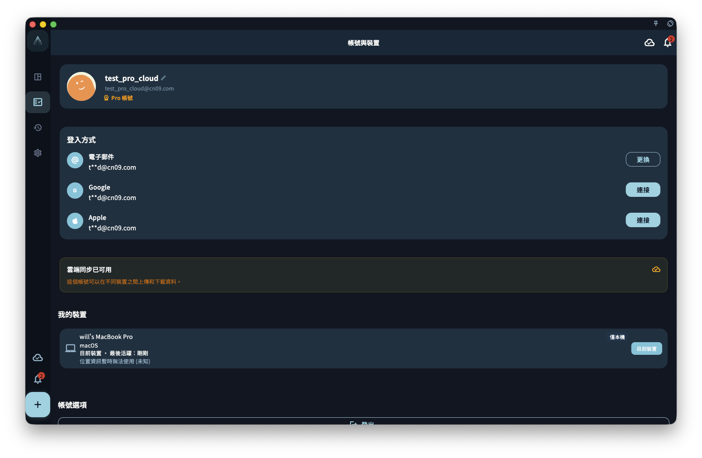

瞭解帳號負責登入、同步身份、設備列表和訂閱狀態，但不替代本地資料備份。

## 從哪裡開始

從帳號設定進入。帳號用於登入身份、同步身份、設備列表和訂閱識別；它不等於本地資料本身。

<!-- manual-screenshot:id=account-overview-profile -->

## 怎麼操作

- 註冊或登入後，確認當前帳號是否是你希望同步和訂閱識別使用的帳號。
- 在設備管理裡查看已登入設備；移除設備前，先理解它影響的是帳號關聯，而不是一定清除該設備本地資料。
- 執行退出、重置、刪除等危險操作前，先確認是否已有備份以及是否會影響遠端資料。

## 結果和邊界

帳號狀態會影響同步、訂閱和設備識別。切換帳號後看到的遠端狀態可能不同，本地仍可能保留當前設備上的資料。

- 退出登入不是刪除帳號；刪除帳號也不等於清理每臺設備上的本地副本。
- 危險操作通常需要確認，遇到不確定影響範圍時先停止。

## 下一步

如果問題和訂閱有關，繼續閱讀“訂閱總覽”；如果和本地資料有關，繼續閱讀“備份與復原”。
