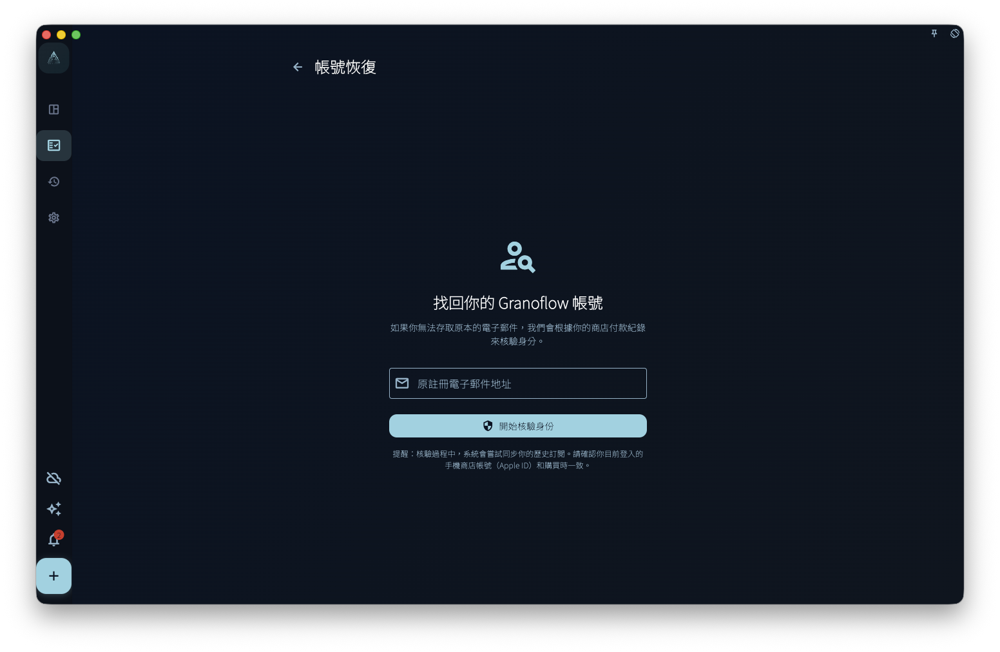

如果你曾經透過 App Store 或 Google Play 購買 GranoFlow 會員，但目前帳號看不到會員權益，帳號恢復可以讓你提交一次核對申請：系統會檢查商店購買紀錄是否可以對應到你填寫的信箱。

帳號恢復只處理「購買紀錄可能連到另一個帳號」這個問題。它不是刪除帳號、登出、恢復購買、恢復本機資料，或找回加密金鑰的入口。

## 什麼時候使用帳號恢復

適合使用帳號恢復的情況：

- 你確定自己曾經透過 App Store 或 Google Play 購買 GranoFlow
- 你目前登入的帳號看不到會員權益
- 你不確定當時用哪個信箱註冊或連接購買紀錄

不適合使用帳號恢復的情況：

- 你只是想恢復目前平台的訂閱：請使用「恢復購買」
- 你的本機資料不見了：請查看「備份與恢復」
- 你想找回加密金鑰：請查看「加密與恢復金鑰」

## 操作步驟

1. 在登入頁面或帳號相關頁面找到「帳號恢復」連結。
2. 填寫你想用來核對的信箱。
3. 確認這台裝置可以存取當時購買 GranoFlow 的 App Store 或 Google Play 帳號。
4. 提交申請，然後按照頁面提示等待核對結果，或查看相關信件。

## 可能的結果

| 結果 | 含義 |
|------|------|
| 申請已提交 | 系統已收到申請。請按頁面提示等待，或查看信件 |
| 沒有歷史記錄 | 目前平台下找不到可用來核對的購買紀錄 |
| 記錄不符合 | 商店購買紀錄和你填寫的信箱無法透過目前驗證連接起來 |
| 暫時失敗 | 網路或服務暫時無法使用。你可以稍後重試 |

:::caution[別急著刪資料]
如果你懷疑自己登入了錯誤帳號，**先不要刪除本機資料**。先確認目前登入信箱，再檢查訂閱頁和裝置管理。
:::
