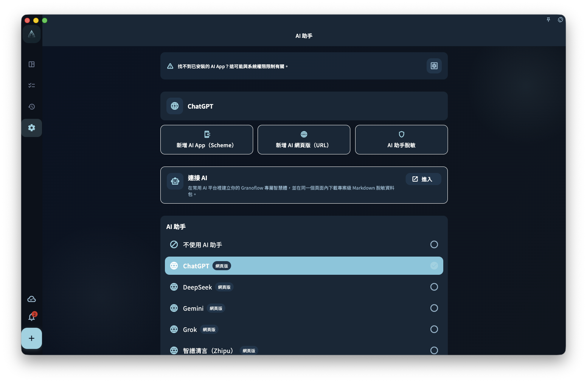

想像你剛開完會，會議紀錄複製到了剪貼簿，裏面有一堆「要做的事」。剪貼簿助手可以幫你把這些文字整理成一張任務清單，你確認後再寫入。

## 怎麼用

1. 先複製你想整理的內容（會議紀錄、郵件片段、隨手記……）
2. 打開 GranoFlow 的剪貼簿助手入口
3. AI 會分析內容，提取出它認為是「待辦事項」的部分
4. 你看一下預覽，調整或確認
5. 寫入任務

## 什麼內容適合用

- 會議紀錄裏的行動項
- 郵件裏需要跟進的事
- 聊天紀錄裏答應過別人的事
- 筆記裏的隨手待辦

## 注意事項

- AI 整理的是它「理解」出來的任務，可能有誤判，比如把背景說明當成待辦
- 確認前一定要看一遍預覽
- 內容不會在背景自動發送，只有主動觸發才進入處理流程

:::tip[不想發整段文字？]
可以先刪掉剪貼簿裏不相關的內容，只保留你真正想整理的部分，再觸發助手。
:::
