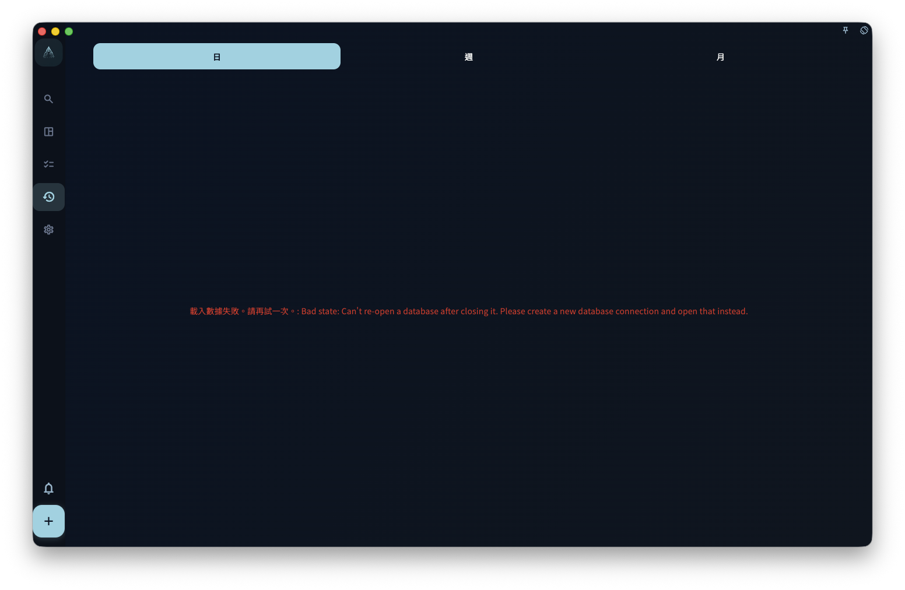

「回顧今日任務」適合在日回顧時使用。它讓 AI 和你一起整理當天任務、經驗教訓和後續安排，並把你確認過的結果寫回任務、當天涉及的領域日報，以及你確認要安排的新任務。

AI 只會準備建議。標題、任務回顧、日報內容和新建任務，都需要你在 GranoFlow 裡確認後才會寫入。任務開始時間、結束時間和耗時只會作為只讀上下文提供給 AI，不能透過這個流程寫回。

## 從哪裡開始

打開日回顧，在右側欄找到「回顧今日任務」。如果今天沒有可回顧的任務，入口會保持不可用，並提示今天還沒有可回顧的任務。

只要當天有可回顧任務，右側欄會直接顯示「回顧今日任務」。

## AI 會和你討論什麼

AI 會依照當天任務生成一張表，按已記錄時間順序列出任務標題、時間上下文和複盤線索。時間只幫助 AI 理解當天脈絡；真實時間修正需要你在任務列表或任務詳細資料裡手動完成。AI 會整理當天涉及的領域、專案和里程碑推進。

你負責說明真實情況、遇到的問題和經驗教訓。AI 負責記錄、理解和整理，不替你下結論。

## 可以寫回哪些欄位

確認匯入時，只允許寫回這兩類任務欄位、當天涉及領域的日報內容，以及你確認要建立的新任務：

| 欄位 | 用來做什麼 |
| --- | --- |
| 任務標題 | 修正標題裡的表達 |
| 任務回顧 | 儲存你確認後的任務級複盤內容 |

AI 不能透過這個流程改任務時間、任務描述、標籤、提醒或既有任務截止日期。它可以在你確認後新建任務，但只支援任務標題、日期，以及可選的專案 / 里程碑綁定；如果你在對話中說不安排任務，就不會建立任務。專案推進和里程碑推進只會作為當天日報內容的一部分儲存，不會直接改專案或里程碑資料。

## 匯入前會確認

AI 輸出結果後，你需要把結果複製回 GranoFlow。GranoFlow 會先顯示底部確認介面，讓你檢查將要修改的任務、日報寫入摘要，以及將新建的任務。確認介面不會要求你編輯 JSON。
如果不確認，什麼都不會寫入。確認後，你仍然可以在任務詳情裡繼續手動調整。

<!-- manual-screenshot:id=ai-daily-task-review-import-confirm -->

## 寫回後在哪裡看

寫回的任務回顧會出現在完成或封存任務詳情裡的「任務回顧」區域。任務完成或封存後可以編輯；如果之後把任務恢復為未完成，已有回顧不會被清空，但任務詳情會先隱藏任務回顧，直到任務再次完成或封存。
