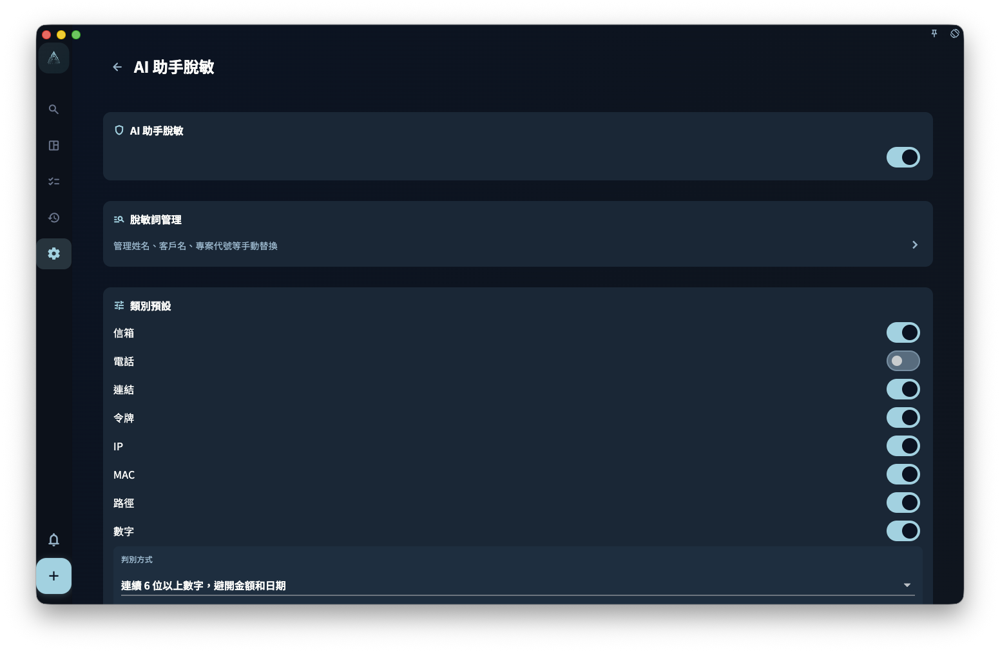

如果你只是瀏覽任務、寫日記、做回顧，GranoFlow 不會把這些內容發送給 AI。只有當你主動點了某個 AI 功能時，與這次操作有關的文字才可能進入 AI 處理流程。

<!-- manual-screenshot:id=ai-redaction-settings -->

## 不同功能會發送什麼

| AI 功能 | 可能發送的內容 |
| --- | --- |
| 標題解析 | 你目前正在輸入的任務標題 |
| 剪貼簿助手 | 你複製到剪貼簿的文字 |
| Helper 提示詞 | 目前頁面的說明 + 你設定的提示詞 |
| 任務助手 | 目前任務的標題、狀態、截止日期、提醒、任務回顧、標籤、描述摘要、附件名稱摘要、節點、所屬專案 / 里程碑摘要、資料包摘要，以及這條任務已關聯的卡片摘要 |
| 回顧 AI 整理 | 你這次觸發整理的回顧內容 |

任務助手不會預設傳送目前專注工作階段、哪條任務被置頂、任務詳情按鈕是否可點這類頁面執行狀態。它看到的是任務內容與上下文；如果你只是想問任務詳情裡的「專注」「完成」「目前任務」是什麼意思，更適合使用該頁面的 Helper 提示詞。

## AI 脫敏設定有什麼用

AI 脫敏設定只影響內容發出前的替換，不代表 AI 會自動判斷所有敏感資訊。

這裡有四個關鍵項目：

- **總開關**：關閉後，GranoFlow 不會執行出站脫敏替換。
- **類別預設策略**：當系統依規則發現郵箱、連結、日期、長數字、金額、銀行卡、IBAN 等內容時，預設處理為「脫敏」或「允許」；電話預設允許，可以依需求開啟。
- **電話、數字和金額設定**：電話開啟後可以選擇辨識地區，地區選擇器支援搜尋地區名、英文名、代碼或電話區號；電話區號只幫助你找到地區，實際辨識依你儲存的地區選擇執行。數字可以設定最少位數並替換成「數字」或「編號」；金額可以選擇是否辨識符號/貨幣代碼與中文大寫金額，並設定替換成「金額」或「數額」。
- **脫敏詞管理**：維護你手動確認的固定「敏感詞 → 代號」規則，例如客戶名、公司名或專案代號。

自動發現只是規則輔助，不是智慧審查。它可能遺漏特殊寫法，也可能把普通數字誤判為敏感內容。類別預設策略為「脫敏」時，自動發現值會暫時替換成更容易讀懂的短期脫敏值，例如 `13xxxxx4821`、`foxxxx3920@1846.com`、`2026-08-17`、`192.43.18.206`，並在 AI 返回後嘗試還原；它不會自動寫進你的長期脫敏詞表。**發送前仍需要你自己檢查。**

## 自動脫敏值長什麼樣

規則型自動發現會盡量保留類型形狀，讓 AI 能判斷它看到的是電話、郵箱、連結、日期、金額、銀行卡、IBAN、IP、MAC、token 或檔案路徑。

- 數字、電話、銀行卡與類似帳號：6 位及以上保留前兩位真實數字，中間用 `x`，最後 4 位用短期穩定隨機數字；不足 6 位會替換成同長度隨機數字。
- 金額：保留幣種或金額標記，並保留大致金額量級，便於 AI 做粗略分析，但不會保留精確金額。
- 日期：保留年份，月份與日期替換成合法隨機值。
- 郵箱與連結：保留可識別結構，網域會變成短期隨機數字網域，例如 `1846.com`。
- 路徑：保留常見結構詞與副檔名，其他片段替換成隨機字母。

AI 請求封包與本地 HTTP AI 助手匯出結果還會帶有 `isRedacted` 與 `redactionReason`。`isRedacted: true` 表示這次請求已完成脫敏流程；`false` 表示脫敏被關閉、請求封包無法確認或缺少脫敏元資料，具體原因會寫在 `redactionReason` 裡。

## 脫敏詞會做什麼

你在「脫敏詞管理」裡維護的詞表，會在內容發出前依你設定的代號自動替換。具體用法請看「脫敏詞」頁面。

## 一句話總結

> GranoFlow 的 AI 只在你主動觸發功能時才會涉及資料；不會背景蒐集，不會自動上傳，發送範圍只限目前功能需要處理的相關文字。
