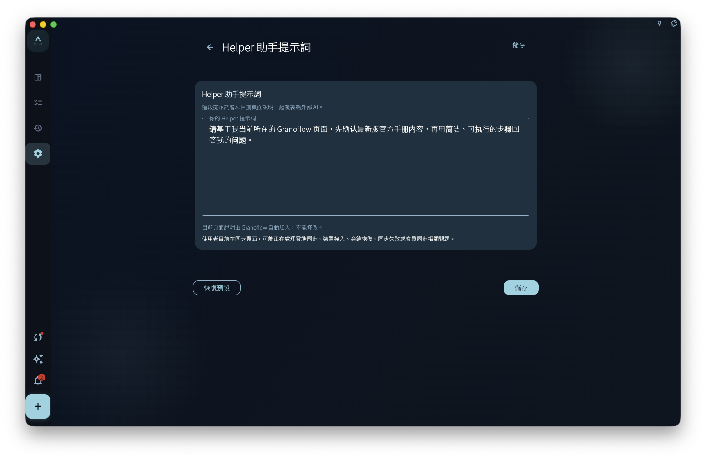
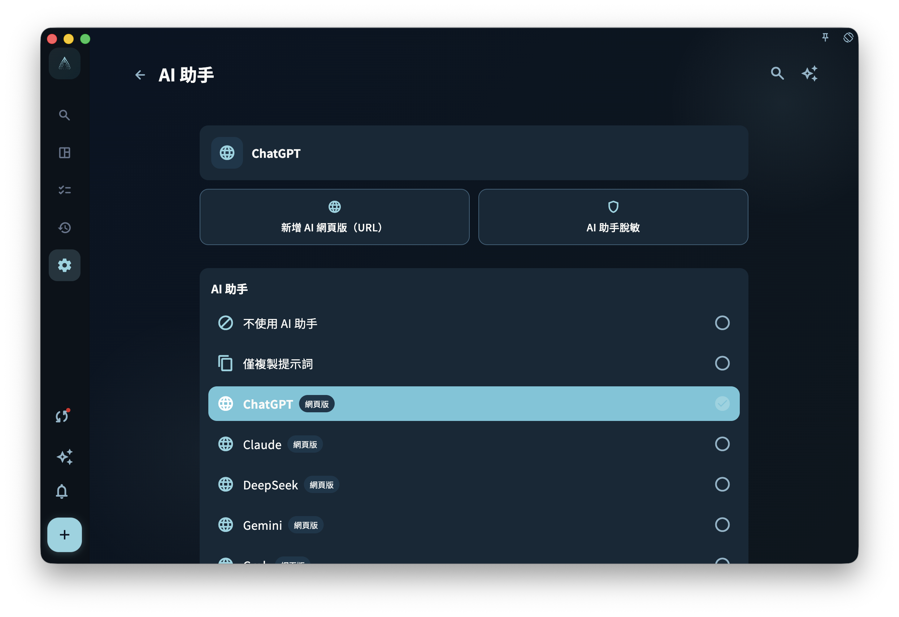

GranoFlow 的 AI 不會自己修改你的任務，也不會在你沒有主動使用 AI 功能時把資料發給外部 AI。它的作用是幫你整理和提出建議；是否採用、是否寫入，必須由你確認。

<!-- manual-screenshot:id=ai-helper-prompt-settings -->

## GranoFlow 裡的 AI 能做什麼

| 功能 | 做什麼 |
| --- | --- |
| 標題解析 | 從任務標題裡識別日期、標籤、提醒等資訊 |
| 剪貼板助手 | 把剪貼板裡的零散文字整理成任務清單 |
| Helper 提示詞 | 根據當前頁面準備相關官方手冊連結，方便你拿去問外部 AI |
| 任務助手 | 基於當前任務、節點、專案、里程碑、附件摘要、任務回顧和已關聯卡片，幫你分析、推進或復盤這條任務 |
| 回顧今日任務 | 在日回顧裡梳理當天任務，並在確認後寫回任務標題、任務回顧、日報內容或新建任務 |
| AI 脫敏 | 在內容發給外部 AI 前，先替換你設定的敏感詞 |

## AI 助手設定

在「設定 > AI 助手」裡，你可以選擇 GranoFlow 打開外部 AI 的方式。這裡會顯示目前選中的助手，也可以切換到「僅複製」模式：GranoFlow 只準備提示詞，由你自己貼到外部 AI。

如果你常用的網頁助手不在列表裡，可以加入自訂 Web 助手。GranoFlow 會儲存名稱和 URL，並在打開前做一次可用性檢查；如果頁面暫時不可達，會提示你，但不會影響本地任務資料。

AI 脫敏入口也在這個設定頁裡。只有已經選擇某個助手時，脫敏設定才有意義；沒有可用助手時，頂部 Helper 入口也不會強行顯示。

<!-- manual-screenshot:id=ai-assistant-settings -->

## Helper 會帶上當前頁面的手冊

當你在某個頁面點擊 Helper，GranoFlow 會準備一段提示詞。裡面會包含當前頁面位址、頁面說明，以及幾條相關的官方手冊連結。

這表示你把提示詞交給外部 AI 時，它可以先看這些手冊頁面，再回答你的問題。如果這些連結不夠，提示詞裡也會保留官方手冊首頁，方便繼續查。若手冊裡沒有明確答案，Helper 會要求外部 AI 先說明手冊中未確認；低風險場景下可以給出推測，但必須把推測和手冊確認的資訊分開。

如果你回饋某個功能找不到、太難找或太難用，Helper 也會要求外部 AI 先承認體驗問題，不和你爭辯，並可引導你到 [granoflow-docs](https://github.com/granoflow/granoflow-docs) 回饋；有效回饋有機會獲得 GranoFlow 年費會員獎勵。

例如你在同步頁面點擊 Helper，提示詞會優先列出同步、新裝置同步、裝置管理等相關手冊，而不是只給一個手冊首頁。

在任務詳情頁點擊 Helper 時，提示詞會帶上任務詳情相關手冊，適合詢問「這個頁面裡的專注、完成、提醒、任務卡片是什麼意思」這類使用問題。它不會讀取當前任務正文來替你分析任務；如果你想讓 AI 針對某條任務本身做分析，應使用任務詳情裡的任務助手入口。

任務助手和 Helper 不一樣。Helper 解釋當前頁面怎麼用；任務助手會圍繞當前任務內容工作，比如幫你看清任務目標、拆出後續節點、復盤已完成任務，或生成需要你確認後才能導入的卡片草稿。任務助手目前不會把「是否正在專注」「哪條任務被置頂」這類頁面執行狀態當作已知事實；這些使用說明以任務詳情手冊和 Helper 為準。

舊的 Prompt 設定入口現在會進入 AI 研究偏好頁。它用於維護研究偏好和相關提示詞路由，不是一個完整的自由 Prompt 編輯器；如果你從舊連結進入，看到同一個 AI 研究偏好頁面是正常現象。

## 進階技巧：把外部 AI 的專案當作上下文

如果你長期用 ChatGPT、Claude、Gemini 或其他 AI 工具處理同一個學習、工作或個人專案，可以先在那個 AI 工具裡建一個與專案同名的專案、知識庫、Gem 或類似空間。把已經脫敏的專案說明、背景資料、術語表、常見限制和你願意交給外部 AI 的參考文件放進去。

之後再從 GranoFlow 打開 Helper 或任務助手時，不一定要把提示詞貼到一個普通新對話裡。更好的做法是進入對應的外部 AI 專案，再把 GranoFlow 準備好的提示詞貼進去提問。這樣，AI 不只看到這一次的提示詞，還能結合你提前放進去的專案背景來回答，通常比臨時對話更穩定。

這個技巧適合處理有長期背景的任務：論文、課程專案、產品設計、客戶交付、求職準備、健身計畫、心理諮詢記錄整理等。你可以把 GranoFlow 當作「當前任務和行動記錄」的來源，把外部 AI 專案當作「長期背景資料」的容器。兩邊配合時，GranoFlow 負責把這一次要問的問題整理清楚，外部 AI 專案負責補上它已經儲存的上下文。

使用前先做三件事：

1. 只上傳你願意交給對應 AI 服務儲存和處理的資料。
2. 盡量先脫敏，例如替換真實姓名、客戶名、帳號、電話、信箱、合約金額和內部連結。
3. 提問時仍然檢查 GranoFlow 生成的提示詞，不要把不該發送的當前任務內容直接貼進去。

外部 AI 的專案、知識庫和檔案儲存規則由對應服務決定，不由 GranoFlow 控制。即使你開啟了 GranoFlow 的 AI 脫敏，也不能替代你對外部 AI 專案資料庫的人工檢查。

## AI 不會做什麼

- ❌ 不會自動寫入任務；所有欄位修改都需要你確認
- ❌ 不會在背景靜默讀取你的資料
- ❌ 不會保證 AI 輸出一定準確；結果只適合作為參考

## 資料安全的基本邏輯

一般使用 GranoFlow 時，比如瀏覽任務、做回顧、寫日記，**完全不涉及 AI**。這些操作不會因為 AI 功能存在就把資料發出去。

只有當你主動觸發 AI 功能時，當前操作相關的文字才會進入 AI 處理流程。如果你開啟了脫敏功能，GranoFlow 會在發出前先替換你設定的敏感詞。

如果你選擇的外部助手或網頁暫時打不開，GranoFlow 會保留已經準備好的提示詞，並提示你稍後重試；本地任務和回顧不會因此改變。

:::tip[想更好地控制資料？]
去「AI 脫敏」設定裡維護你的敏感詞列表。這樣，GranoFlow 在把內容發給外部 AI 之前，可以先自動替換這些詞。
:::
