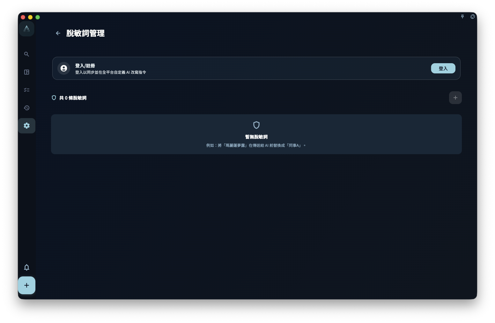

如果你不想把客戶名、公司名、專案代號等原文直接發給外部 AI，可以把它們加到「去識別化詞彙」。GranoFlow 會在發給外部 AI 之前，依照你設定的規則把敏感詞替換成代號，例如把「客戶A公司」替換成 `CLIENT_A`；AI 回覆後，GranoFlow 會嘗試把代號還原成原文。

<!-- manual-screenshot:id=ai-redaction-terms-settings -->

## 適合新增什麼詞

適合新增的是你經常會寫進內容裡、但不希望原樣發給外部 AI 的固定詞語：

- 客戶名、公司名
- 專案代號，例如「獵鷹計劃」這類內部叫法
- 固定電子郵件、固定地址
- 合約金額、帳號資訊
- 其他你認為不適合直接暴露給外部 AI 的常用詞

## 新增詞條的步驟

1. 打開 AI 設定裡的「去識別化詞彙」。
2. 新增一筆詞條。
3. 在「敏感詞」填寫原文，例如「客戶A公司」。
4. 在「代號」填寫替換後的佔位符，例如 `CLIENT_A` 或 `PROJECT_X`。
5. 儲存。下次使用 AI 功能並需要發送內容時，這條規則會自動生效。

即使截圖無法顯示，你也只需要記住：一筆去識別化詞彙就是一組「原文 → 代號」規則。

## 去識別化 vs 允許

每個詞條有兩個狀態：

- **去識別化**：發給外部 AI 之前，GranoFlow 會把敏感詞替換成代號；AI 回覆後，會嘗試把代號還原。
- **允許**：GranoFlow 不會替換這個詞。適合你確認這個詞不敏感、不需要去識別化的情況。

如果你不確定，先用「去識別化」會比較穩妥；如果你確認某個詞可以原樣發送，再設為「允許」。

## 這能保證絕對安全嗎

不能。去識別化詞彙是輔助工具，不是安全保證。

它有這些邊界：

- 可能漏掉縮寫、別名、錯字或其他變體寫法。
- 只處理你已經設定的詞，不會自動掃描和辨識全部敏感資料。
- 外部 AI 收到去識別化後的內容後，GranoFlow 無法控制外部 AI 如何處理這些內容。

發送重要內容前，仍然建議你手動檢查一遍。

:::tip[訂閱功能]
去識別化詞彙是訂閱會員專屬功能。未訂閱用戶可以查看界面，但無法自訂編輯。
:::
