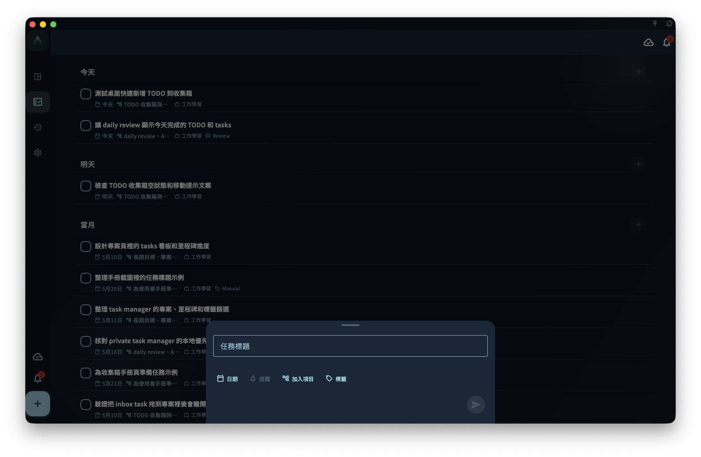

如果你想把「明天下午三點和張總開會 #工作」這類標題快速整理成任務資訊，可以直接把完整句子輸入標題欄；GranoFlow 會嘗試從標題裡識別時間、標籤、專案和提醒，並顯示成建議，等你確認後才會套用到任務。

確認並新增之後，任務會依實際欄位出現在收集箱或任務頁。截圖展示的是一個帶 `#release` 的範例任務在任務頁裡的結果狀態。

## 標題解析可以識別什麼

當你輸入任務標題時，GranoFlow 會嘗試從文字裡找出可以整理成任務欄位的資訊。它可能識別：

- **時間表達**：今天、明天、下週三、3月15日、下午三點……
- **標籤**：#工作 #個人 這類井號標籤
- **專案提及**：和你既有專案名稱相匹配的文字
- **提醒觸發詞**：提醒我、別忘了、記得……這類表達

## 識別後會發生什麼

識別結果會先以建議形式顯示，**不會自動寫入任務**。你可以依照實際需要處理：

- ✅ 接受全部建議
- ✅ 只接受其中一部分，例如只加標籤，不加日期
- ✅ 忽略建議，繼續依原樣輸入標題

只要你沒有確認，建議就不會改變任務內容。

## 識別不準怎麼辦

標題解析不是 100% 準確。如果某個詞被誤識別，或建議不是你想要的結果，可以這樣處理：

- 直接忽略這則建議；不接受就不會寫入任務
- 開啟任務詳情，手動調整正確的欄位

:::note[英文日期表達也能識別]
標題裡寫 "tomorrow 3pm" 或 "next Monday" 也能被識別，不一定要用中文。
:::
