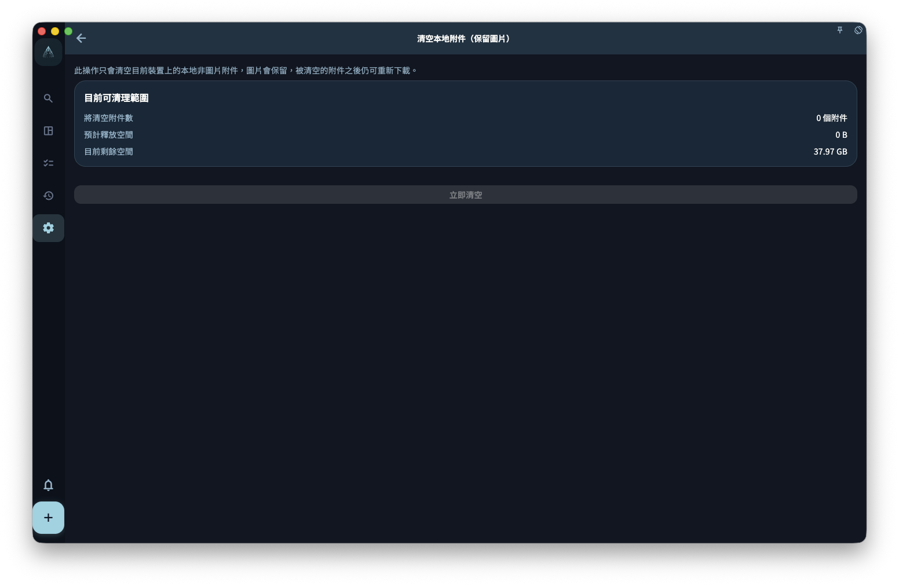

如果你擔心圖片是不是會跟任務一起安全保存，先記住一句話：文字任務和圖片附件是分開儲存、分開同步的。文字可能已經出現在另一台裝置，圖片還在上傳；清除本機附件只會清掉這台裝置上的附件檔案，如果圖片從未成功上傳，清掉後就找不回來了。

## 圖片和文字有什麼不同

- **文字任務**：內容小，同步快，通常很快就能在本機和雲端保持一致
- **圖片附件**：檔案大，同步慢，可能在文字任務已經同步後還沒傳完

所以，你在另一台裝置看到任務已經出現，但圖片暫時沒有顯示，不一定代表任務遺失。通常先確認網路穩定，再給圖片一些上傳和下載時間。

## 刪除圖片附件是什麼意思

處理圖片相關內容時，要分清楚兩件事：

- **從任務移除**：只是不再讓這個任務關聯這張圖片；這台裝置上的本機檔案可能還在
- **清除附件快取**：刪除這台裝置上保存的附件檔案，用來釋放本機儲存空間

清除附件快取以後，如果圖片之前已經成功上傳到雲端，之後通常可以重新下載。但是，如果圖片從來沒有成功上傳，清除本機附件後就沒有可恢復的來源。

## 本機備份會包含圖片嗎

本機備份通常只包含文字資料，例如任務、專案、回顧記錄等，**不一定包含圖片檔案**。如果你需要長期保留圖片，重點是讓雲端同步維持正常，並確保圖片有機會在有網路時完成上傳。

:::note[圖片上傳需要網路]
圖片不會離線上傳。例如你在捷運裡拍了一張照片並附到任務上，這張圖片要等到下次有網路時，才會繼續上傳到雲端。
:::
