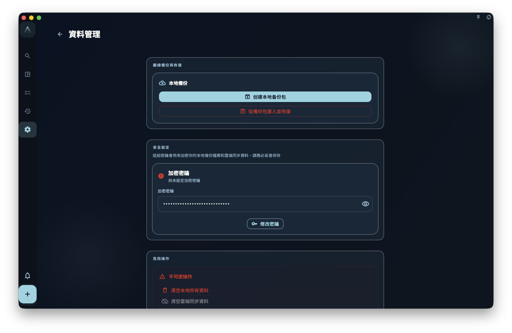
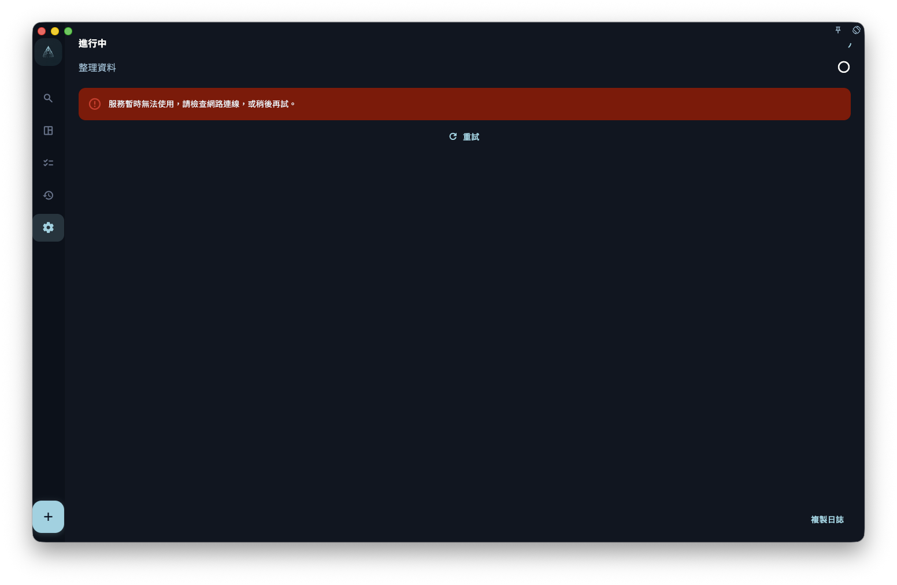

如果你想在誤刪、換設備或重裝系統前保留一份可以回復的資料，請到 GranoFlow 設定裡的資料/備份頁面手動匯出備份檔，並把檔案存到你自己找得到、能掌控的位置。

## 備份和同步有什麼差別

備份是一份「某個時間點的資料副本」。同步是把目前資料同步到雲端或其他設備。它們解決的問題不一樣。

| | 備份 | 雲端同步 |
| --- | --- | --- |
| 會保留歷史狀態嗎？ | ✅ 是某個時間點的快照 | ❌ 只代表目前狀態 |
| 誤刪後能回到舊狀態嗎？ | ✅ 可以還原到建立備份時的狀態 | ❌ 刪除通常也會同步到雲端 |
| 需要你主動操作嗎？ | ✅ 需要手動匯出並儲存檔案 | ✅/❌ 同步會自動進行，但不保留歷史版本 |

## 什麼時候應該做備份

建議在這些情況之前先匯出一份備份：

- 升級 App 大版本之前
- 換手機、換電腦或重裝系統之前
- 刪除大量任務或專案之前
- 完成一個重要階段後，想保留當時的記錄

## 怎麼做備份

1. 打開 GranoFlow 設定。
2. 進入資料/備份相關頁面。
3. 選擇匯出備份。
4. 等待匯出完成，處理期間不要重複點擊或關閉頁面。
5. 把匯出的備份檔存到你能掌控的位置，例如 iCloud、本機資料夾或電腦。

## 怎麼從備份還原

1. 打開 GranoFlow 設定。
2. 進入資料/備份相關頁面。
3. 選擇匯入備份。
4. 找到之前儲存的備份檔。
5. 確認匯入後，等待還原完成，處理期間不要重複操作。

:::caution[還原會覆蓋目前資料]
從備份還原是覆蓋操作。匯入後，目前設備上的資料會被備份檔裡的資料取代。如果你想保留目前設備的最新內容，請先匯出一份目前備份，再匯入舊備份。
:::
