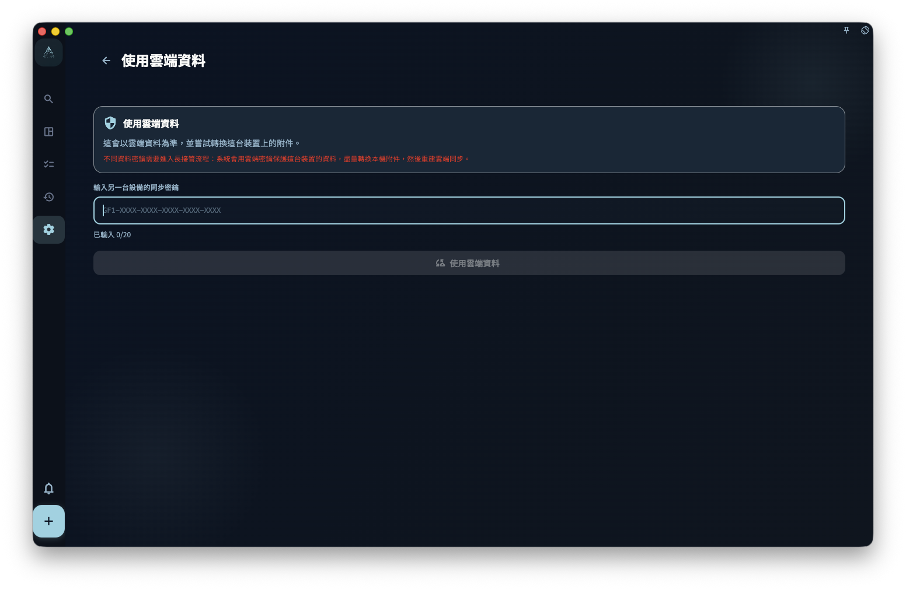

你現在最需要做的是：趁舊裝置還能打開 GranoFlow 時，把雲端同步金鑰存到密碼管理器或其他安全的地方。之後換裝置、重新安裝 App，或看到「同步金鑰不相符」提示時，GranoFlow 可能會要求你輸入這把金鑰；沒有它，雲端加密資料可能打不開。

GranoFlow 的雲端同步資料使用端對端加密。加密金鑰就像保險箱鑰匙：**沒有它，連 GranoFlow 自己的伺服器也無法讀取你的資料**。這也代表：**如果你自己遺失金鑰，GranoFlow 無法幫你重設或找回。**

## 金鑰 vs 登入密碼，有什麼差別

| | 登入密碼（或驗證信） | 加密/同步金鑰 |
| --- | --- | --- |
| 用來做什麼 | 證明你是誰 | 打開雲端加密資料 |
| 忘記了怎麼辦 | 重新發送驗證信 | **無法找回** |
| 更換了會怎樣 | 只影響登入 | 影響是否能存取雲端資料 |

## 我的金鑰在哪裡

在 GranoFlow 設定 → 資料/安全/同步 裡，可以查看和儲存目前裝置的雲端同步金鑰。

**建議立刻保存：**把金鑰抄下來，或儲存到你的密碼管理器裡。不要只存在 GranoFlow 裡，因為需要金鑰的時候，通常正是你換了裝置，或舊環境已經打不開的時候。

## 在新裝置上什麼時候需要金鑰

以下情況可能需要輸入舊裝置上的雲端同步金鑰：

- 換了手機或電腦
- 重新安裝 GranoFlow
- 看到「同步金鑰不相符」提示

輸入正確金鑰後，新裝置才有機會存取雲端既有的加密資料。

## 輸入金鑰後會發生什麼

GranoFlow 會先檢查這把金鑰能不能打開目前的雲端資料：

- **金鑰相符，雲端和本機是同一份資料** → 直接連接同步
- **金鑰相符，但本機有新資料** → 顯示選擇畫面，讓你決定保留哪份資料
- **金鑰不對** → 不會改變任何資料，讓你重新輸入

## 忘記金鑰怎麼辦

依照這個順序檢查：

1. **舊裝置還能用嗎？** → 在舊裝置上打開 GranoFlow，找到金鑰並複製
2. **密碼管理器裡有嗎？** → 檢查你常用的密碼管理器
3. **舊裝置還在，但 App 打不開？** → 聯絡 GranoFlow 支援，說明舊裝置和目前情況

如果以上都沒有，雲端加密資料可能無法復原。本機備份（如果有的話）仍然可以使用。

## 看到「輸入雲端同步密鑰」時怎麼辦

如果 GranoFlow 提示密鑰不一致，請輸入目前雲端資料對應的完整金鑰。

輸入正確後，GranoFlow 會先判斷本機資料和雲端資料是不是同一份：

- 如果是同一份資料，只會更新這台裝置的同步密鑰設定。
- 如果不是同一份資料，才會進入「使用雲端資料」確認流程。繼續前，請先確認本機資料和雲端資料哪一份更重要。

:::caution[金鑰不是密碼，不能重設]
加密金鑰遺失後，GranoFlow 無法幫你重設或找回。現在就去保存你的金鑰，不要等到需要用的時候才後悔。
:::
