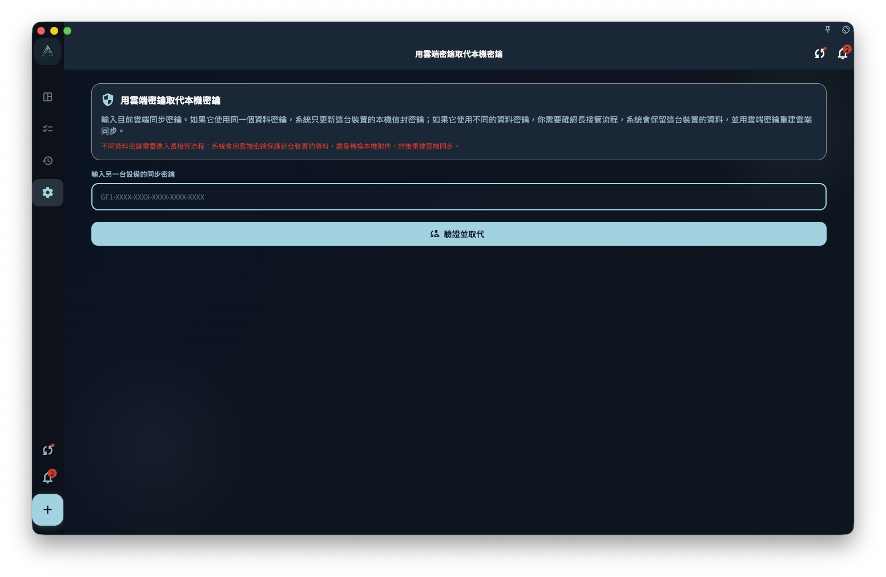

GranoFlow 用加密密鑰保護需要同步或備份的資料。登入賬號只能證明你是誰；加密密鑰決定這台裝置能不能打開已有的雲端加密資料。

如果你正在遷移裝置、重裝 App、復原備份，或同步頁提示「雲端同步設定需要處理」，先把目前裝置上還可見的重要資料確認一遍，再繼續密鑰復原或接管。

<!-- manual-screenshot:id=data-encryption-recovery-key -->

## 從哪裡進入

你可能從這些位置進入相關頁面：

- 設定裡的資料、安全、同步或備份入口。
- 同步失敗提示、頂部同步狀態提示，或雲端資料概覽中的復原提示。
- 資料管理頁裡的「用雲端密鑰替換本地密鑰」。

這些入口的共同點是：目前裝置和雲端之間的密鑰、資料來源或同步狀態還未對齊。它們不是一般重新整理按鈕。

## 輸入另一台裝置的同步密鑰

當頁面要求你輸入另一台裝置的同步密鑰時，GranoFlow 會先檢查這把密鑰能不能打開目前雲端資料。檢查完成前，不會儲存你輸入的密鑰，不會清空本機資料，也不會開始下載雲端資料。

檢查後可能出現幾種結果：

- 如果雲端和本機使用的是同一份資料密鑰，GranoFlow 只更新這台裝置的同步設定，讓它繼續使用同一組雲端資料。
- 如果雲端和本機不是同一份資料，頁面會讓你選擇保留本機資料、使用雲端資料，或取消。
- 如果密鑰格式不對、密鑰不是這份雲端資料的密鑰，或網路暫時不可用，復原不會繼續。

這條路徑不能保證找回你沒有儲存的同步密鑰。能復原到什麼程度，取決於目前裝置、舊裝置、雲端資料和本地備份裡還保留了哪些可驗證材料。

## 沒有密鑰時檢查這台裝置

有些情況下，即使你忘了雲端同步密鑰，這台裝置仍可能保留能驗證雲端資料的本機材料。頁面可能會提供「沒有密鑰，檢查這台裝置」這樣的次級入口。

這一步只做檢查。通過檢查後，GranoFlow 還會讓你再次確認是否只修復雲端同步密鑰。確認後，它只修復雲端同步所需的密鑰材料，不會上傳這台裝置的業務資料、不會清空雲端，也不會下載雲端資料。

如果檢查失敗、雲端沒有可用檢查記錄，或這台裝置已經無法讀取本機加密材料，就需要回到輸入同步密鑰、使用備份，或取消後先找舊裝置。

## 用雲端密鑰替換本地密鑰

「用雲端密鑰替換本地密鑰」用於目前裝置還有本地資料，但你決定讓這台裝置改用雲端同步密鑰的場景。它通常從資料管理頁或密鑰不匹配提示進入。

操作前先確認兩件事：

1. 你輸入的是目前雲端同步資料對應的完整密鑰。
2. 你知道這台裝置上的本地資料和附件是否仍需要保留。

如果本機和雲端實際使用同一份資料密鑰，GranoFlow 只更新這台裝置的保護方式。如果它們不同，頁面會要求你確認一次更長的接管流程：保留這台裝置的資料，用雲端密鑰保護，並在可行時處理本機附件，隨後重建雲端同步。

這個流程可能耗時，尤其是本機附件較多時。不要在不確定資料來源時把它當成一般登入或同步修復。

## 選擇來源時怎麼判斷

- 想保留這台裝置的資料：選擇「重建雲端同步」或相近路徑前，確認本機任務、專案、回顧和附件就是你要保留的版本。後續雲端會改用這台裝置的資料。
- 想使用雲端資料：選擇「使用雲端資料」或「清空本地資料」前，確認本機新建但未同步的內容可以放棄，或已經另行儲存。
- 不確定：取消操作，先檢查舊裝置、雲端概覽和本地備份。

同步和密鑰復原不會替你判斷哪份資料更重要，也不能保證所有未同步附件、舊裝置殘留或遺失密鑰後的雲端資料一定可復原。

## 下一步

如果你是在新裝置上復原已有雲端資料，繼續讀「在新裝置同步既有雲端資料」。如果你手上有本地備份檔案，繼續讀「備份與恢復」。
