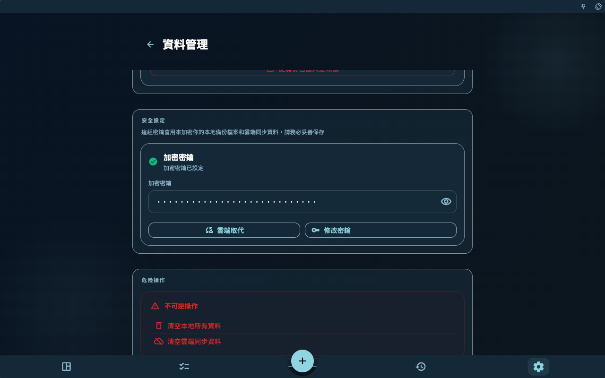
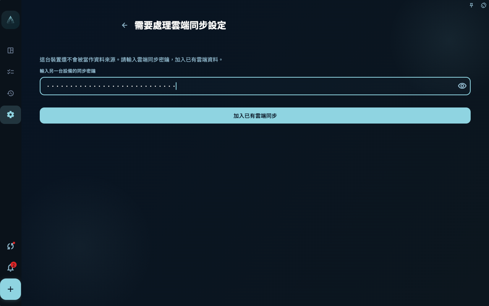
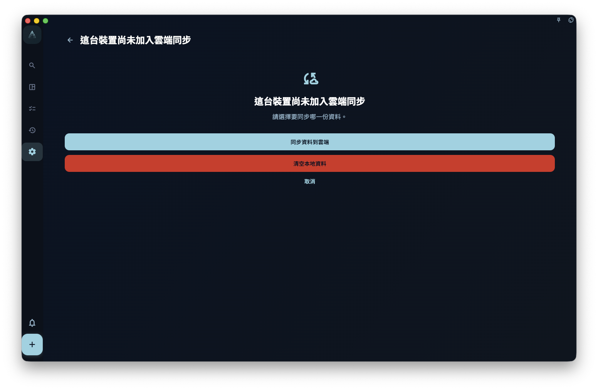
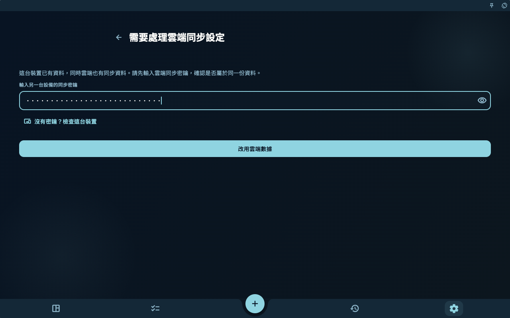

如果你換了新手機、新電腦，或剛重裝 GranoFlow，想把以前已經同步到雲端的資料取回來：先在舊裝置或你儲存的記錄裡找到雲端同步密鑰，再在新裝置登入同一個帳號，輸入這把密鑰並選擇加入既有雲端同步。

如果新裝置還沒有新增任務、專案、回顧或圖片，按照下面的「空裝置同步」操作。如果新裝置已經有你新建的內容，先看「本機已經有資料時」，不要直接當成空裝置處理。

## 開始前準備

先確認 4 件事：

- 舊裝置曾經成功同步過，或者你之前儲存過雲端同步密鑰。
- 新裝置登入的是同一個 GranoFlow 帳號。
- 新裝置可以連上網路，而且帳號狀態允許讀取雲端同步資料。
- 你拿到的是雲端同步密鑰。它不是登入密碼，而是用來打開雲端加密資料的密鑰。

最穩妥的順序是：先在舊裝置確認資料還在，再複製或記錄同步密鑰，最後操作新裝置。

<!-- manual-screenshot:id=data-new-device-sync-old-device-key -->

## 空裝置同步

這裡的空裝置，指剛安裝、剛重裝，或還沒有輸入真實資料的裝置。即使 GranoFlow 已經在這台裝置上產生了本機密鑰，只要你還沒有新增真實內容，它仍然會按空裝置處理，不會用空裝置覆蓋雲端資料。

1. 在舊裝置打開 GranoFlow，進入儲存或查看同步密鑰的頁面。
2. 複製或記錄目前雲端同步密鑰。不要只記登入密碼，登入密碼不能代替同步密鑰。
3. 在新裝置安裝並打開 GranoFlow。
4. 用同一個帳號登入。
5. 進入同步入口。如果頁面要求「輸入另一台設備的同步密鑰」，填入舊裝置上的雲端同步密鑰。
6. 點擊「加入已有雲端同步」，等待驗證和下載完成。
7. 回到任務、專案、回顧等頁面，確認雲端資料已經出現在新裝置上。

<!-- manual-screenshot:id=data-new-device-sync-enter-key -->

<!-- manual-screenshot:id=data-new-device-sync-join-existing -->

<!-- manual-screenshot:id=data-new-device-sync-restored-data -->

完成後，這台裝置就加入了原來的雲端同步。之後你在任一裝置上產生的新變化，會按一般多裝置同步繼續上傳和下載。

## 空裝置不會做什麼

空裝置同步的目的，是把既有雲端資料下載到新裝置，不是用新裝置重新建立雲端資料。

- 不會因為新裝置產生了新的本機密鑰，就替換雲端同步密鑰。
- 不會預設讓你用這台新裝置覆蓋雲端資料。
- 不會把一台沒有真實資料的新裝置當作資料來源。

如果你看到「同步資料到雲端」「重建雲端同步」「清空本機資料」這類選擇，表示目前情況已經不是最簡單的空裝置同步。先停下來，按下一節判斷。

## 這台裝置尚未加入雲端同步

有時 GranoFlow 會發現：目前裝置登入的是同一個帳號，但這台裝置還沒有加入目前雲端同步。頁面會讓你在「同步資料到雲端」「清空本機資料」和「取消」之間選擇。

<!-- manual-screenshot:id=data-sync-device-join -->

這個頁面通常出現在同步入口、資料管理頁，或頂部同步狀態提示裡。它不是一般的同步按鈕，而是在問你要保留哪一邊的資料。

- 選擇「同步資料到雲端」前，先確認這台裝置上的任務、專案、回顧和附件就是你想保留的版本。確認後，雲端會改用這台裝置的資料，其他裝置後續也會受到影響。
- 選擇「清空本機資料」前，先確認雲端資料才是你要保留的版本。確認後，這台裝置會清掉本機目前資料和本機同步設定，再從雲端下載。
- 選擇「取消」會停止這次處理。你可以先回到舊裝置、同步密鑰記錄或備份頁面核對資料。

無論選哪條路，都不能保證未上傳成功的本機附件、另一台裝置上的未同步改動，或沒有密鑰的資料一定能復原。做選擇前，先確認目前裝置和舊裝置上最重要的資料還能看到。

## 下載已有雲端資料

如果帳號裡已有可解密的雲端歷史資料，GranoFlow 會直接進入同步進度頁下載復原。這個動作只是把雲端資料取回目前裝置，不等於自動開啟日常上傳同步。下載完成後，先回到任務、專案和回顧頁面檢查內容。

如果 GranoFlow 需要原本的雲端同步密鑰，會顯示「輸入雲端同步密鑰」的輕量入口。你可以輸入密鑰繼續復原，也可以選擇「清空雲端資料」重新開始；如果暫時找不到密鑰，選擇「暫不同步」會回到本機繼續使用，不會下載、上傳或清空雲端。

## 本機已經有資料時

如果你已經在新裝置上新增過任務、專案、回顧，或者給任務上傳過圖片，再同步既有雲端資料就要更謹慎。這時本機和雲端都可能有資料，GranoFlow 需要先確認你想保留哪一份。

<!-- manual-screenshot:id=data-new-device-sync-local-image-task -->

先做這幾件事：

1. 不要連續點擊「同步資料到雲端」或「重建雲端同步」。
2. 先確認舊裝置或雲端裡有哪些重要資料。
3. 如果新裝置上的新內容也重要，先確認它是否還能在目前裝置看到。必要時先匯出或截圖留存。
4. 按頁面提示輸入舊裝置上的雲端同步密鑰，讓 GranoFlow 先確認這份雲端資料是否能打開。

接下來根據頁面上的選擇判斷：

<!-- manual-screenshot:id=data-new-device-sync-local-data-choice -->

- 如果你只想把雲端資料同步到這台裝置，選擇偏向「使用雲端資料」或「清空本機資料」的路徑。這樣會讓這台裝置改用雲端資料，本機剛新增但還沒同步成功的內容可能不會保留。
- 如果你確實要以這台裝置為準，才選擇「同步資料到雲端」或「重建雲端同步」。這類操作會讓雲端改用目前裝置的資料，並影響其他裝置後續同步，不能當成一般下載按鈕使用。
- 如果你不確定，選擇取消，回到舊裝置檢查資料和同步密鑰，再繼續。

有圖片或附件時更要謹慎。圖片需要本機檔案、附件記錄和雲端上傳狀態都完成，才算真正穩定。不要因為任務文字已經出現，就以為圖片也一定已經安全同步到雲端。

## 常見問題

**輸入密鑰後提示無法打開雲端同步設定怎麼辦？**
先檢查有沒有複製完整，尤其是開頭、結尾和空格。確認你輸入的是雲端同步密鑰，不是帳號密碼，也不是本機備份檔案裡的其他說明文字。

**舊裝置不在身邊怎麼辦？**
如果你之前儲存過雲端同步密鑰，可以直接使用儲存的那一份。如果既沒有舊裝置，也沒有密鑰，GranoFlow 可能無法解開既有雲端加密資料。

**新裝置上剛建了一個任務，還能按空裝置流程走嗎？**
不要按空裝置處理。只要這台裝置已經有真實本機資料，就按「本機已經有資料時」處理，先弄清楚要保留雲端資料、本機資料，還是先取消操作。

**同步完成後為什麼有些圖片還在載入？**
任務和圖片附件不一定同時完成。一般同步可能先復原任務和附件記錄，圖片檔案再繼續上傳、下載或按需載入。保持網路可用，等同步完成後再檢查圖片。

## 下一步

同步完成後，去「多裝置同步」了解日常同步如何繼續運作。如果你擔心密鑰遺失，再去「加密與復原密鑰」儲存必要憑證。
