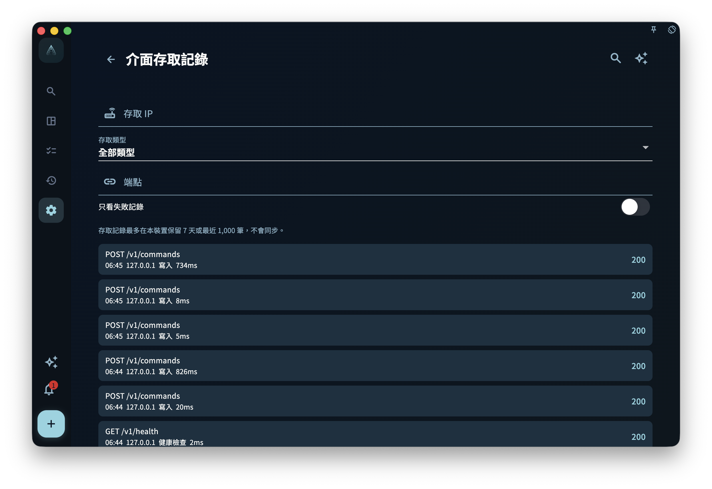

GranoFlow 桌面端面向自動化的主入口是本機 HTTP API。它監聽在本機回環位址
`http://127.0.0.1:<port>`，用於讓腳本、AI 助手或命令列用戶端讀取和寫入 App
已經公開的自動化能力。

`granoflow` CLI 是這個 API 的可選用戶端。它由 Rust 重寫，作為獨立包下載，不隨
macOS、Windows 或 Linux 桌面安裝包一起安裝。換句話說，安裝桌面 App 之後，你已經
可以在 App 裡開啟本機 HTTP API；如果還想在終端機裡使用 `granoflow` 命令，需要另外
安裝 CLI。

本機 HTTP API 預設只繫結 `127.0.0.1`，不會自動暴露到區域網路或公網。如果需要在
`granoflow.com` 文件頁除錯本機介面，必須在 App 中臨時開啟官方文件除錯，並使用
1 小時存取碼；它不再預設允許文件頁存取業務介面。允許任何裝置來源也必須先開啟存取碼
保護。

## 先看這個導航

- 想先理解工作原理：讀 [本機 HTTP API 工作原理](/manual/zh-tw/desktop/cli-how-it-works/)
- 想確認存取碼、本機存取、App Lock、金鑰區別：讀 [安全設定與金鑰邊界](/manual/zh-tw/desktop/cli-security-and-settings/)
- 想查 CLI 命令和 HTTP 端點：讀 [命令參考與 HTTP 映射](/manual/zh-tw/desktop/cli-command-reference/)
- 想按真實場景組合呼叫：讀 [工作流程](/manual/zh-tw/desktop/cli-workflows/)
- 想給腳本或 AI 助手用：讀 [JSON、環境變數與直接呼叫](/manual/zh-tw/desktop/cli-json-and-scripting/)
- 遇到報錯：讀 [排障](/manual/zh-tw/desktop/cli-troubleshooting/)

## 安裝與首次檢查

先安裝並打開 GranoFlow 桌面版，然後在設定裡的本機介面服務頁面開啟本機 HTTP API。
這一步只開啟 App 裡的本機介面，不會安裝 `granoflow` 終端命令，也不會寫入 PATH、
MSIX App Execution Alias 或 `/usr/local/bin/granoflow` symlink。

<!-- manual-screenshot:id=desktop-command-line-tool-settings-main -->


如果你只想確認介面是否可達，可以直接用 curl：

```bash
curl -s http://127.0.0.1:56789/v1/health
curl -s http://127.0.0.1:56789/v1/version
```

如果你已經單獨安裝了 CLI，可以再檢查 CLI 讀取到的連線設定：

```bash
granoflow config --json
granoflow health --json
```

預設 API 位址是 `http://127.0.0.1:56789`。如果你在 App 裡修改了埠號，CLI 也需要
使用同一個位址；可以透過設定檔、`--api-base-url` 或 `GRANOFLOW_API_BASE_URL`
指定。

## 讀者常見誤解

- 桌面 App 不負責安裝、修復或解除安裝 CLI。CLI 的下載、升級、簽名和 PATH 設定由官網
  或 release 說明承接。
- CLI 不直接讀寫 GranoFlow 資料庫。任務、專案、回顧和卡片等寫入操作都會轉發給執行中
  的本機 HTTP API，由 App 服務層處理。
- `granoflow backup decrypt/encrypt` 是離線備份包轉換工具，不依賴執行中的 App；它不
  等於「建立 App 備份」或「恢復到 App」。
- 公開能力以 OpenAPI 和 CLI help 為準。舊 Dart CLI、App 內建 CLI 安裝器和
  `bin/granoflow.dart` 入口已經退役。

## 目前狀態

目前公開 CLI 包按平台單獨發行：

- macOS Apple Silicon：signed/notarized zip
- Linux x64：tar.gz
- Windows x64：先發布 unsigned zip，再由 Windows 簽名裝置補 signed zip

不提供 macOS Intel CLI 包。桌面 App 安裝包也不會附帶這些 CLI 資產。

## 參考：規則與邊界

本頁用於查邊界，不影響你完成前面的首次檢查。

- 本機 HTTP API 的公開端點以 OpenAPI 文件為準。
- CLI 的公開命令以 `granoflow help --json` 和本手冊命令參考為準。
- 桌面三平台安裝包不得寫 PATH、不得注入 MSIX App Execution Alias、不得嵌入 macOS
  CLI helper，也不得提供 App 內安裝 CLI 的按鈕。
- 存取受保護端點時，仍會經過本機介面總開關、來源檢查、App Lock、nonce 與存取碼保護。

## 連線日誌用於排查本機存取

如果命令列或瀏覽器能打開介面，但結果和預期不一致，可以從本機介面服務頁進入「連線日誌」。連線日誌會記錄最近存取的 IP、HTTP 方法、端點、讀寫類型、耗時和狀態碼，並提供 IP、端點、讀寫類型和「僅失敗」篩選。

這個頁面適合回答這類問題：

- 請求有沒有真正到達當前裝置？
- 存取來自 `127.0.0.1`，還是來自區域網路裝置？
- 失敗集中在哪個端點？
- 是健康檢查、讀取請求還是寫入請求出錯？

連線日誌只用於本機排障，不是雲端稽核，也不會取代系統級防火牆或帳號安全記錄。截圖、回饋或求助時，注意不要暴露真實區域網路位址、存取碼、token、裝置名稱或帳號資訊。

<!-- manual-screenshot:id=local-api-access-log -->


## 下一步

現在你已經分清了「本機 HTTP API」和「獨立 CLI」的關係。下一頁可以繼續看它們如何一起
工作，以及為什麼很多自動化問題要先從本機位址和權限邊界判斷。
