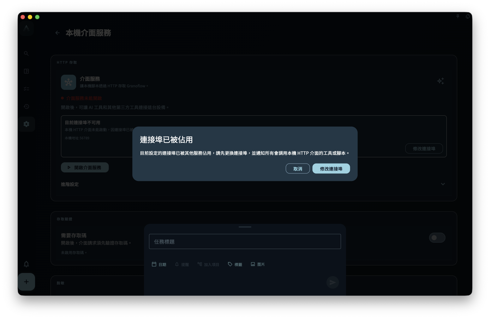

`granoflow` 桌面版提供本機 HTTP API，監聽在 `http://127.0.0.1:<port>`。

你可以透過**命令列工具**（`granoflow` CLI）、**curl** 或**腳本**直接與 API 互動。

本機 HTTP API 只繫結到 `127.0.0.1`，不會暴露到區域網路或公網。

如果需要從 `granoflow.com` 文件頁偵錯本機介面，必須先在 App 中臨時開啟官方文件偵錯並使用 1 小時存取碼；文件頁不再預設可以存取業務介面。允許任何裝置來源也必須先開啟存取碼保護。

## 先看這個導覽

- 想先理解工作原理：讀 [本機 HTTP API 工作原理](/manual/zh-tw/desktop/cli-how-it-works/)
- 想確認存取碼、本機存取、App Lock、金鑰區別：讀 [安全設定與金鑰邊界](/manual/zh-tw/desktop/cli-security-and-settings/)
- 想查完整 CLI 命令和 HTTP 端點：讀 [命令參考與 HTTP 對應](/manual/zh-tw/desktop/cli-command-reference/)
- 想按真實場景走流程：讀 [工作流](/manual/zh-tw/desktop/cli-workflows/)
- 想給腳本或 AI 助手用：讀 [JSON、環境變數與直接呼叫](/manual/zh-tw/desktop/cli-json-and-scripting/)
- 遇到報錯：讀 [排障](/manual/zh-tw/desktop/cli-troubleshooting/)

## 安裝與首次檢查

在 macOS 上，先把 GranoFlow 拖入「應用程式」，再在 App 的「命令列工具」設定頁點「安裝命令列工具」或「修復命令列工具」。首次安裝時，macOS 可能要求你在「系統設定 → 一般 → 登入項目」中允許「Granoflow 背景項目」；批准後再次點擊安裝，App 即可建立 `/usr/local/bin/granoflow` 符號連結，後續修復或重裝通常不再需要額外操作。需要 macOS 13 或更新版本。

<!-- manual-screenshot:id=desktop-command-line-tool-settings-main -->


安裝後先確認 API 可達：

```bash
curl -s http://127.0.0.1:42667/v1/health
granoflow version --json
granoflow bridge config show --json
```

## 讀者常見誤解

- `granoflow lang` 只影響 CLI 輸出語言，不會修改 App 語言。
- `granoflow backup-package` 是 native CLI 本機工具，不依賴執行中的 App。
- 業務物件、備份、真實資料 AI 命令都依賴執行中的本機 HTTP API。

## 下一步

建議先讀 [本機 HTTP API 工作原理](/manual/zh-tw/desktop/cli-how-it-works/)，再看命令參考。
