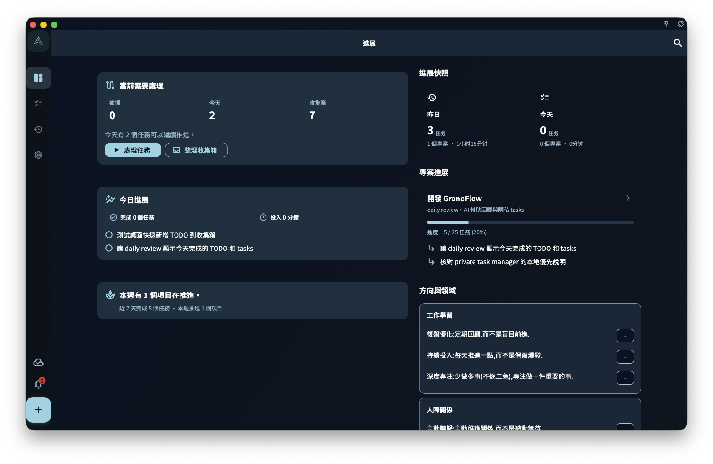

桌面端有一個容易讓人混淆的地方：**關閉視窗 ≠ 結束應用程式**。

## 關閉視窗後發生了什麼

在 macOS 和 Windows 上，點選視窗的關閉按鈕（×）通常只是**隱藏視窗**，GranoFlow 繼續在背景執行。

這樣設計的目的是：讓 GranoFlow 能在背景持續同步，你隨時可以快速呼叫。

## 如何再次開啟視窗

- **macOS**：點選選單列的 GranoFlow 圖示
- **Windows**：點選工作列通知區的 GranoFlow 圖示
- **任意平台**：如果你設定了全域快捷鍵，直接用快捷鍵呼叫

## 如何真正結束應用程式

- **macOS**：右鍵點選 Dock 或選單列圖示 → 選擇「結束」
- **Windows**：右鍵點選工作列圖示 → 選擇「結束」

真正結束後，GranoFlow 不再在背景執行，同步也會暫停直到下次開啟。

:::tip[想每次關視窗就結束？]
你可以在 GranoFlow 偏好設定裡修改關閉視窗的預設行為。
:::
