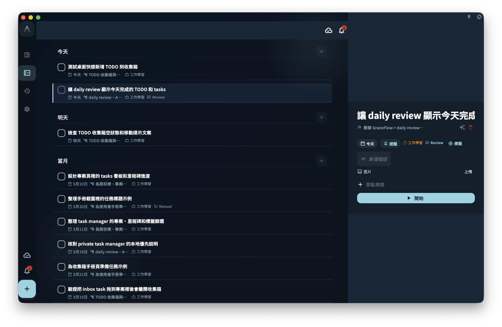

在桌面端找功能時，先看左邊切換頁面，再看中間的任務清單或目前頁面；如果視窗夠寬，點開任務後，詳情通常會顯示在右邊，不需要離開目前清單。

<!-- manual-screenshot:id=desktop-visual-interaction-wide -->

## 寬螢幕版面的特點

桌面端和手機端最大的不同，是螢幕比較寬。寬螢幕時，GranoFlow 可以把導覽、清單和任務詳情放在同一個視窗裡，讓你少一點來回切換頁面。

- **左側側邊欄**：這裡是導覽區。你可以在這裡切換不同視圖，例如收件匣、專案、回顧等。
- **中間內容區**：這裡顯示任務清單，或是你目前開啟的頁面內容。
- **右側詳情面板**（寬螢幕時）：點選一個任務後，任務詳情會在右側展開。這樣你可以一邊看清單，一邊查看或處理這個任務。

如果視窗比較窄，桌面端會把側邊欄摺疊起來，使用方式會更接近手機版。如果找不到左側側邊欄，可以先把視窗拉寬，或尋找摺疊選單入口。

## 鍵盤優先

桌面端適合用鍵盤快速操作。你不一定要記住所有快捷鍵，先記住最常用的幾類就夠了。

- **快速新增任務**：通常透過全域快捷鍵開啟。這個快捷鍵可以在偏好設定裡設定。
- **在清單裡導覽**：可以使用方向鍵在任務之間移動。
- **完成任務**：在任務上按對應快捷鍵即可完成，實際按鍵以介面顯示或你的設定為準。

如果快捷鍵和其他應用程式衝突，可以到 GranoFlow 偏好設定裡改成你更順手、也比較不容易誤按的組合。

## 拖曳排序

在桌面端，你可以用滑鼠直接拖曳任務來調整順序。也可以把任務拖到不同的專案或時間段，用來快速重新安排任務位置。

拖曳前先確認你拖的是任務本身，而不是開啟詳情、選取文字或點擊其他按鈕。如果拖動後位置沒有變，可能是目前視圖不支援這種排序方式，或任務不能移到目標位置。

:::tip[快捷鍵設定]
在 GranoFlow 偏好設定裡可以自訂全域呼叫快捷鍵。設定好之後，在其他應用程式裡按這個快捷鍵，就可以開啟 GranoFlow。
:::
