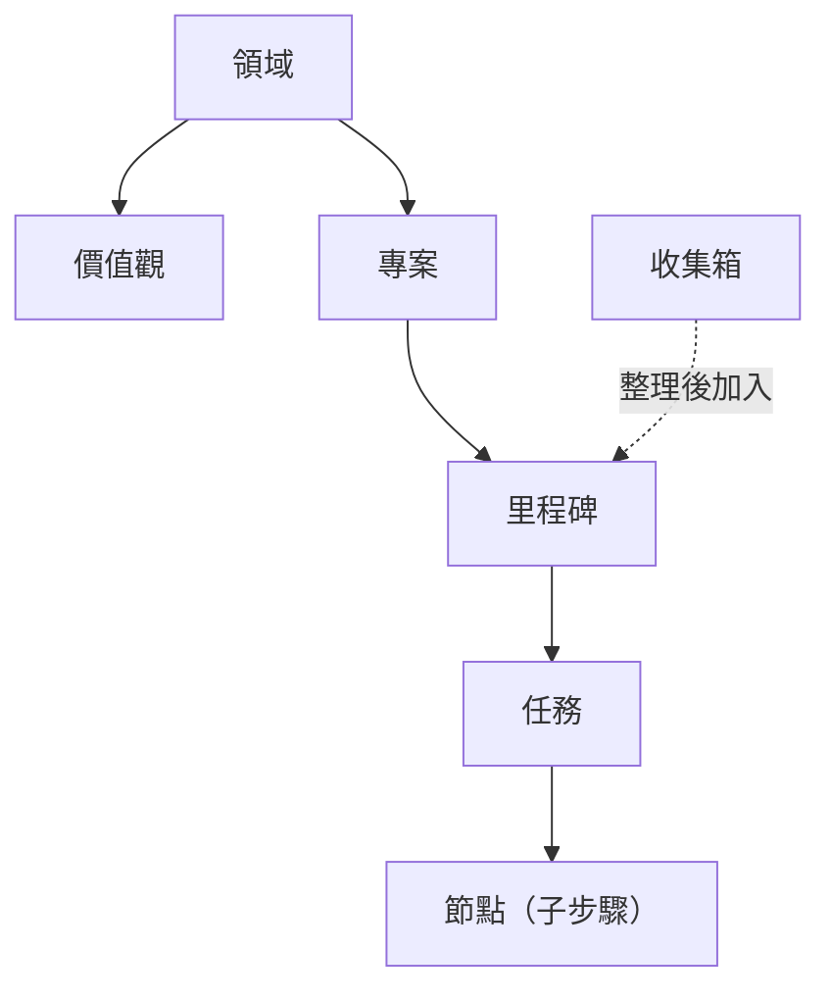

不知道某個詞是什麼意思？翻這頁就夠了。每個概念都只用兩三句話解釋清楚，不廢話。

下圖展示了 GranoFlow 裡各概念的層級關係：

---

## 人生結構

### 領域

你的人生可以分幾個大方向，例如「工作」「健康」「家庭」「學習」，這些就是領域。

領域不是資料夾，不存任務，它更像是你給自己畫的人生地圖上的幾塊區域。專案會歸屬到某個領域，回顧的時候你能看到自己最近在哪些領域投入了精力。

### 價值觀

價值觀是你在某個領域裡希望長期堅持的判斷標準，例如「做工作時：只做真正有影響力的事」。

它不是任務，不能被完成，也不會自動把事情打勾。它主要在回顧時幫你問自己：這段時間的行動，有沒有符合我自己的標準？

### 專案

專案是一段時間內要持續推進的目標容器，例如「搬家」「畢業論文」「開發 App v2」。

任務可以掛在專案裡，收集箱的任務一旦被加入專案就會消失。專案可以封存或完成，但如果裡面還有未處理的任務，系統會先讓你決定怎麼處理它們。

### 里程碑

里程碑是專案裡的階段節點，用來把大專案拆成小階段，例如「初稿完成」「測試通過」「上線」。

每個里程碑下面有任務，任務全完成後里程碑才算可以關閉。它的作用是讓你在推進長專案時，不會感覺永遠在走一段看不到頭的路。

### 任務

任務是 GranoFlow 的基本行動單位——就是你要做的那件具體的事。

一個任務可以有標題、截止日期、提醒、標籤、專案、里程碑和描述。任務有幾種狀態：待辦、進行中、已完成、已封存、回收站。完成時會記錄時間，取消完成會清除這個時間。

### 節點

節點是任務裡面的步驟，用於拆解一個複雜任務。

例如任務是「提交報稅申報」，節點可以是「整理收據」「填寫表格」「提交」。節點全部完成後，父任務會自動完成；新增一個未完成的節點，父任務會回到待辦。

### 收集箱

收集箱是「還沒想好怎麼安排」的任務的臨時停放處。

只有沒有截止日期、沒有專案、沒有里程碑，且狀態是待辦或進行中的任務，才會出現在收集箱。一旦你給任務加了日期或加入了專案，它就自動離開收集箱。把收集箱想成你口袋裡的便條紙——先放著，等你有時間再整理。

---

## 使用節奏

### 規劃

把腦子裡的想法變成一個有日期、有專案的可執行任務，這個過程叫規劃。

你可以在快速新增、收集箱整理或任務詳情裡做規劃。輸入框裡的 `#` `@` `~` 是快捷方式，但任何寫入都需要你確認。

### 執行

執行就是真的去做任務——可以配合專注計時、置頂任務或背景音樂使用。

任務完成時，GranoFlow 會先把相關的專注工作階段收尾，再記錄完成時間，避免回顧資料出現時間段混亂。

### 完成

完成表示任務做完了，會記錄一個完成時間。

日回顧按任務「實際完成那天」統計，不按截止日期。凌晨 3 點前完成的任務還算是「昨天」的。

### 封存

封存表示這件事已經封存，不會出現在當前工作視圖裡了，但記錄還在，可以翻查。

### 日回顧

日回顧是每天結束時看一看「今天實際完成了什麼」的頁面。

按完成時間統計，沒有完成任務的日期會安靜顯示空態，不會用空圖表製造焦慮。

### 複盤

複盤是回看一段時間的投入、進展和狀態——比日回顧涵蓋的時間更長。

---

## AI 輔助

### AI 助手

AI 助手是你自己選擇的外部 AI 工具，例如 ChatGPT、Claude、Gemini 或 DeepSeek。

GranoFlow 不內建一個替你改資料的黑箱 AI。它幫你準備好提示詞，複製到剪貼簿，再打開你選的 AI。

### 提示詞

提示詞是 GranoFlow 交給外部 AI 的說明文字，告訴 AI 應該問什麼、整理什麼、輸出什麼格式。

### 剪貼簿回流

這是把 AI 生成的結果複製回 GranoFlow 的流程。AI 回覆不會被偷偷寫進你的任務，彈出確認後你點同意才會匯入。

---

## 資料與安全

### 本機優先

本機優先表示 GranoFlow 的核心資料先存在你的裝置上，不依賴伺服器也能正常用。

### 雲端同步

雲端同步把你的本機資料和雲端對齊，讓不同裝置看到同樣的內容。同步前會檢查帳號、會員狀態和加密金鑰是否匹配。

### 端對端加密（E2EE）

端對端加密意味著資料離開你的裝置之前就已經加密，伺服器上存的是密文，伺服器讀不到你的任務內容。

### 加密金鑰

加密金鑰是解鎖加密備份和雲端資料的關鍵憑證，**不是登入密碼**。金鑰遺失後伺服器不能幫你找回。

### 備份與還原

備份把裝置資料匯出為 `.flow.grano` 加密檔案，還原需要提供相同的金鑰。

### App 鎖定

App 鎖定在打開應用時增加一次本機驗證（Face ID / 指紋 / PIN），減少他人臨時拿到你裝置就能翻看的風險。

---

## 帳號與權益

### 帳號

帳號用於登入、同步、訂閱識別和帳號恢復。主要登入方式是電子郵件驗證碼。

### 會員與權益

會員（Pro 或天使會員）表示你購買了正式權益，由伺服器端確認。影響雲端同步、儲存配額和附件下載等功能。

---

## 介面與裝置

### 桌面端 vs 行動端

桌面端（Windows / macOS / Linux）適合長時間整理和回顧；行動端（iOS / Android）適合快速記錄和隨手捕捉。

### 系統工作列

桌面端關掉視窗可能只是隱藏到工作列，GranoFlow 仍在背景執行。要徹底結束，從工作列選單選「結束」。

### 側邊欄模式

桌面端可以把 GranoFlow 收成窄視窗貼在螢幕邊緣，一邊做其他事一邊查看或勾選任務。
