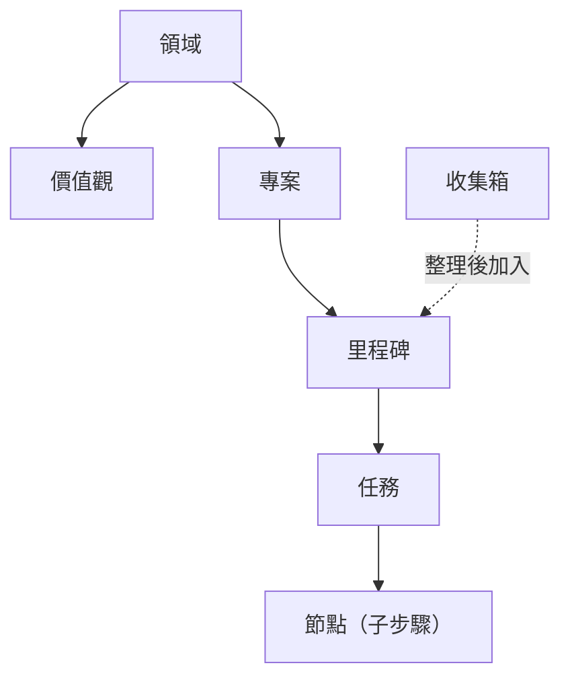

如果你在 GranoFlow 裡看到一個詞不懂，就在這頁查：它會告訴你這個詞是什麼、在哪裡用、和其他概念是什麼關係。

GranoFlow 的主要結構可以這樣理解：領域下面有價值觀和專案，專案下面有里程碑，里程碑下面有任務，任務裡可以再拆節點；收集箱裡的任務整理後可以加入專案或里程碑。

---

## 人生結構

### 領域

領域是你生活裡的大方向，例如「工作」「健康」「家庭」「學習」。

它不是任務資料夾，不能直接拿來存任務。你可以把它理解成一張人生地圖上的區域：專案會歸到某個領域裡，回顧時你就能看到自己最近把精力放在哪些方向。

### 價值觀

價值觀是你在某個領域裡想長期堅持的標準，例如「工作上只做真正有影響力的事」。

它不是任務，不能被完成，也不會自動幫你打勾。它的作用是在回顧時提醒你：這段時間做的事，是否符合你自己定下的標準。

### 專案

專案是一個需要持續推進的目標容器，例如「搬家」「畢業論文」「開發 App v2」。

任務可以放進專案裡。收集箱裡的任務一旦加入專案，就會自動離開收集箱。專案可以封存或完成；如果專案裡還有未處理的任務，系統會先讓你決定這些任務怎麼處理。

### 里程碑

里程碑是專案裡的階段節點，用來把大專案拆成幾個小階段，例如「初稿完成」「測試通過」「上線」。

每個里程碑下面可以有任務。任務全完成後，里程碑才算可以關閉。它的用處是讓長專案有清楚的階段感，而不是一直像在做一件沒有盡頭的事。

### 任務

任務是 GranoFlow 裡最基本的行動單位，也就是你要做的那件具體事情。

一個任務可以有標題、截止日期、提醒、標籤、專案、里程碑和描述。任務狀態包括：待辦、進行中、已完成、已封存、回收站。任務完成時會記錄完成時間；取消完成時，這個完成時間會被清除。

### 節點

節點是任務裡的子步驟，用來拆解複雜任務。

例如任務是「提交報稅申報」，節點可以是「整理收據」「填寫表格」「提交」。當所有節點都完成時，父任務會自動完成；如果你又新增一個未完成節點，父任務會回到待辦狀態。

### 收集箱

收集箱是暫時放任務的地方，適合放那些「先記下來，還沒想好怎麼安排」的事。

只有沒有截止日期、沒有專案、沒有里程碑，並且狀態是待辦或進行中的任務，才會出現在收集箱。一旦你給任務加了日期，或把它加入專案，它就會自動離開收集箱。你可以把收集箱想成口袋裡的便條紙：先放進去，之後再整理。

---

## 使用節奏

### 規劃

規劃就是把一個模糊想法，變成有日期、有專案，或至少更清楚的可執行任務。

你可以在快速新增、收集箱整理或任務詳情裡做規劃。輸入框裡的 `#` `@` `~` 是快捷方式，但任何真正寫入資料的操作都需要你確認。

### 執行

執行就是開始做任務本身。

你可以配合專注計時、置頂任務或背景音樂使用。任務完成時，GranoFlow 會先把相關的專注工作階段收尾，再記錄完成時間，這樣回顧資料裡的時間段不會混亂。

### 完成

完成表示任務已經做完，並且會記錄一個完成時間。

日回顧按任務「實際完成的那一天」統計，不按截止日期統計。每天從 0 點開始算新的一天，0 點以後完成的任務會進入新一天的回顧。

### 封存

封存表示這件事已經封存，不再出現在目前工作視圖裡，但記錄仍然保留，可以之後翻查。

專案、里程碑、任務都可以封存。封存前如果裡面還有進行中的任務，系統會先讓你決定怎麼處理這些任務。

### 日回顧

日回顧是用來查看「某一天實際完成了什麼」的頁面。

它按完成時間統計，不按截止日期統計。如果某天沒有完成任務，頁面會顯示安靜的空狀態，不會用空圖表製造壓力。

### 複盤

複盤是回看一段更長時間裡的投入、進展和狀態。

你可以在週回顧、月詳情等視圖裡做複盤。它關注的不是單純完成了多少任務，而是你有沒有在推進真正重要的事，以及精力分布有沒有偏掉。

---

## AI 輔助

### AI 助手

AI 助手指的是你自己選擇的外部 AI 工具，例如 ChatGPT、Codex、Claude、Gemini 或 DeepSeek。

GranoFlow 不內建一個會偷偷替你改資料的黑箱 AI。它會幫你準備提示詞，複製到剪貼簿，然後打開你選擇的 AI 工具。

### 提示詞

提示詞是 GranoFlow 交給外部 AI 的說明文字，用來告訴 AI 應該問什麼、整理什麼、按什麼格式輸出。

你可以編輯提示詞範本，但系統會阻止空範本或損壞的範本被儲存。

### 剪貼簿回流

剪貼簿回流就是把外部 AI 生成的結果複製回 GranoFlow 的流程。

AI 的回覆不會被自動寫進你的任務。你把結果複製回來後，GranoFlow 會先識別格式並跳出確認；只有你同意後，內容才會真正匯入。已經拒絕過或已經匯入過的內容，不會反覆跳出提示。

---

## 資料與安全

### 本機優先

本機優先表示 GranoFlow 的核心資料會先存在你的裝置上，不依賴伺服器也能正常使用。

離線記任務、整理任務、做回顧都可以。只有當資料要離開裝置時，例如備份或雲端同步，才會進入加密流程。

### 雲端同步

雲端同步會把你的本機資料和雲端資料對齊，讓不同裝置看到同樣的內容。

同步前，系統會檢查帳號、會員狀態和加密金鑰是否匹配。如果發現不一致，系統會先暫停並引導你確認，而不是默默覆蓋資料。

### 端對端加密（E2EE）

端對端加密表示資料離開你的裝置之前就已經被加密，伺服器上保存的是密文。

這代表 GranoFlow 的伺服器讀不到你的任務內容。本機搜尋和日常使用優先保證速度；備份和雲端上傳才會走加密流程。

### 加密金鑰

加密金鑰是解鎖加密備份和雲端資料的關鍵憑證，**不是登入密碼**。

金鑰很重要。遺失金鑰，就解不開舊備份或對應的加密雲端資料。GranoFlow 會多次提醒你保存金鑰，但伺服器不能替你找回遺失的金鑰。

### 備份與還原

備份是把裝置上的全部資料匯出為 `.flow.grano` 檔案，並用金鑰加密保護。

還原是把這個備份檔案重新匯入 GranoFlow，需要提供建立備份時使用的金鑰。如果附件在備份時沒有完全下載，備份裡可能不會包含完整附件。

### App 鎖定

App 鎖定會在你打開應用時增加一次本機驗證，例如 Face ID、指紋或 PIN。

它可以降低別人臨時拿到你裝置就能翻看內容的風險。但它不是全能防護；如果裝置本身已經被破解，它擋不住這種情況。

---

## 帳號與權益

### 帳號

帳號用於登入、同步、訂閱識別和帳號恢復。

目前主要登入方式是電子郵件驗證碼。未登入也可以使用本機功能，但進入雲端同步時，系統會引導你先登入。

### 會員與權益

會員，包括 Pro 或天使會員，表示你購買了正式權益。

權益由伺服器端確認，不是用戶端自己判斷。權益會影響雲端同步、儲存配額、附件補下載等功能。如果訂閱買在另一個帳號上，目前帳號不會自動獲得對應權益。

---

## 介面與裝置

### 桌面端 vs 行動端

桌面端，也就是 Windows、macOS、Linux，更適合長時間整理、專案管理和回顧。

行動端，也就是 iOS 和 Android，更適合快速記錄和隨手捕捉。

### 系統工作列

在桌面端，關掉視窗可能只是把 GranoFlow 隱藏到系統工作列，它仍然在背景執行。

這種情況下，專注計時不會中斷。要徹底結束，請從工作列選單選擇「結束」。

### 側邊欄模式

桌面端可以把 GranoFlow 收成窄視窗，貼在螢幕邊緣使用。

這樣你可以一邊做其他事，一邊查看或勾選任務。
