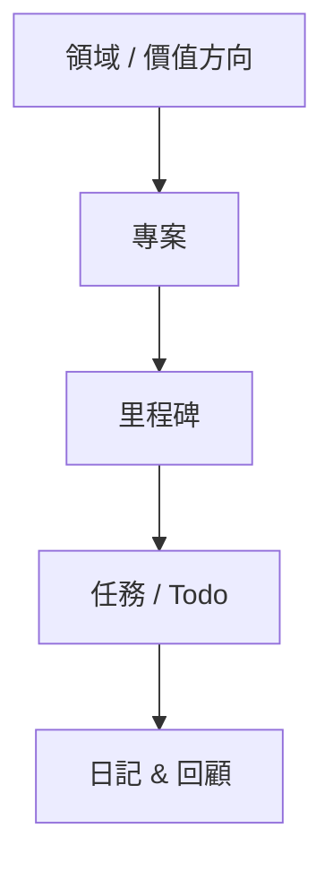

GranoFlow 是一個本機優先的個人規劃 app。你可以先把它當 Todo 用：記下任務、安排時間、完成後勾掉；之後再把任務連到專案、里程碑、價值觀和回顧，看看自己每天做的事，是否真的在推進重要目標。

## 任務只是入口

最簡單的用法是：想到一件事，就在 GranoFlow 新增一個任務。你不需要一開始就把所有內容整理好。

等你有時間時，可以再決定這個任務屬於哪個專案、和哪個里程碑有關、什麼時候處理。任務在 GranoFlow 裡不是孤立清單，而是一個入口，幫你把日常事情放回更大的生活結構裡。

## 不只是 Todo 清單

普通 Todo 工具通常只回答一個問題：今天要做什麼？

GranoFlow 會幫你多看一層：這個任務屬於哪個專案？專案正在推進哪個里程碑？這件事和你在意的方向有沒有關係？

下面是 GranoFlow 裡常見的關係：

這樣，即使一週只完成了幾件事，你也可以回頭看：它們只是讓你很忙，還是真的讓某個專案往前走了一點。

## 回顧不等於打卡

GranoFlow 也是回顧工具。日回顧和每週價值觀記錄，不是為了製造連續打卡壓力，也不是為了把暫停說成失敗。

你可以用它記錄發生了什麼、當時怎麼想、下一步想怎麼調整。回顧的重點是看清事實，而不是責備自己。

## 保留私人的規劃空間

GranoFlow 採用本機優先產品思路。核心記錄先在你的裝置上；同步、備份和加密各有明確邊界。

AI 輔助回顧可以幫你整理想法，但它只是輔助。要不要採納、怎麼調整、下一步做什麼，仍然由你決定。

:::note[新手提示]
第一次打開 GranoFlow，只需要記住一件事：點 **+** 可以新增任務。其他功能可以等真正需要時再慢慢探索。
:::
