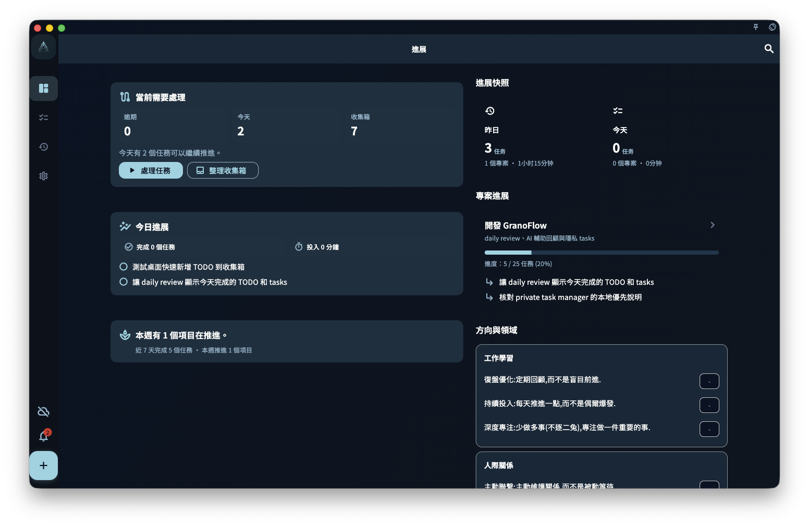

「進展」是 GranoFlow 的預設首頁，用來快速查看你最近是否正在穩定推進。

它不是單純的統計頁，而是一張目前狀態看板：你可以看到今天做了什麼、昨天留下了什麼、本週和本月推進了哪些專案，以及這些行動是否正在連接到更長期的方向。

## 今日與昨日

頁面會顯示「今天」和「昨天」的簡要狀態，包括完成任務數、涉及專案數和專注時間。

<!-- manual-screenshot:id=interface-home-progress-main -->

點擊「今天」可以進入任務頁，繼續處理目前任務。  
點擊「昨天」可以進入對應日期的回顧，查看昨天完成了什麼。

## 專案進展

如果你正在推進專案，進展頁會顯示重點專案卡片。

專案卡片通常包含：

- 專案名稱
- 目前關注的里程碑
- 任務完成進度
- 最近需要繼續推進的任務

點擊專案卡片，可以進入對應專案詳情頁。

## 領域價值進展

如果你在回顧中記錄了與長期方向有關的內容，進展頁會按領域展示這些價值項。

這部分不是為了評分或排名，而是幫助你看到：最近的行動是否仍然連接著自己重視的方向。

## 本週與本月

進展頁還會彙總本週和本月的推進情況，包括專案數、完成任務數和專注時間。

點擊本週或本月統計，可以進入回顧頁查看更完整的週回顧或月曆檢視。

## 回顧入口

當一天接近結束，或當天已有任務進展時，頁面可能會顯示回顧入口。

你可以從這裡寫今日回顧，也可以打開月曆查看更長時間範圍內的積累。

## 第一次使用時

如果你還沒有建立任務、專案或領域內容，進展頁會顯示新手引導。

你可以先完成三件事：

1. 建立第一條任務。
2. 建立第一個專案。
3. 編輯一個重要領域或價值方向。

完成這些之後，進展頁會逐漸從引導頁變成你的個人進展看板。
