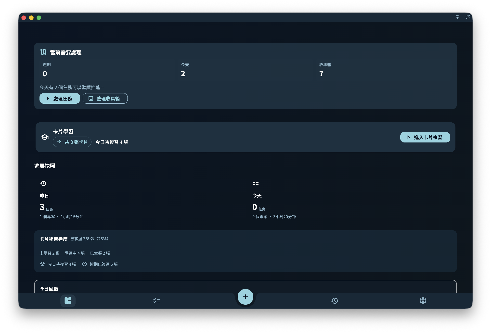

「進展」頁讓你一打開 GranoFlow 就知道：今天做了什麼、昨天留下了什麼、本週和本月有沒有持續推進，以及正在進行的專案目前是什麼狀態。

它不是任務清單，也不是統計報表。你可以把它當成首頁狀態看板：先快速看一眼，再決定要繼續做今天的任務，還是回頭檢視昨天。

## 今日與昨日狀態

頁面上方會顯示今天和昨天的簡要狀態。你可以看到完成了幾個任務、涉及哪些專案、投入了多少時間。

點擊「今天」可以進入任務頁，繼續處理目前任務。點擊「昨天」可以進入昨天的回顧，查看那天完成了什麼。

## 本週與本月狀態

進展頁也會展示本週和本月的推進情況。它的重點不是給你一個很有壓力的排名或分數，而是幫你看見最近一段時間有沒有持續行動。

如果某個領域連續幾天沒有出現，你可以在回顧時想一想：這是正常安排，還是它已經被你忽略了。

## 專案進展卡片

如果你正在推進專案，進展頁會顯示相關專案卡片。這樣你不用逐一打開專案頁面，也能先大致知道哪些專案最近有進展。

## 它適合用來做什麼

進展頁最適合回答這個問題：

> 我最近有沒有穩定地推進我在意的事？

如果你只想快速確認狀態，看進展頁就夠了。如果你想深入分析原因、調整安排，再進入回顧頁。

:::note[進展不取代回顧]
進展頁是快速看一眼的入口，回顧頁才是深入思考的地方。兩者搭配使用效果更好。
:::
