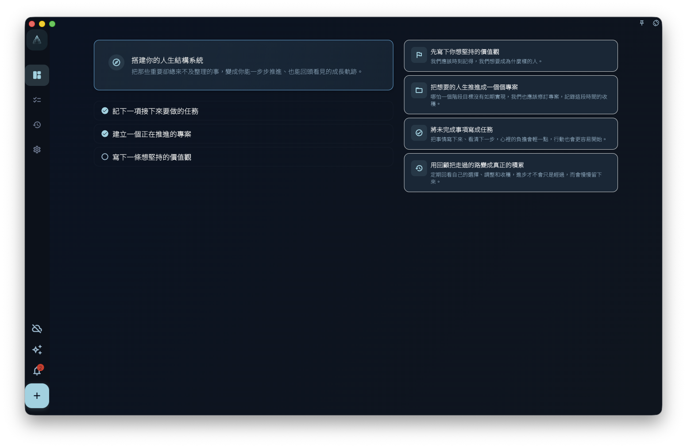

如果你想知道 GranoFlow 裡每個功能在哪裡，先看主介面的四個入口：**進展** 看狀態，**任務** 處理待辦，**回顧** 做復盤，**設定** 管帳號、同步、資料、AI 輔助、外觀和偏好；中間的 **+** 用來快速新增一件事。

GranoFlow 的主介面很簡單。手機直向使用時，導覽通常在底部；橫向或桌面使用時，導覽可能在左側。位置會變，但入口還是這幾個。

## 四個主要入口

| 入口 | 在這裡可以做什麼 |
|------|--------------|
| **進展** | 預設首頁。用來看今天完成了什麼，以及專案大概在哪個階段。 |
| **任務** | 查看任務清單，並繼續推進還沒完成的任務。 |
| **回顧** | 做日回顧、週回顧，也可以查看月度行事曆。 |
| **設定** | 管理帳號、同步、資料、AI 輔助、外觀與偏好。 |

## 快速新增

底部中間的 **+** 是快速新增入口。

你想到一件事時，點 **+**，先把它寫下來。需要的話，可以同時設定日期、專案、里程碑和標籤；還不確定也沒關係，可以先不設定，之後再整理。

這個入口不會把你帶到一個完全獨立的頁面。它的作用，是讓你在目前介面快速記錄想法或任務。

:::tip[找不到某個功能？]
先去 **設定** 看看。帳號、同步、資料、AI 輔助、外觀和偏好這類不常用但重要的入口，通常都在那裡。任務、專案進展和回顧這些常用功能，直接從主導覽切換。
:::
