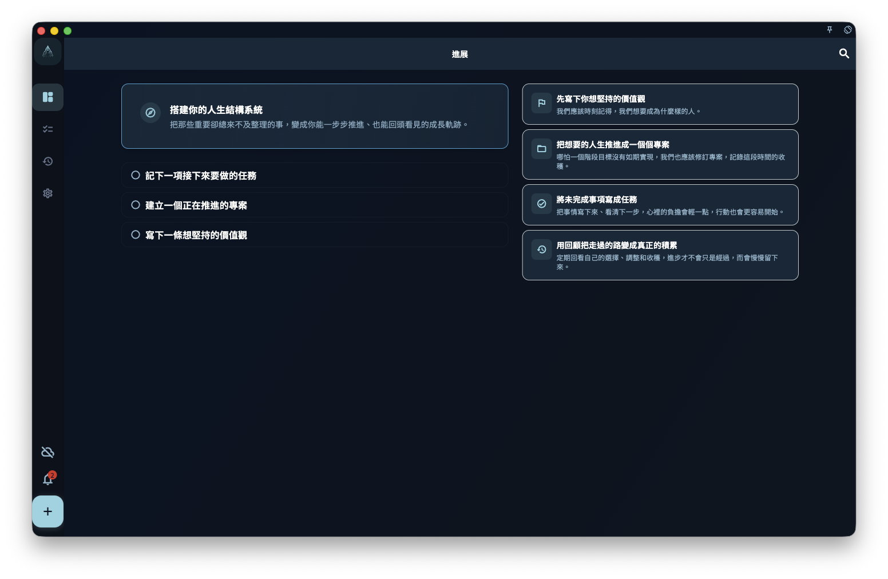

當你第一次打開 GranoFlow，或本機資料還沒有形成任務、專案和價值觀內容時，「進展」頁會先顯示第一次使用引導。

這個狀態不是錯誤，也不是統計頁沒有載入出來。它是在告訴你：GranoFlow 還沒有足夠內容產生你的個人進展看板，所以先給你一條最短路徑，把重要的事寫下來，再逐漸變成可以回顧的結構。

<!-- manual-screenshot:id=interface-progress-onboarding-cold-start -->

## 你會看到什麼

橫向或桌面視窗足夠寬時，頁面左側會顯示標題「搭建你的人生結構系統」和三個起步動作：

1. 記下一項接下來要做的任務。
2. 建立一個正在推進的專案。
3. 寫下一條想堅持的價值觀。

右側會顯示四段方法文案，說明 GranoFlow 希望你怎麼開始：

- 先寫下你想堅持的價值觀。
- 把想要的人生推進成一個個專案。
- 把未完成事項寫成任務。
- 用回顧把走過的路變成真正的積累。

在較窄的視窗或直向裝置上，這些內容會改成單欄排列，但意思不變。

## 什麼時候會消失

當你完成起步動作，或應用偵測到已經有任務、專案、註冊賬號、匯入歷史或有效同步歷史時，GranoFlow 會略過這個第一次使用引導。

之後再次進入「進展」頁，你會看到有資料支撐的狀態：目前需要處理什麼、今天如何繼續、近期專案、價值觀、每週／每月進展和回顧入口。

## 和一般進展頁的差別

第一次使用引導只負責幫你開始。它不會提前顯示工作佇列、今日進展或簡短回饋，因為這些卡片需要真實任務和專案資料才有意義。

如果你已經匯入備份或同步過資料，卻仍然看到這個狀態，通常表示本機資料還沒有完成復原、匯入或重新整理。等資料完成載入後，再回到「進展」頁檢查一次。

## 相關頁面

- [進展](/manual/zh-tw/interface/home-progress/)
- [任務系統總覽](/manual/zh-tw/tasks/overview/)
- [專案與里程碑總覽](/manual/zh-tw/projects/overview/)
- [回顧系統總覽](/manual/zh-tw/review/overview/)
