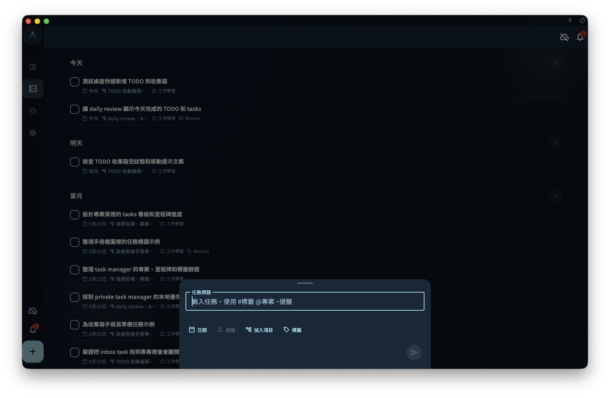

快速新增適合先把腦中想到的一件事記下來。點擊底部中間的 `+` 後，輸入任務標題，再提交即可儲存。

如果暫時不想分類，只寫標題就夠了。沒有日期、專案或里程碑的任務會進入收集箱，之後再整理。

## 直接寫標題

可以輸入一行普通文字，例如：

```text
整理週報
給 Alex 回信
檢查發布截圖
```

寫完後點擊提交按鈕。系統會把這一行作為任務標題儲存。

## 在標題裡加欄位

桌面端輸入框會提示 `#標籤 @專案 ~提醒`。這些符號是快捷入口，不是必填項目。

<!-- manual-screenshot:id=interface-quick-add-main -->


- 輸入 `#` 可以搜尋標籤。
- 輸入 `@` 可以搜尋專案或里程碑。
- 輸入 `~` 可以寫提醒時間。

例如：

```text
檢查訂閱頁文案 @官網改版 #發布 ~明天 8點
```

快捷入口只有在你選擇候選，或用 `Enter` / `Tab` 確認後，才會寫入任務欄位。未確認的 `#發布` 或 `@官網改版` 會保留在標題裡，按普通文字儲存。

## 日期和提醒

你也可以直接寫日期詞，例如：

```text
週五前檢查發布截圖
```

日期詞會先被醒目標示或顯示為待確認的日期。點擊日期提示，或在日期詞後輸入空格完成確認後，它才會成為任務日期；沒有確認的日期詞會繼續留在標題裡。

提醒用 `~` 開始，例如：

```text
明天整理截圖 ~8點
給 Alex 回信 ~8am
```

提醒是通知時間，不等同於任務日期。若目前任務還沒有日期，Granoflow 會根據提醒時間補一個合適的任務日期；你也可以用下方的日期按鈕手動選擇。

## 用下方按鈕選擇

不想記快捷符號時，可以直接用輸入框下方的按鈕：

- 日期
- 提醒
- 加入專案
- 標籤

按鈕和 `#`、`@`、`~` 寫入的是同一組任務欄位。已經選擇的欄位會顯示成小標籤，可以再次點擊修改，或點掉移除。

## 建議和修正

輸入時，Granoflow 可能會顯示相似任務建議。點擊建議會套用那則任務的標題，以及它最近一次儲存的標籤、專案或里程碑，並直接建立新任務。

如果系統發現明顯拼字問題，第一次提交可能會先把文字修正出來，而不是立刻儲存。檢查修正後的標題後，再次提交即可儲存。

## 行動裝置和桌面端

行動裝置輸入提示更簡短，通常只提示你輸入新任務。桌面端會顯示 `#標籤 @專案 ~提醒`，方便鍵盤操作。

無論在哪個端，快捷符號都只是加速方式。你可以完全不用它們，只透過下方按鈕設定日期、提醒、專案、里程碑和標籤。
