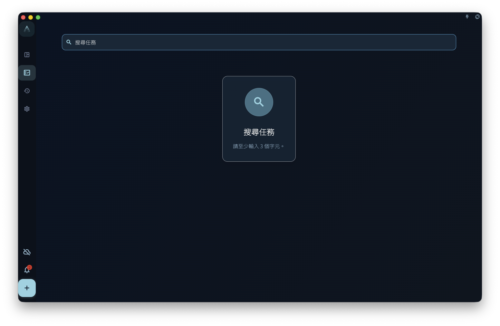

搜尋用來快速找到既有任務。當你記得一部分標題，但不記得任務放在哪個列表時，可以使用它。

不要把搜尋當成完整資料審核、附件全文搜尋或長期篩選規則。它是找回和開啟入口，不會替你重新整理任務。

## 從哪裡進入

從首頁或主介面的搜尋入口進入。開啟搜尋頁後，輸入足夠明確的關鍵字，再查看結果。

<!-- manual-screenshot:id=interface-search-main -->

如果關鍵字太短，頁面會先提示你繼續輸入。沒有結果時，代表目前可搜尋範圍內沒有符合項目，不代表所有歷史資料、附件或已刪除內容都被逐項檢查過。

## 如何使用結果

搜尋結果以任務為主。開啟某條結果後，GranoFlow 會根據任務目前狀態帶你回到對應位置，例如收集箱、任務列表、已完成、歸檔或回收站。

如果任務屬於專案，開啟結果後仍要在任務或專案脈絡中繼續判斷它和階段、里程碑、日期的關係。

## 什麼時候使用

- 記得任務標題的一部分，但忘了它放在哪裡。
- 想快速開啟已完成或已歸檔的任務。
- 整理收集箱、專案或回顧前，先找出某個舊任務。

搜尋不會建立新任務，不會批次修改結果，也不會儲存成自動篩選檢視。需要長期按標籤、專案、日期或完成狀態查看時，請繼續使用對應列表和專案頁。
