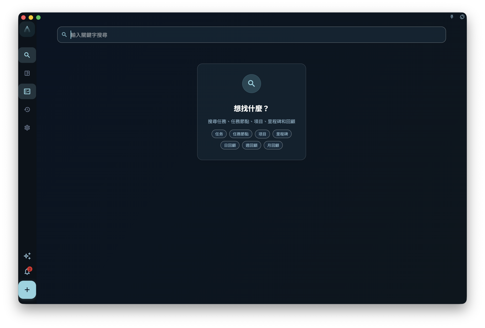

如果你記得任務標題裡的一兩個詞，但忘了任務在哪個列表，就用搜尋把它找出來並開啟。搜尋的作用是「找既有任務」，不是做完整檢查，也不會替你整理任務。

## 從哪裡進入

從首頁或主介面的搜尋入口進入搜尋頁。開啟後，在輸入框輸入比較明確的關鍵字，例如任務標題中的幾個連續字詞，然後查看下方出現的結果列表。

<!-- manual-screenshot:id=interface-search-main -->

如果關鍵字太短，頁面會提示你繼續輸入。你需要把關鍵字補充得更具體，再看是否出現結果。

如果沒有結果，只代表目前可搜尋範圍內沒有符合項目。這不代表 GranoFlow 已經逐項檢查所有歷史資料、附件內容或已刪除內容。

## 如何使用結果

搜尋結果主要是任務。開啟某條結果後，GranoFlow 會依照這個任務目前所在的位置帶你過去。它可能在收集箱、任務列表、已完成、歸檔或回收站裡。

如果這個任務屬於某個專案，開啟結果後仍然要回到任務或專案頁面繼續判斷：它屬於哪個階段、和哪個里程碑有關、日期是否仍然合適。

## 什麼時候使用

- 你記得任務標題的一部分，但忘了它放在哪裡。
- 你想快速開啟一個已完成或已歸檔的任務。
- 你在整理收集箱、專案或做回顧前，想先找出某個舊任務。

搜尋不會建立新任務，不會批次修改搜尋結果，也不會儲存成自動篩選檢視。如果你需要長期按標籤、專案、日期或完成狀態查看任務，請繼續使用對應的列表和專案頁面。
