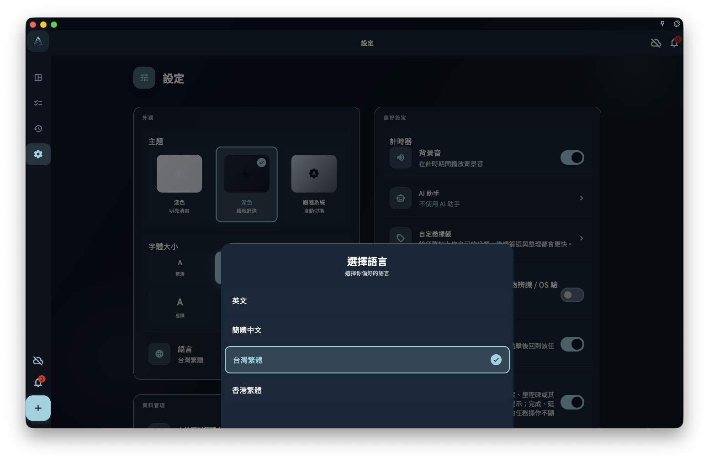

設定相關頁面：

- [設定總覽](/manual/zh-tw/interface/settings-overview/)
- [語言、主題與字型](/manual/zh-tw/interface/settings-language-appearance/)
- [目前裝置偏好](/manual/zh-tw/interface/device-preferences/)
- [賬號、同步與資料入口](/manual/zh-tw/interface/settings-account-data-entrypoints/)

語言、主題和字型大小決定你在目前裝置上如何閱讀和操作 GranoFlow。它們屬於顯示體驗設定，不會改變任務、專案、標籤、回顧記錄或同步資料的含義。

## 更改語言

進入「設定」→「外觀」→「語言」，選擇你想使用的介面語言。

<!-- manual-screenshot:id=interface-settings-language-appearance -->

語言切換只改變 App 的介面文案。它不會自動翻譯你自己寫過的任務標題、專案名稱、標籤、筆記或回顧內容。比如你把介面從中文切到英文，原來寫下的中文任務仍會保持中文。

如果你在多台裝置上使用 GranoFlow，每台裝置可以按自己的使用環境選擇語言。語言偏好不應被理解為賬號級資料，也不應影響 [多端同步](/manual/zh-tw/data-security-and-recovery/sync/) 中的業務記錄。

## 更改主題

進入「設定」→「外觀」→「主題」，選擇淺色、深色或跟隨系統。

主題只影響目前裝置上的顯示效果。你可以在桌面端使用深色主題，在手機上使用淺色主題；這不會改變任何任務、專案、回顧記錄或 [賬號](/manual/zh-tw/account/overview/) 狀態。

如果某個平台顯示為跟隨系統，實際效果取決於目前裝置的系統外觀設定。

## 調整字型大小

進入「設定」→「外觀」→「字型大小」，把介面文字調大或調小。

字型大小適合按裝置分別設定。例如，手機上可以調大一些方便閱讀，桌面端可以保持更緊湊的顯示。它只改變介面呈現，不會改變你寫入的資料，也不會影響 [備份與恢復](/manual/zh-tw/data-security-and-recovery/backup-and-restore/) 的內容。

## 下一步

- 想了解設定頁整體怎麼分組，閱讀 [設定總覽](/manual/zh-tw/interface/settings-overview/)。
- 想了解應用程式鎖、提醒橫幅等本機體驗設定，閱讀 [目前裝置偏好](/manual/zh-tw/interface/device-preferences/)。
