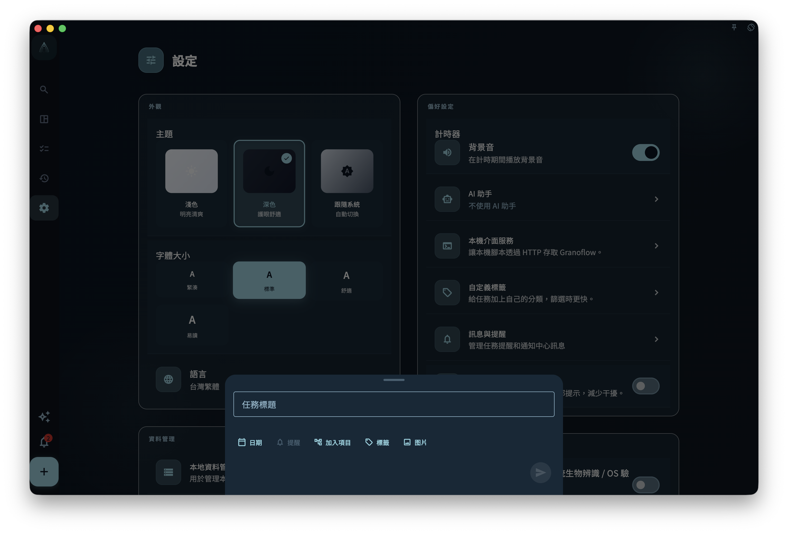

如果你不確定某個設定會影響哪裡，先看它屬於哪個分組：外觀和目前裝置通常只影響這台裝置的顯示和提醒；帳號、同步、資料、訂閱和 AI 入口會帶你進入對應頁面，處理更具體的設定或說明。

設定相關頁面：

- [設定總覽](/manual/zh-tw/interface/settings-overview/)
- [語言、主題與字型](/manual/zh-tw/interface/settings-language-appearance/)
- [目前裝置偏好](/manual/zh-tw/interface/device-preferences/)
- [帳號、同步與資料入口](/manual/zh-tw/interface/settings-account-data-entrypoints/)
- [命令列工具](/manual/zh-tw/desktop/command-line-tool/)

設定頁是 GranoFlow 的統一入口。它把顯示體驗、目前裝置偏好、帳號、同步、資料、訂閱、AI 和關於資訊放在同一個地方，但每個入口影響的範圍不一樣。

## 外觀

外觀通常包含主題、字型大小和語言。

<!-- manual-screenshot:id=interface-settings-overview-main -->

這些設定主要影響你在目前裝置上看到的介面。切換語言、改用深色模式或調大字型，不會改寫任務、專案、標籤、回顧記錄，也不會改變 [多端同步](/manual/zh-tw/data-security-and-recovery/sync/) 中的資料含義。

如果你只是想調整閱讀和顯示體驗，繼續閱讀 [語言、主題與字型](/manual/zh-tw/interface/settings-language-appearance/)。

## 目前裝置

目前裝置偏好控制這台裝置上的操作習慣，例如計時器聲音、App 鎖、任務提醒橫幅、滑動操作通知，以及防止投入時間段重疊。

你可以把這些選項理解為：這台裝置怎麼提醒我、怎麼保護我、怎麼顯示回饋。它們不應被理解為帳號級業務資料，也不應被當作跨裝置同步承諾。

## 帳號與同步

帳號入口用於登入、登出、查看帳號狀態或進入相關帳號功能。同步入口用於理解目前裝置與雲端資料之間的關係。

如果你要處理登入、裝置或同步問題，先閱讀 [帳號總覽](/manual/zh-tw/account/overview/) 和 [裝置管理](/manual/zh-tw/account/device-management/)。如果你要理解資料如何在多台裝置之間流動，閱讀 [多端同步](/manual/zh-tw/data-security-and-recovery/sync/)。

## 創作與回顧

設定頁可能提供 AI 助手、標籤管理、提示詞或回顧相關入口。

這些入口是為了進入具體配置或說明頁面，不代表 AI 會自動修改你的記錄。涉及外部 AI 的流程，應先理解 [AI 輔助](/manual/zh-tw/ai-assistance/overview/) 和 [AI 助手與剪貼簿](/manual/zh-tw/ai-assistance/clipboard-assistant/) 的邊界。

## 命令列工具

設定頁提供「命令列工具」入口，用於安裝或修復 `granoflow` 命令，並確認目前平台是否可以在終端機裡呼叫 CLI。

這裡的 CLI 只面向使用者本機和正在執行的桌面 App，不包含開發、建置、雲端管理員、內部偵錯或發布類命令。

如果你只是手動使用 `granoflow help`、`granoflow version`、`granoflow status --json`、`granoflow display get --json` 或 `granoflow open <route> --json`，通常不需要額外設定。需要讓腳本或 AI 助手讀取結構化結果時，優先使用 `--json`。

需要從終端機調整 App 顯示偏好時，使用 `granoflow display language/theme/font-size/reset`。這些命令只影響顯示體驗，不會清空帳號或業務資料。

業務物件命令包括 `task`、`project`、`milestone`、`tag`、`domain-value` 和 `review`。這些命令需要執行中的桌面 App 承接；App 不可達時會返回 `app_not_reachable`，不會繞過 App 直接讀取或寫入本機資料庫。

CLI 的 `backup create` 和 `backup restore` 也需要執行中的桌面 App 承接。備份恢復前應先使用 `--preview` 查看摘要，只有明確 `--confirm` 後才會匯入。完整命令見 [命令列工具](/manual/zh-tw/desktop/command-line-tool/)。

## 資料與恢復

資料與恢復入口用於匯入、匯出、備份、恢復、附件或清理相關操作。

這些操作的影響通常比外觀設定更大。繼續前先閱讀對應頁面，尤其是 [備份與恢復](/manual/zh-tw/data-security-and-recovery/backup-and-restore/) 和 [資料與安全總覽](/manual/zh-tw/data-security-and-recovery/overview/)。

## 關於、訂閱與調研

關於區域通常包含版本資訊、帳號入口和必要的輔助入口。隱藏診斷或測試資料入口不會作為一般使用者預設入口展示。

訂閱入口用於查看權益、購買狀態或恢復購買說明。具體權益和平台規則以 [訂閱總覽](/manual/zh-tw/subscription/overview/) 及實際平台展示為準。

調研計畫屬於低頻入口，用於使用者主動參與回饋或研究，不影響日常任務和資料結構。

## 下一步

- 想調整顯示效果，閱讀 [語言、主題與字型](/manual/zh-tw/interface/settings-language-appearance/)。
- 想理解本機開關，閱讀 [目前裝置偏好](/manual/zh-tw/interface/device-preferences/)。
- 想處理帳號、同步或資料入口，閱讀 [帳號、同步與資料入口](/manual/zh-tw/interface/settings-account-data-entrypoints/)。
- 想讓終端機、腳本或 AI 助手呼叫 GranoFlow，閱讀 [命令列工具](/manual/zh-tw/desktop/command-line-tool/)。
