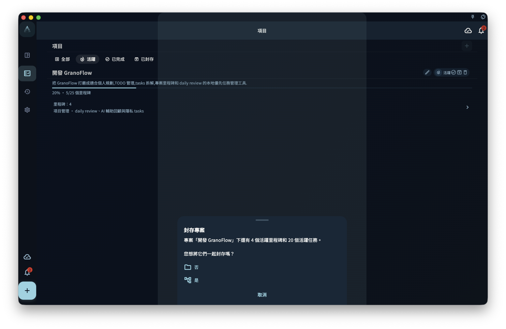

專案做完了，有三種處理方式：完成、封存、刪除。

| 操作 | 含義 | 裡面的任務去哪 |
|------|------|--------------|
| **完成** | 標記目標已達成 | 仍然存在，可以查看 |
| **封存** | 放進封存，不佔當前視圖 | 仍然存在，隨時還原 |
| **刪除** | 徹底移除專案 | 根據裡面內容決定 |

:::tip[不確定就用封存]
封存的專案可以隨時還原，而刪除是不可復原的。
:::
