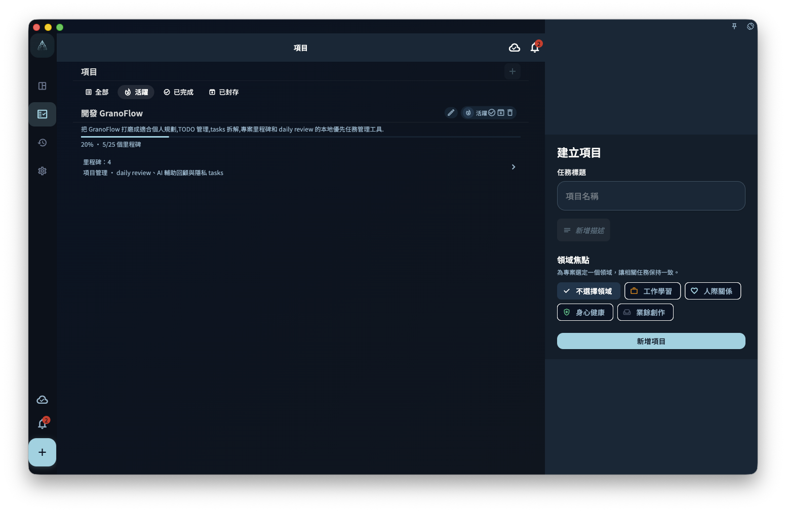

建立一個專案，設定名稱與基礎資訊，並理解空專案、已有任務和後續封存之間的關係。

## 從哪裡開始

從專案頁進入。專案適合承載持續一段時間的目標，里程碑負責階段，任務負責具體行動。

<!-- manual-screenshot:id=projects-create-dialog -->

## 怎麼操作

- 建立或打開專案後，先確認名稱和目標是否清晰，再把相關任務連結進去。
- 需要階段管理時新增里程碑；需要執行時建立或移動任務，而不是把所有說明都寫進專案名。
- 專案完成或封存前，檢查裡面是否仍有任務或里程碑，避免活躍內容被收起。

## 結果和邊界

專案會改變任務的組織位置，但不會替代今日安排、標籤篩選或日回顧。一個任務可以在專案中出現，也可能因為日期或完成狀態出現在其他視圖。

- 空專案可以更直接地刪除；包含任務或里程碑的專案通常需要先處理內部內容。
- 專案封存是整理長期目標，不是刪除所有相關任務。

## 下一步

繼續閱讀建立專案、里程碑、連結任務或封存規則，按你當前要做的動作進入下一頁。
