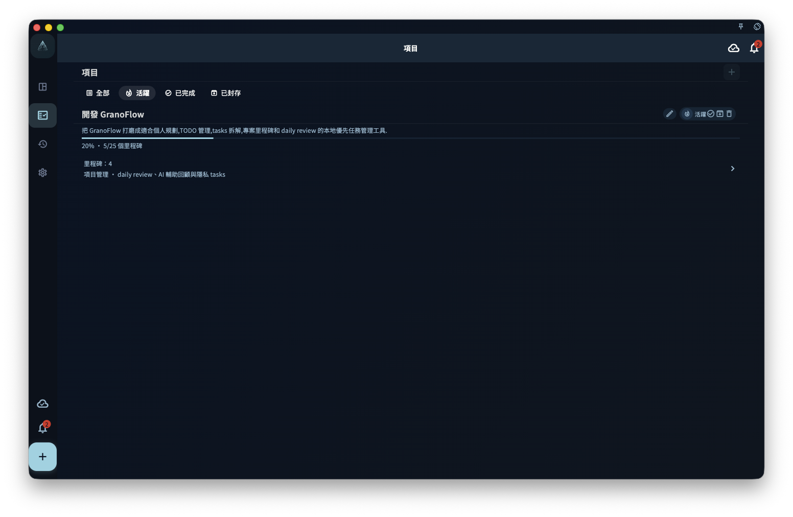

如果你想管理一個比較大的目標，例如一次發表、一門課程，或某段時間的計畫，就可以建立專案：進入專案頁，點擊右上角 **+**，填寫專案名稱，然後建立。

## 建立入口

在專案列表頁右上角點擊 **+** 按鈕，會跳出建立對話框。

建立時可以填寫：

- **名稱**（必填）：寫清楚這個專案要完成什麼。像是「Q3 產品發表」會比「專案一」更容易看懂。
- **領域**（可選）：把專案放到一個大方向下，例如「工作」「學習」「健康」。
- **截止日期**（可選）：整個專案希望完成的時間。

:::tip[名字起好，以後省事]
專案名稱會出現在專案列表裡。建議用「動詞 + 目標」的寫法，例如「寫完畢業論文」，不要只寫「論文」。
:::

## 建立空專案 vs 先加任務再歸入專案

兩種方式都可以，照你的使用習慣選就好：

| 方式 | 適合場景 |
| --- | --- |
| 先建立專案，再慢慢加任務 | 還在規劃階段，想先把專案架構建起來 |
| 先把任務加到收集箱，再歸入專案 | 正在執行，想先快速記下來，之後再整理 |

不管用哪種方式，最後任務都可以放進專案裡管理。

## 專案建立後

專案建立後，你通常可以繼續做這些事：

1. 新增里程碑（可選）——如果這個目標有明顯階段。
2. 把已有任務連接到專案。
3. 在專案裡直接建立新任務。

如果你現在還不知道要加哪些任務，也可以先關閉專案頁面。專案已經建立好，之後再回來補充就可以。
