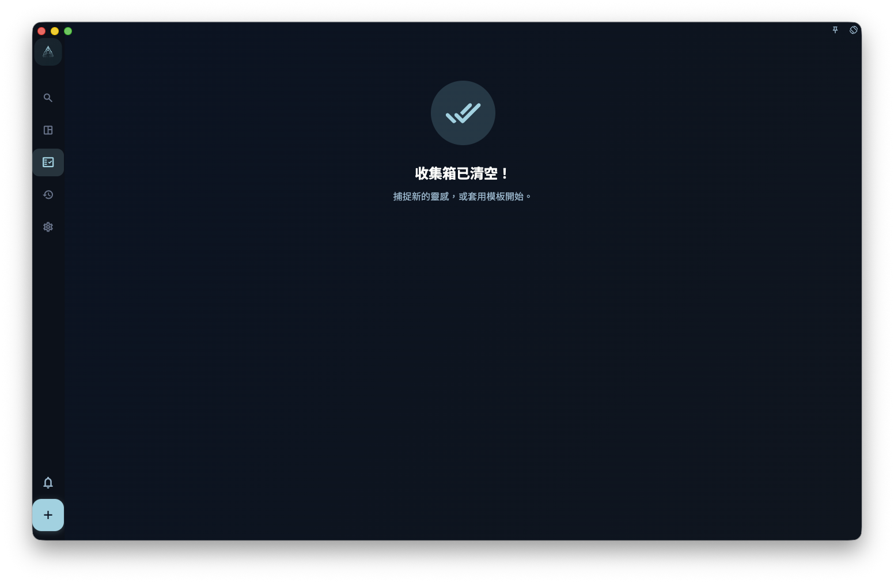

把任務連接到專案後，它會出現在專案裡；如果它有日期，也仍然會出現在今日檢視或日曆檢視裡。專案用來說明這件事屬於哪個目標，里程碑用來說明它屬於專案裡的哪個階段。

這裡最容易誤會的是收集箱：**連接專案本身不會讓一個無日期任務自動離開收集箱**。收集箱主要看任務有沒有日期；如果任務仍然沒有日期，它可能會繼續留在收集箱裡，方便你稍後安排時間。

## 怎麼連接

你可以用幾種方式把任務連接到專案。

### 方法一：在任務詳情裡選擇專案

打開任務詳情，找到專案欄位，選擇目標專案。需要時，也可以繼續選擇這個專案下的某個里程碑。

這是最常用的方式，適合你已經打開任務、想直接幫它分類的時候。

### 方法二：在任務列表或收集箱裡「加入專案」

在任務列表或收集箱裡使用「加入專案」時，需要選擇一個具體里程碑。這樣任務會同時連接到專案和這個階段。

<!-- manual-screenshot:id=projects-link-tasks-drag -->

### 方法三：在專案頁面建立新任務

打開專案詳情頁，在某個里程碑下新增任務。這樣建立出來的任務會自動帶上目前專案和里程碑，不需要再手動選擇一次。

## 任務連接後出現在哪裡

連接專案之後，同一個任務可能會同時出現在多個地方。它不是被複製了，而是同一個任務在不同檢視裡顯示。

| 檢視 | 說明 |
| --- | --- |
| 專案頁面 | 出現在對應專案裡；如果選了里程碑，會出現在對應里程碑下 |
| 今日檢視 | 如果任務有今天的日期，仍然出現 |
| 日曆檢視 | 依截止日期顯示 |
| 收集箱 | 如果任務仍然沒有日期，而且還是待辦或進行中，可能繼續出現 |

:::note[收集箱的變化]
收集箱不是「沒有專案的任務列表」，而是「還沒有安排日期的待處理任務列表」。如果你把任務加入了附帶截止日期的里程碑，GranoFlow 可能會把里程碑日期帶到任務上；這時它會依日期進入任務列表或日曆，不再留在收集箱。
:::

## 掛到專案和掛到里程碑有什麼差別

掛到專案，表示這個任務屬於這個專案。

掛到里程碑，表示這個任務不只屬於專案，還屬於專案裡的某個階段。比如一個專案裡有「準備」「執行」「回顧」幾個里程碑，任務可以放到其中一個里程碑下。

在任務列表或收集箱裡的「加入專案」操作通常會要求你選到具體里程碑。這麼做是為了避免任務只掛在一個大專案下面，卻不知道屬於哪個階段。

## 想把一個任務從專案裡移出來

打開任務詳情，把專案欄位清空就行。

清空後，如果這個任務也沒有截止日期，而且還是待辦或進行中，它會重新出現在收集箱。如果它還有截止日期，它仍然會依日期出現在今日檢視或日曆檢視裡。

## 一個任務能掛多個專案嗎

不能。每個任務只能屬於一個專案（和一個里程碑）。

如果你發現一個任務好像跨了兩個專案，通常有兩種處理方式：

1. 選擇它更主要歸屬的那個專案
2. 把它拆成兩個任務，分別掛到各自的專案
