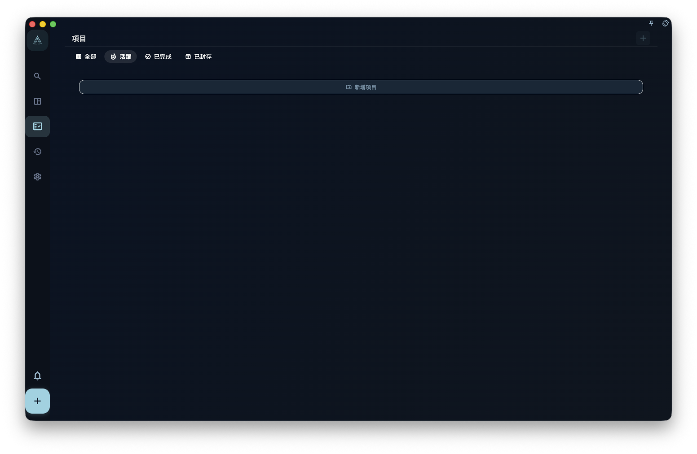
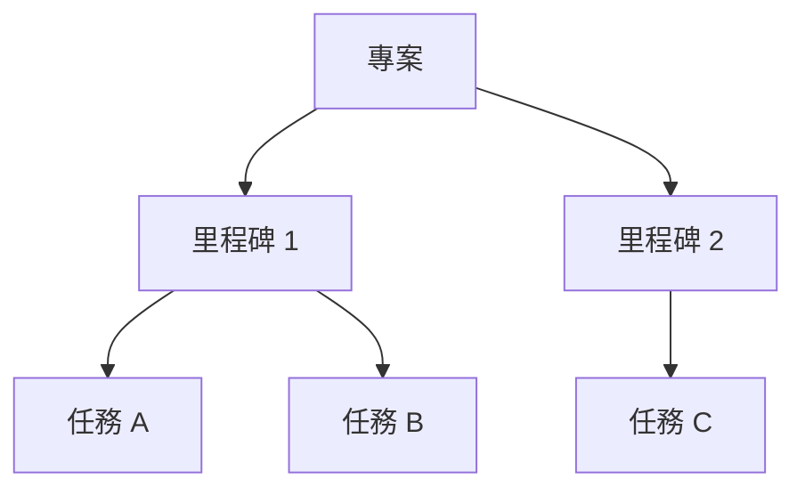

專案用來管理一個會持續一段時間的目標：你可以把相關任務放進同一個專案，用里程碑分階段，再查看整體進度。

任務是一件具體要做的事，專案是一組相關任務背後的目標。比如你要搬家，買紙箱、打包廚房、聯絡搬家公司都是任務；「搬家」這件事本身就是專案。把這些任務放進同一個專案，你就不用到處找，也更容易判斷這件事做到哪一步了。

## 專案頁面能看什麼

<!-- manual-screenshot:id=projects-overview-main -->

在專案列表裡，你可以看到已有專案，以及每個專案目前的進度。即使截圖沒有載入，你也可以把這裡理解成「所有專案的總覽頁」：先找到你要看的專案，再進入詳細內容。

進入專案詳細內容後，你可以看到：

- 這個專案裡的所有里程碑，也就是階段目標
- 每個里程碑下面的任務
- 專案整體完成了多少

<!-- manual-screenshot:id=projects-detail-main -->

在寬螢幕或桌面上，點選任務後，任務詳細內容會以右側彈窗開啟。關閉彈窗後，你會回到原本的專案階段位置，不需要在多個頁面之間來回切換。

## 專案能做什麼、不能做什麼

專案**能做的**：

- 把相關任務放在一起看
- 用里程碑把一個大目標拆成幾個階段
- 追蹤專案整體進度

專案**不能取代**：

- 今日安排：哪天做一件事，還是要看截止日期
- 標籤篩選：跨專案的橫向分類，還是要靠標籤
- 每日回顧：每日回顧看的是每天完成了什麼，不是專案視角

:::tip[什麼時候該建立專案]
如果一件事會產生三個以上相關任務，而且會持續超過一週，就值得建立一個專案。如果只是一兩個任務，直接建立任務就好，不需要特別建立專案。
:::

## 三層結構快速回顧

專案、里程碑、任務這三層按需使用。簡單目標可以只用「專案 + 任務」，不一定要建立里程碑。
