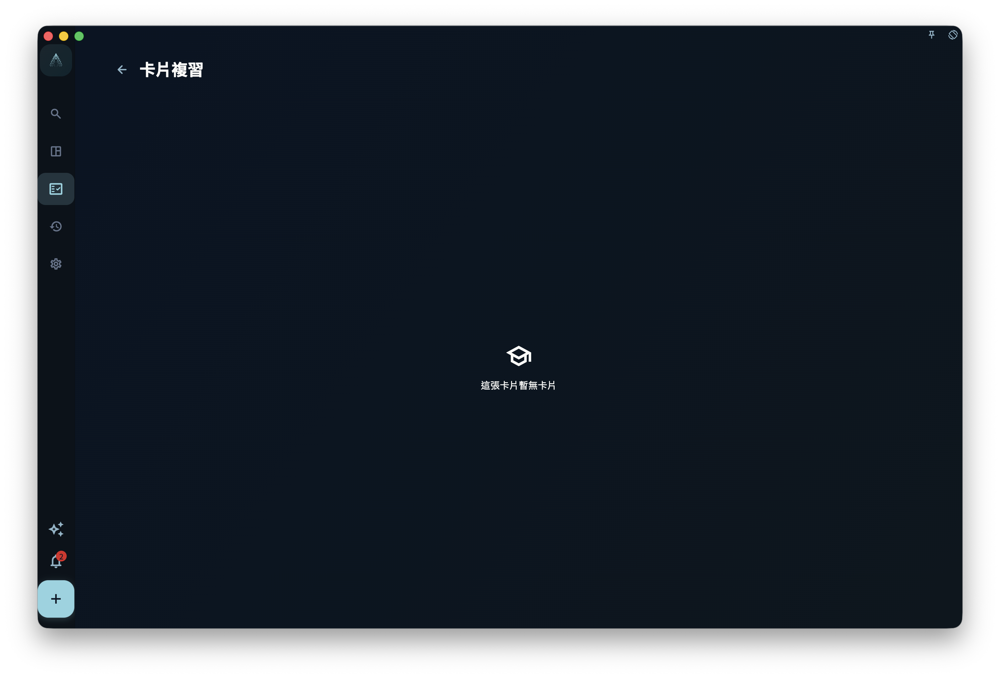

建立卡片時，最重要的不是先想「我要做多少張」，而是先想「這條經驗來自哪裡，以後應該回到哪裡」。

在 GranoFlow 裡，卡片通常從任務上下文進入。這麼做有一個好處：你不是在空白頁面裡憑感覺造知識，而是在一個已經發生的任務旁邊整理經驗。任務提供來源，卡片保存可重複使用的判斷，關聯關係讓這條判斷以後還能回到類似任務中。

## 不要一開始就追求完整卡片庫

很多人剛開始用卡片系統，會想先搭一個很完整的知識庫：分類、範本、標籤、匯入、批次整理，全都安排好。

但真正能留下來的經驗，往往不是這樣來的。它更像你做完一件事後突然意識到：

> 這條經驗以後肯定還會用到。

這時建立一張卡片，比一次性匯入幾百張更有價值。因為它知道自己的來源，也知道自己為什麼存在。

## 核心概念：先有筆記，再有卡面

GranoFlow 現在把「筆記」和「卡片佈局」分開。

筆記頁儲存完整上下文，比如標題、內容、譯文和自訂欄位。卡片佈局頁決定這些筆記欄位怎樣出現在正面和背面。你可以把它理解成：筆記保留上下文，卡片負責練習方式。

同一則筆記下面可以有多張卡片。比如同一個「訪談問題設計」筆記，可以做一張問原則的卡，也可以再排一張問例子的卡。它們共享同一則筆記，但每張卡有自己的正反面編排。

這個分離很重要。它避免你為了做第二張相關卡片而複製一整則筆記，也讓你能在以後回到同一則筆記繼續擴展。

## 一個真實任務例子

假設你完成了「閱讀一篇關於可用性測試的論文」這個任務。回顧時，你發現一個以後會反覆用到的經驗：

> 測試問題要讓使用者完成真實動作，而不是讓使用者評價介面好不好。

你可以從這個任務詳情裡的「任務卡片」區域開始：

1. 點選「新增卡片」，進入「關聯卡片」頁面。
2. 先搜尋已有卡片，看看是否已經有相同經驗。
3. 如果沒有合適結果，選擇「新增卡片」。
4. 在筆記頁填寫標題，例如「可用性測試要觀察真實動作」。
5. 標題填寫後，其餘欄位會解鎖；繼續填寫內容。
6. 進入卡片佈局頁，把筆記欄位安排到正面和背面。
7. 完成佈局後回到筆記頁，這張卡片會和當前任務建立關聯。

筆記頁會自動儲存欄位內容。儲存成功時，標題旁會短暫顯示「已儲存」。你不需要額外尋找「儲存筆記」按鈕。

## 手動新增時會發生什麼

手動新增卡片會經歷兩個主要頁面：

1. **筆記頁**：先填寫標題，標題非空後解鎖其他欄位；欄位內容會自動儲存。
2. **卡片佈局頁**：選擇哪些欄位出現在正面，哪些欄位出現在背面。

如果這則筆記下還沒有卡片，頁尾會顯示「製作卡片」。如果已經有卡片，頁尾會顯示「再排一張」，用於給同一則筆記繼續製作另一張卡片。

「本筆記下的卡片」會以正面縮圖網格展示，縮圖會盡量把目前面的內容完整縮放進卡面。點一張縮圖，會在原位置切換到背面；再點一次，會切回正面。進階選項裡可以新增標題譯文、內容譯文和自訂欄位。

來源會在首次儲存標題時自動寫入當前任務名稱，但不會在筆記頁裡打擾你；複習時，它會在卡片背面底部以較弱樣式顯示，提醒你這張卡片從哪裡來。

<!-- manual-screenshot:id=review-card-study-answer -->

## 關聯已有卡片

不是每次都要新建卡片。

如果你已經有相關卡片，可以在「關聯卡片」頁面先搜尋。頁面會顯示目前任務已關聯卡片數量，並排除已經和當前任務確認關聯的卡片，避免你重複關聯同一批卡片。點開某則筆記結果後，面板會用兩列縮圖展示可關聯卡片；再次點擊同一則筆記結果會收起面板。活躍卡片預設顯示正面並加亮邊框，已歸檔卡片預設顯示背面並弱化。點擊卡片會在正反面之間切換，表示這張卡片確認關聯後是活躍還是歸檔。底部會顯示本次共關聯幾張卡片、其中幾張活躍、幾張已歸檔；點擊「關聯」後，面板會關閉，這則筆記結果會從待關聯列表消失，已關聯卡片數量會按活躍卡片數增加。

關聯已有卡片適合這些情況：

- 當前任務正在使用以前總結過的經驗。
- 你發現某張卡片和這個任務高度相關。
- 你想讓這張卡片以後能體現自己在不同任務中的使用痕跡。

這一步看似簡單，但它會影響「已內化」的判斷。系統只有看到一張已掌握卡片被帶回多個不同專案的任務，才會把它歸為已內化。

## 使用任務 AI 助手生成卡片草稿

任務 AI 助手適合在分析任務或復盤任務後，把值得以後複用的經驗整理成卡片草稿。它不會靜默建立卡片。

AI 會先用自然語言和你確認任務理解、資料依據和候選卡片方向。只有你明確同意輸出並確認匯入後，GranoFlow 才會建立筆記、卡片佈局，並關聯當前任務。

這裡要記住一個邊界：AI 可以幫你起草，但不能替你判斷這條經驗是否真的值得留下。確認階段就是用來做這件事的。看到一條說得漂亮但以後用不上的內容，可以要求 AI 不要匯入；看到一條表達不準但方向有用的內容，可以讓 AI 修改後再確認。

## 任務卡片區怎樣展示

任務詳情裡的「任務卡片」區域會按筆記分組展示同一則筆記下的多張卡片。未封存卡片會排在已封存卡片前面；已封存卡片仍可從任務上下文開啟，只是會以更低調的狀態出現。

你可以點單張卡片進入佈局編輯。任務詳情裡右滑卡片可以封存或取消封存，左滑可以取消與當前任務的關聯。取消關聯不會刪除卡片，也不會影響它與其他任務的關係；如果同一則筆記下有多張卡片變體，GranoFlow 會按同一則筆記一起解除當前任務關聯，並在需要時先提醒你影響範圍。

日回顧、週回顧和月回顧裡的任務卡片也會複用相似列表，但因為那裡不是單一任務上下文，左滑會把卡片移到回收桶，而不是取消當前任務關聯。

## 什麼時候不要建立卡片

如果一條內容只是當天情緒、臨時安排或不會再次使用的事實，不要勉強做成卡片。

例如「今天下午三點開會」不適合做卡片；「重要會議前先確認決策人是否在場」才可能適合。前者是一次性資訊，後者是可重複使用的判斷。

下一章會繼續看：卡片建立之後，怎樣透過練習、封存、掌握和內化，讓它不只是留在系統裡，而是真的回到你的行動中。
