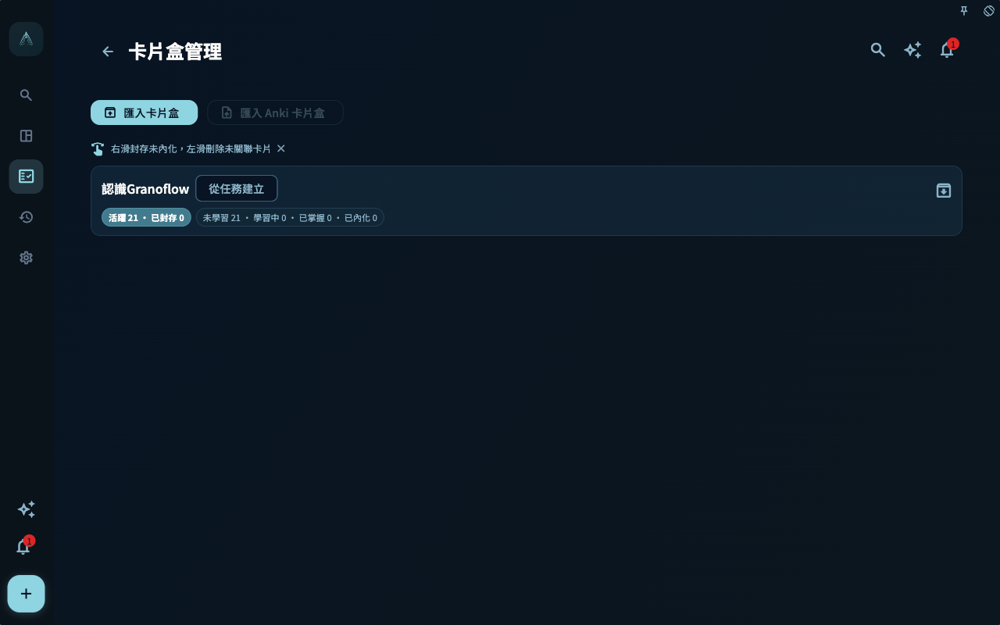

當卡片變多以後，你會自然想整理它們：哪些屬於同一批任務，哪些來自同一個匯入包，哪些可以遷移到另一台裝置，哪些應該暫時封存。

這就是卡片盒存在的原因。卡片盒不是另一個專案系統，也不是完整備份。它更像一個用來管理與遷移卡片範圍的容器。

## 不要把三種檔案混在一起

GranoFlow 裡有幾類容易混淆的東西：

- `.flow.grano`：完整本機備份，用來整機遷移或還原。
- `.deck.grano`：GranoFlow 自有卡片盒包，只處理選定卡片盒與其中卡片。
- Anki/APKG：Anki 的卡片盒格式，和 GranoFlow 的筆記、佈局、任務關聯模型並不相同。

它們看起來都和「匯入/匯出」有關，但解決的問題不同。把 `.deck.grano` 當完整備份，會漏掉任務、專案與回顧。把 Anki 當 GranoFlow 的原生卡片盒，也會誤解欄位、媒體、模板與學習記錄的邊界。

## 核心概念：卡片盒處理範圍，不處理整個人生系統

卡片盒關注的是一組卡片以及它們的卡片盒樹。它可以幫助你遷移某一類知識經驗，例如「論文閱讀方法」「使用者訪談經驗」「產品設計原則」。

但任務本體、專案、里程碑、日回顧、帳號與裝置金鑰，不屬於 `.deck.grano` 的職責。它不會建立任務本體，也不能取代完整本機備份。

你可以這樣判斷：

- 想換機或整機還原，用 `.flow.grano` 本機備份。
- 想遷移或分享某個卡片盒，用 `.deck.grano`。
- 想嘗試把 Anki 卡片帶進來，看 Anki 匯入入口與說明，但不要期待無損還原。

## 一個真實任務例子

假設你整理了一組「科研寫作」卡片，裡面有讀論文、寫摘要、準備組會、處理導師反饋的經驗。你想把這組卡片遷移到另一台電腦。

這時不需要匯出整個 GranoFlow 備份，也不應該把它理解成 Anki 包。你可以進入卡片盒清單，選擇頂層卡片盒並匯出 `.deck.grano`。這個包會包含選定頂層卡片盒、子卡片盒、未刪除卡片與可打包的本機圖片媒體。

如果你開啟了「包含學習記錄」，學習記錄才會寫入匯出包；預設不會包含。匯入時也一樣，學習記錄預設不匯入，只有你在匯入預覽裡明確開啟「匯入學習記錄」才會合併。

## 從哪裡管理卡片盒

卡片盒級匯入、匯出與 Anki 匯入的主要入口在卡片盒清單。

你可以從卡片統計進入卡片盒清單，也可以在卡片管理頁透過卡片盒麵包屑進入。清單頂部提供「匯入卡片盒」與一個弱化的「匯入 Anki 卡片盒」入口，每個頂層卡片盒行尾有匯出按鈕。目前版本中，Anki 入口只顯示說明與反饋入口，不會讓你選擇 `.apkg` 檔案，也不會真正匯入 Anki 卡片。

卡片管理頁本身主要用於搜尋、篩選、排序與整理當前範圍的卡片；它不承擔卡片盒級匯入匯出。這樣分開，是為了避免你在整理單張卡片時誤以為自己正在操作整個卡片盒。

<!-- manual-screenshot:id=review-card-deck-list-main -->

## 卡片盒清單裡的封存與刪除

卡片盒清單會顯示活躍、已封存、未學習、學習中、已掌握與已內化等統計。

在卡片盒清單裡：

- 右滑可以封存未內化卡片，已內化卡片會保留在主動複習裡。
- 左滑只刪除未關聯任務的卡片。
- 卡片盒本身會盡量保留，尤其當裡面還有不能刪除或不應該刪除的卡片時。

這個設計有點保守，但很必要。卡片盒往往包含一整組經驗，誤刪的代價比單張卡更高。已內化卡片尤其值得小心，因為它已經在多個專案中被用過。

## `.deck.grano` 能做什麼

`.deck.grano` 適合在 GranoFlow 之間遷移一個卡片盒。

它會處理：

- 選定頂層卡片盒與子卡片盒
- 未刪除卡片
- 筆記、欄位、佈局與可打包的本機圖片媒體
- 可選的學習記錄

它不會處理：

- 任務本體
- 專案與里程碑本體
- 日回顧、週回顧、月回顧正文
- 完整帳號或裝置還原
- 任意 Anki 模板、CSS 或調度歷程的無損還原

匯入 `.deck.grano` 前，GranoFlow 會先顯示預覽，再由你確認。匯入不會建立任務本體，只會保留這台裝置上仍然存在、且不在回收站裡的任務關聯。缺失的任務關聯會在預覽中計數並跳過；沒有有效任務關聯的卡片可能進入已封存卡片。

## Anki 入口怎樣理解

Anki/APKG 和 GranoFlow 的卡片格式完全不同。

Anki 更強調卡片模板與欄位組合；GranoFlow 還要處理任務關聯、筆記、佈局、媒體邊界、卡片盒來源與複習上下文。所以 Anki 匯入不能被理解成「原樣搬進來」。

當前 Anki 入口會顯示說明與限制。確認後，GranoFlow 會開啟 `@Granoflow` 的 X 頁面作為需求反饋入口；它不會進入檔案選擇、預檢或匯入進度頁。

底層仍保留 Anki/APKG 相容程式碼和防線，但這不代表目前使用者介面已經開放 Anki 匯入。即使未來重新開放，也不應期待任意 Anki 模板、CSS、調度歷程與學習記錄都能無損遷移。

更穩妥的方式仍然是：讓 GranoFlow 卡片來自你自己的任務與回顧。Anki 入口可以作為補充，但不應該成為建立經驗系統的主路徑。

## 與完整備份的關係

如果你準備換裝置、重灌系統或做大規模刪除，應該先建立完整本機備份 `.flow.grano`。完整備份才是回到某個時間點的主要防線。

資料管理頁裡的「卡片盒」卡片可以處理 `.deck.grano` 匯入、Anki 匯入說明、匯出當前卡片盒、查看卡片快取與清空快取。但這些都不等於完整備份。

一個簡單原則是：

- 擔心整套資料遺失，先備份。
- 只想遷移一組卡片，再匯出卡片盒。
- 想匯入外部卡片，先讀限制；目前 Anki 入口只收集反饋，`.deck.grano` 才是 GranoFlow 之間遷移卡片盒的主路徑。

## 收束

卡片盒讓卡片系統可以整理、遷移與控制範圍，但它不改變卡片的核心：真正重要的仍然是經驗能不能回到任務裡。匯入匯出只是搬運方式，卡片是否有價值，最終還是要看它是否幫助你在下一次行動中做出更好的判斷。
