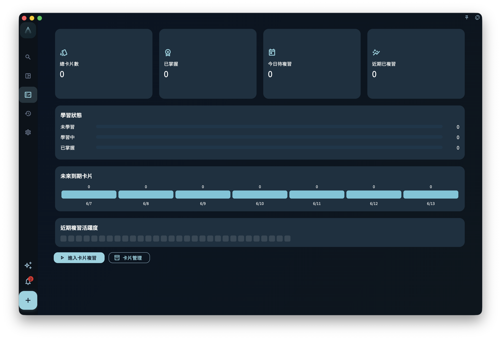

你可能已經習慣把「卡片」理解成背單字、背概念、背答案的工具。這樣理解沒有錯，但放在 GranoFlow 裡還不夠。

GranoFlow 的卡片更像一張可以隨身帶走的經驗紙條：它來自你做過的事，也應該回到你將要做的事。它不只是提醒你「答案是什麼」，更重要的是提醒你「下次遇到類似情況時，我該怎樣判斷」。

比如你剛完成一次論文開題彙報，回顧時寫下：

> 老師真正關心的不是我列了多少材料，而是研究問題是否能被一句話說清楚。

如果這句話只留在當天回顧裡，它當然有價值，但以後不一定會被你想起來。把它整理成卡片，並關聯到這次彙報任務後，它就能在未來寫摘要、做組會或準備答辯時重新出現。經驗開始從「那天發生過的事」，變成「下次可以使用的判斷」。

## 容易誤解的地方

最容易誤解的是：卡片越多，學習越紮實。

實際上，卡片太多、太散、脫離任務，反而會讓你重新回到另一個收集箱。你可能每天刷了很多張，卻很少知道這些內容應該用在哪裡。這樣的卡片更像材料堆，不像經驗。

GranoFlow 裡的卡片故意和任務、回顧、專案放在一起，是為了避免這種漂浮感。你可以從任務詳情新增卡片，也可以在日回顧、週回顧或月回顧中看到與任務相關的卡片，再進入練習。系統關心的不是你把多少內容搬進來，而是這些內容有沒有機會回到真實行動。

## 核心概念：卡片是經驗的最小可重用單位

一條回顧記錄可以很長，裡面有當天的情緒、過程、背景和細節。卡片要小一些，它只保留以後值得重複提取的一點。

這點可以是：

- 一個判斷原則：溝通前先確認對方真正受什麼限制。
- 一個方法提醒：讀論文時先找問題、證據和結論，不急著摘句子。
- 一個易錯邊界：歸檔不是刪除，只是退出主動關注。
- 一個操作經驗：複盤專案時先看里程碑是否還成立，再看任務數量。

這就像把一段經歷壓成一枚可以再次點亮的書籤。書籤本身不是書，但它能把你帶回重要位置。

## 一個真實任務例子

假設你是研究生，今天完成了「整理訪談提綱」這個任務。你在回顧裡發現，自己一開始寫了很多問題，但真正有用的是那些能讓受訪者講出具體經歷的問題。

你可以把這條經驗整理成一張卡片：

- 標題：訪談問題要引出具體經歷
- 正面：設計訪談問題時，怎樣避免只得到抽象評價？
- 背面：把「你怎麼看」改成「上一次發生這種情況時，你做了什麼、當時有什麼限制、後來怎麼變化？」

這張卡片不是為了讓你背誦一句漂亮話。它的價值在於，下次你建立「準備用戶訪談」「寫調研問題」「複盤訪談結果」這類任務時，可以把它關聯過去，再透過任務或回顧上下文重新練習。

## 可以重用的判斷原則

判斷一條內容是否適合做成卡片，可以問三個問題：

1. 這條經驗以後還會遇到嗎？
2. 它能幫助我在下一次任務裡做出更好的判斷嗎？
3. 它能被壓縮成一個清楚的問題和一個可用的回答嗎？

如果答案都是「是」，它就值得進入卡片。反過來，如果它只是當天的情緒宣洩、臨時事實或不會再用到的瑣碎記錄，留在回顧裡就好。

這也是為什麼 GranoFlow 不鼓勵你一開始就批量搬入大量卡片。卡片最好從真實任務裡慢慢長出來。少一點，但每一張都知道自己從哪裡來、要回到哪裡去。

## 從哪裡進入卡片系統

卡片通常有幾個入口：

1. 在專案任務詳情裡，從「任務卡片」區域點選「新增卡片」。
2. 在「關聯卡片」頁面，搜尋並關聯已有卡片，或者選擇「AI 新增卡片」「新增卡片」。
3. 在進度頁的「卡片學習」區域進入卡片統計、練習或管理。
4. 在日回顧、週回顧、月回顧裡，從相關任務卡片進入上下文練習。

這些入口看起來分散，其實都服務同一件事：讓卡片留在任務和回顧的上下文裡，而不是變成另一個孤立倉庫。

<!-- manual-screenshot:id=review-card-statistics-main -->

## 邊界：卡片不是完整記錄

卡片不替代任務，不替代回顧，也不替代專案文件。

任務負責說明你要做什麼；回顧負責記錄這件事發生後你怎麼看；專案負責承載長期目標。卡片只取其中最適合以後反複使用的一點。它越清楚，越容易在未來被想起來；它越想包辦一切，越容易變成沒人願意複習的長文。

一個簡單的自檢是：如果你下次看到這張卡片時，能立刻知道它適用於哪類任務，它就是好卡片。如果你需要重新讀一大段背景才知道它在說什麼，可能應該回到回顧或專案文件裡整理，而不是急著做卡片。

理解了卡片為什麼要回到行動，下一章就可以看它怎樣從一個具體任務裡被建立、關聯和編排。
