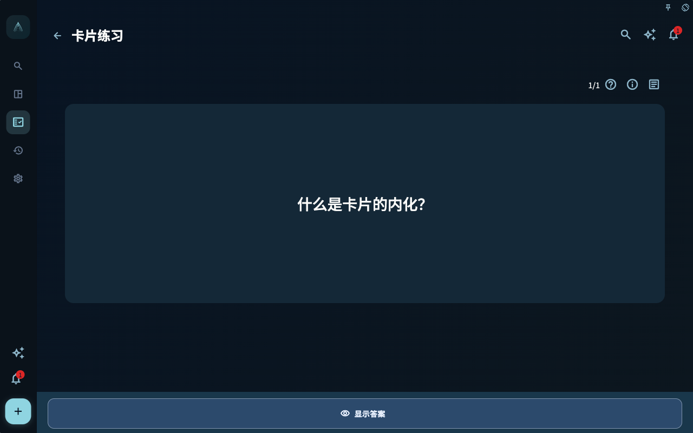
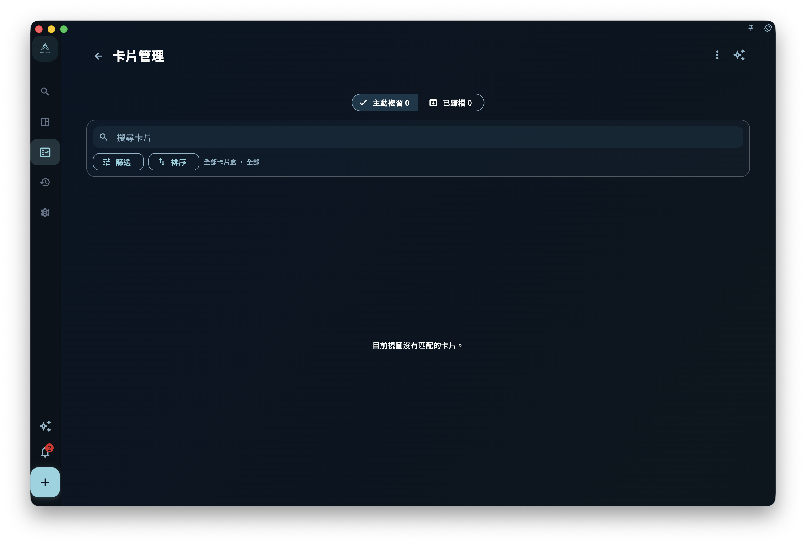

卡片練習很容易讓人緊張。看到問題，翻答案，再點「遺忘」或「輕鬆」，好像系統正在給自己打分。

在 GranoFlow 裡，最好把它理解成一次很短的提醒：這條經驗我還記得嗎？我知道它適合用在什麼地方嗎？下次遇到類似任務時，我能不能更快做出判斷？

練習不是為了證明你記憶力好，而是讓經驗有機會從卡片回到行動。

## 迷思：複習得輕鬆就代表學會了

一張卡片今天答得出來，只說明它今天容易被提取。它不一定已經能在真實任務裡使用。

比如你能背出：

> 訪談問題要引出具體經歷。

這很好，但還不夠。真正有用的是，當你下次寫訪談大綱時，能自然把「你怎麼看」改成「上一次發生時你怎麼做」。這才是卡片從記憶走向使用。

GranoFlow 用「已掌握」和「已內化」區分這兩層。已掌握表示它在複習中已經穩定；已內化表示它被帶回多個不同專案的任務，開始作為經驗參與真實行動。

## 核心概念：主動複習與上下文複習不同

進展頁裡的「卡片學習」是主動複習。它會根據今日待練習和複習排程，提醒你哪些主動卡片應該練習。

任務、日回顧、週回顧、月回顧裡的卡片練習是上下文複習。它不只是問「今天到期了嗎」，而是問「這個任務、這段回顧裡有哪些相關經驗值得重新看一遍」。

這兩種練習都重要：

- 主動複習幫助你維持記憶，不讓經驗完全沉下去。
- 上下文複習幫助你把經驗放回場景，看它能不能指導目前任務。

如果說主動複習像定期翻書籤，上下文複習就像在寫新章節時發現舊書籤正好派上用場。

## 一個真實任務例子

你有一張卡片：

- 正面：設計訪談問題時，怎樣避免只得到抽象評價？
- 背面：讓對方講最近一次真實經歷，包括當時限制、採取動作和後來變化。

第一次練習時，你可能點「勉強」。後來多練幾次，你能穩定答出，就進入已掌握。

但真正的變化發生在後面。你在「畢業論文訪談」「產品用戶調研」「團隊復盤訪談」三個不同專案裡都把這張卡片關聯到任務，並在準備問題時用到了它。此時，系統會將它歸為已內化：它不只是被你記住，也已經在不同專案中被使用過。

已內化不是 AI 自動評價，也不是說它永遠不用複習。它只是一個很有用的提示：這條經驗已經走出卡片盒，回到了你的行動裡。

## 四種學習狀態

卡片學習狀態分為四種：

- **未學習**：還沒有複習記錄，或者沒有學習狀態。
- **學習中**：已經複習過，但還沒有達到已掌握。
- **已掌握**：複習中已經穩定，但還沒有滿足已內化條件。
- **已內化**：已掌握，並且同一張卡片關聯到 3 個不同專案的任務。

同一專案裡的多個任務只算一個專案。這個限制很重要，因為內化看的是跨場景遷移，而不是在同一個專案裡反覆出現。

## 練習時如何評分

練習頁會先顯示問題。你點擊顯示答案後，再用四檔回饋：

- **遺忘**：基本上想不起來。
- **勉強**：有印象，但不穩，或者需要看答案才接上。
- **記得**：能答出來，理解基本清楚。
- **輕鬆**：很自然，幾乎不費力。

這四檔會被系統用來安排後續複習。不要為了讓統計好看而點更高檔，也不要因為今天狀態差就責備自己。回饋越真實，後續提醒越有幫助。

如果今日待練習為 0，但還有可練習候選，進展頁可能顯示「今天的卡片練習已完成」和「再練一組」。這適合你還有精力時繼續練一小組，不表示今天必須額外完成。

<!-- manual-screenshot:id=review-card-study-question-focus -->

## 查看卡片資料

有些卡片屬於一份更完整的卡片資料。練習頁會提供資料入口，開啟後可以在側邊面板查看：

- 資料標題與內容
- 對應譯文
- 來源
- 關聯專案與關聯任務
- 同一份資料下的所有卡片

關聯專案會用三個圓點表示覆蓋 0、1、2、3 個及以上專案；沒有專案的任務會放在「未歸入專案」下面。點擊關聯任務時，GranoFlow 會先關閉資料面板，再開啟任務詳情。

這個面板的作用不是讓你在練習時讀長文，而是在需要時幫你找回上下文：這張卡從哪裡來，和哪些任務有關，同一份資料下還有哪些卡片。

## 封存與回收桶

封存適合不想再進入主動複習，但仍有保存價值的卡片。

已封存卡片不會進入進展頁的主動複習卡片數、今日待練習或主動複習佇列；但它仍保留內容、任務關聯和回顧上下文。你在相關任務或回顧裡仍可能看到它，需要時也可以在已封存檢視中取消封存。

移到回收桶則不同。它表示這張卡片暫時被刪除，不再進入一般卡片詳情、學習佇列或關聯卡片區。只要回收桶沒有清空，你仍可以恢復；永久刪除或清空後就不能依賴回收桶找回。

預設情況下，已內化卡片在卡片管理列表裡受到保護。你滑動封存或移到回收桶時，系統會提醒你這張卡片已經在多個專案中被用過。這個提醒不是阻止你整理，而是避免你一時手滑刪掉已經證明有用的經驗。

## 從進展頁進入練習

進展頁的「卡片學習」區域會顯示主動複習卡片數和今日待練習數量。點擊總卡片數可以進入卡片統計，查看學習狀態、未來 7 天負荷和近期練習活動。

卡片統計是卡片系列頁面的主要入口。你可以從那裡進入卡片練習，也可以打開卡片管理。卡片練習和卡片管理會作為子頁面打開，並返回卡片統計頁。

<!-- manual-screenshot:id=review-card-management-main -->

## 一個小檢查

練習完一張卡後，可以快速問自己：

- 我只是記得答案，還是知道它適用於哪類任務？
- 它是否應該繼續主動複習？
- 它是否已經過時，應該封存或移到回收桶？
- 最近有沒有真實任務可以關聯它？

這些問題不需要每次都寫下來。它們只是幫你把練習從「點按鈕」拉回「下一次怎麼做」。

下一章會處理卡片盒、匯入、匯出和備份邊界：當卡片變多之後，如何遷移、整理，而不把卡片盒誤當成完整備份或 Anki 複製品。
