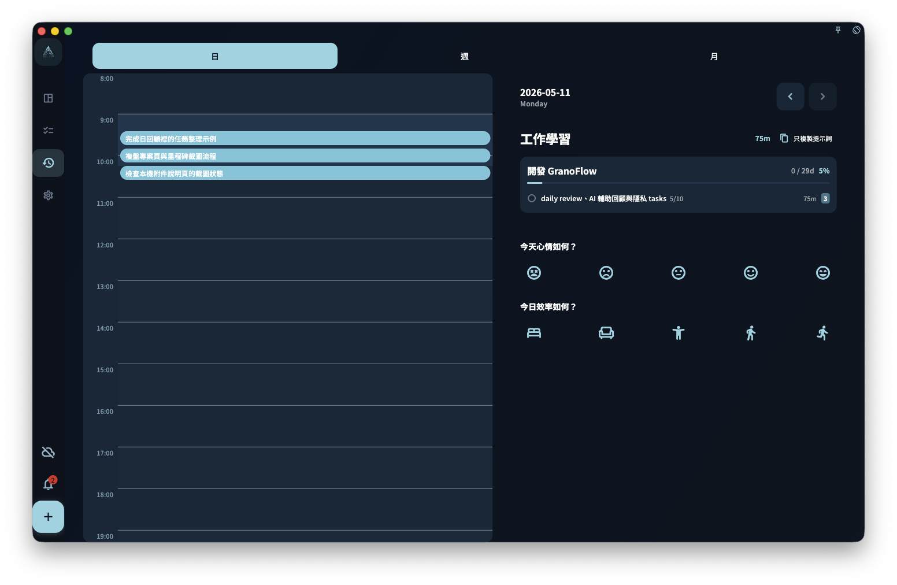

日回顧用來在一天結束時確認自己實際完成了什麼，並寫下幾句記錄。它依照任務的**完成時間**統計，不看截止日期；每天從 0 點開始算新的一天。

你可以在日回顧的日期標題旁切換前一天或後一天。直向螢幕開啟詳情時，詳情頁頂部也會顯示目前日期，並保留同一組前一天 / 後一天按鈕；即使某一天沒有完成任務，也可以切過去查看空狀態。

{/* manual-screenshot:id=review-overview-main */}

## 統計邏輯

日回顧只看任務什麼時候被標記為完成。

這代表：

- 任務昨天截止，但你今天才完成 → 出現在今天的回顧裡
- 任務昨天 23:58 完成 → 出現在昨天的回顧裡
- 任務今天 1:00 完成 → **出現在今天的回顧裡**

也就是說，日回顧依自然日歸類：0 點以後完成的任務會進入新一天的回顧。

## 怎麼寫日回顧

日回顧沒有固定格式。你可以直接寫下今天值得記住的幾件事，例如：

- 今天完成了什麼，沒完成什麼
- 哪件事做得順，哪件事卡住了
- 明天想先處理什麼
- 今天的狀態怎麼樣

三到五句通常就夠了。不需要寫成工作日報，也不需要把每個提示問題都回答一遍。

## 整理今天的任務時間

日回顧右側會顯示「今日投入時間」。這個時間依照當天任務時間區塊的聯集計算：如果兩個任務時間重疊，重疊的部分不會重複相加。

時間軸裡的任務區塊以任務標題為主。如果任務有關聯專案，而且任務區塊空間足夠，標題下方會用小字顯示專案名稱；短任務、重疊後變窄的任務區塊，或沒有關聯專案的任務，只會顯示任務標題。

如果 GranoFlow 發現任務時間重疊，會提示你可以自動擺布任務時間。這適合事後整理：例如工作時忘了即時記錄，休息時一次完成幾個任務，導致它們都集中在同一個時間點。
點「自動擺布任務時間」後，GranoFlow 會先把當天任務放進一個底部預覽彈窗。預設從當天 9:00 開始，到目前時間結束，再依照任務順序平均排布；你可以拖動任務區塊上沿或下沿微調開始和結束時間，再儲存。預覽彈窗內任務暫不重疊，只是為了降低拖動調整複雜度；底層仍然允許任務時間重疊，這也不是排班行事曆。

更多規則見[自動擺布任務時間](task-time-arrangement)。

你也可以點「回顧今日任務」，讓 AI 幫你依照任務順序梳理每個任務用了多久，並整理當天涉及的領域、專案和里程碑推進。AI 只會產生建議；你把結果複製回 GranoFlow 後，仍需要在確認框確認，才會寫入任務開始時間、結束時間、標題、任務回顧或當天領域日報。完整流程見[回顧今日任務](../ai-assistance/daily-task-review)。

## 沒有完成任務的日期

如果某天沒有完成任何任務，日回顧會顯示空狀態。它不會用空圖表，或是「你今天什麼事都沒做」之類的文字製造壓力。

空頁面只是表示：這一天沒有記錄到已完成任務。

:::note[回顧是給你自己看的]
回顧的讀者是未來的你，不是老闆或其他使用者。怎麼寫讓自己之後看得懂，就怎麼寫。
:::
